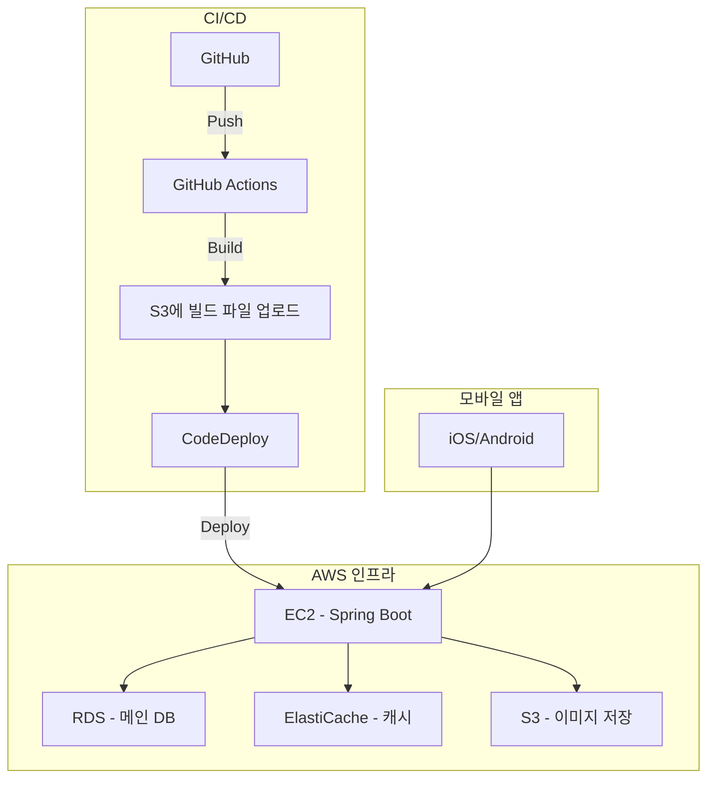
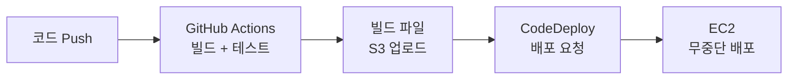
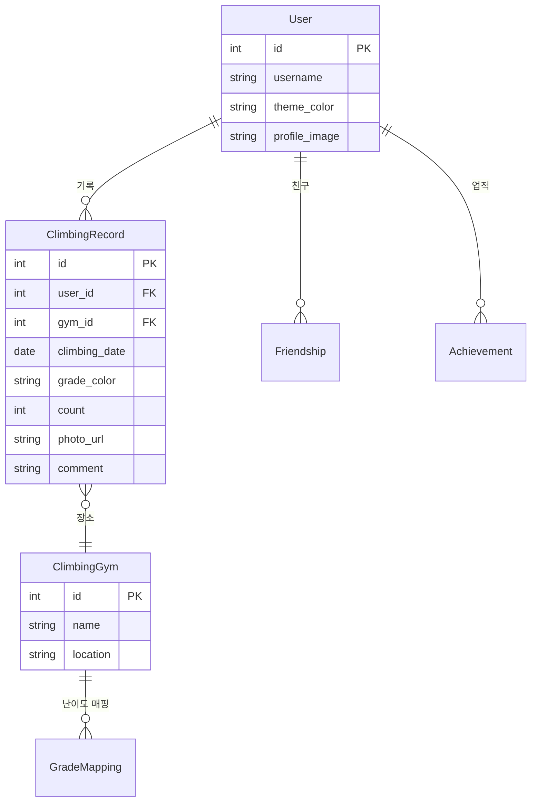
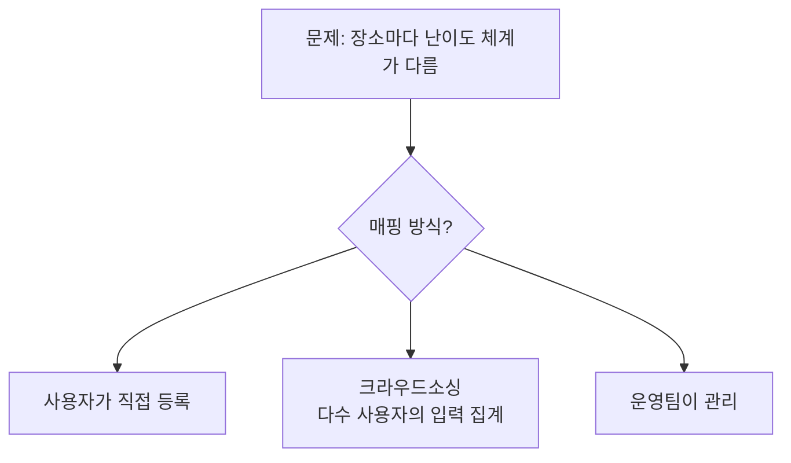

## 프로젝트 소개

CliInfo는 클라이밍하는 사람들을 위한 SNS/기록 앱이다. 클라이밍장에서 푼 문제(볼더링 루트)를 기록하고, 성장을 추적하고, 친구들과 공유하는 서비스.

기획, UI 디자인, 인프라 설계, CI/CD 파이프라인까지 전부 혼자 설계했다. 구현까지는 가지 못했지만, **"전체 시스템을 처음부터 끝까지 설계하는 경험"** 자체가 이후 실무에서 큰 자산이 되었다.

---

## 왜 만들려고 했나

클라이밍을 하면서 느낀 불편함:

- **기록이 안 남는다**: 오늘 어떤 난이도를 몇 개 풀었는지 기억에 의존
- **성장이 안 보인다**: 한 달 전보다 얼마나 실력이 올랐는지 체감하기 어렵다
- **공유가 안 된다**: 같이 가는 친구들과 기록을 비교하거나 응원할 방법이 없다

기존 앱들은 일반적인 운동 트래커라서 클라이밍의 특성(난이도별 색상, 볼더링 vs 리드, 클라이밍장별 세팅 주기)을 반영하지 못했다.

---

## UI 디자인: 사용자 경험 설계

Figma가 아니라 직접 프로토타입을 그렸다. 핵심 화면 3가지:

### 1. 프로필 화면

사용자의 정체성을 보여주는 첫 화면:

- **테마 색상 커스터마이징**: 사용자가 자기 프로필의 배경색을 선택 (노랑, 핑크, 파랑, 빨강, 보라, 갈색 등)
- **업적 배지**: 트로피, 인증, 등반, 토치 — 달성 조건별 배지 시스템
- **Problem History**: 최근 방문한 클라이밍장과 기록
- **Friends**: 함께 클라이밍하는 친구 목록

### 2. 문제 기록 화면

클라이밍 후 기록을 남기는 핵심 플로우:

```text
클라이밍장 선택 → 날짜 선택 → 난이도별 완등 기록 → 사진 첨부 → 코멘트
```

- 클라이밍장마다 난이도 체계가 다르므로, 장소별 색상/등급 매핑이 필요
- x/y 그래프로 색깔별 weekly/monthly/total 통계 시각화

### 3. 소셜 피드

- 친구의 기록을 타임라인으로 표시
- 같은 클라이밍장에서의 기록 비교

---

## 아키텍처 설계



### 기술 스택 선택 근거

| 레이어 | 선택 | 근거 |
|--------|------|------|
| **백엔드** | Spring Boot (Kotlin) | 이전 회사에서 Spring Boot/Kotlin 경험, 대출 중계 TPS 150 프로젝트 경험 활용 |
| **DB** | AWS RDS | 관계형 데이터(사용자-기록-클라이밍장) 구조에 적합 |
| **캐시** | ElastiCache | 클라이밍장 정보, 난이도 매핑 등 자주 조회되는 데이터 캐싱 |
| **이미지** | S3 | 문제 사진 저장, CDN 연계 가능 |
| **CI/CD** | GitHub Actions + CodeDeploy | 자동 배포 파이프라인 |

---

## CI/CD 파이프라인 설계



GitHub에 push하면 자동으로:
1. GitHub Actions에서 빌드 + 테스트
2. 빌드 결과물을 S3에 업로드
3. CodeDeploy가 EC2에 배포

실무에서 운영하는 배포 파이프라인과 동일한 구조를 개인 프로젝트에도 적용했다.

---

## 데이터 모델 설계



### 핵심 설계 고민

**클라이밍장별 난이도 매핑**: 클라이밍장마다 난이도 체계가 다르다. A장은 빨강이 가장 어렵고, B장은 검정이 가장 어렵다. 이 매핑을 어떻게 관리할 것인가?



MVP에서는 **사용자가 직접 등록**하는 방식을 선택했다. 사용자 수가 늘면 크라우드소싱으로 전환할 수 있다.

---

## 구현하지 못한 이유와 배운 것

### 왜 구현까지 가지 못했나

- 당시 이직을 준비하면서 시간이 부족했다
- 모바일 앱 프론트엔드 개발 경험이 없어서 학습 비용이 예상보다 높았다
- 혼자서 기획/디자인/백엔드/프론트/인프라를 전부 하려니 scope이 너무 컸다

### 그래도 배운 것

**1. 전체 그림을 그리는 경험**

실무에서는 시스템의 일부를 담당한다. 이 프로젝트에서는 사용자 플로우 → UI → API → DB → 인프라 → CI/CD까지 전체를 설계했다. 이 경험이 이후 실무에서 "내가 담당하는 부분이 전체에서 어떤 위치인지"를 이해하는 데 큰 도움이 됐다.

**2. 디자인 감각**

엔지니어가 직접 UI를 설계하면 "이 버튼이 여기 있으면 사용자가 불편하겠다"를 체감하게 된다. 이 감각은 이후 운영 도구를 설계할 때(Retool + Internal API 패턴) 직접적으로 활용됐다.

**3. Scope 관리의 중요성**

"혼자서 전부 다 하겠다"는 의욕이 프로젝트를 죽일 수 있다. 이 경험 이후 LifeRPG에서는 "M1 끝나기 전에 M2 안 본다"는 원칙을 철저히 지키고 있다.

---

## 이 프로젝트와 현재의 연결

| CliInfo에서 설계한 것 | 이후 실무에서 적용한 것 |
|---------------------|---------------------|
| Spring Boot + AWS 인프라 설계 | 이전 회사에서 대출 중계 프로젝트 (TPS 150) |
| CI/CD 파이프라인 (GitHub Actions) | 현재 회사에서 배포 자동화 |
| 사용자 플로우 → API 설계 | 운영 도구 워크플로우 재설계 |
| 업적/배지 시스템 | LifeRPG의 스킬 언락 시스템에 영감 |

미완성 프로젝트라도 설계 경험은 사라지지 않는다. 오히려 "왜 실패했는가"를 아는 것이 다음 프로젝트의 성공 확률을 높인다.

---

## 느낀 점

### 미완성도 괜찮다, 설계가 남으니까
코드가 없어도 UI 목업, 인프라 다이어그램, 데이터 모델이 남아있다. 이 산출물들은 "이 사람이 시스템을 어떻게 생각하는지"를 보여주는 포트폴리오다.

### 엔지니어의 디자인은 "동작 가능한 디자인"이다
디자이너의 디자인은 아름다움을 추구하지만, 엔지니어의 디자인은 "이걸 실제로 구현할 수 있는가?"를 동시에 고려한다. 데이터 모델과 API를 알고 있으니까, 화면을 그릴 때 "이 데이터를 어디서 가져와야 하지?"를 자연스럽게 생각하게 된다.

### Scope creep이 사이드 프로젝트를 죽인다
기획/디자인/백엔드/프론트/인프라를 전부 혼자 하려 하면 아무것도 완성하지 못한다. 다음 프로젝트(LifeRPG)에서는 "텔레그램 봇으로 프론트를 대체"하고, "SQLite로 인프라를 단순화"해서 MVP를 먼저 완성하는 전략으로 바꿨다.
