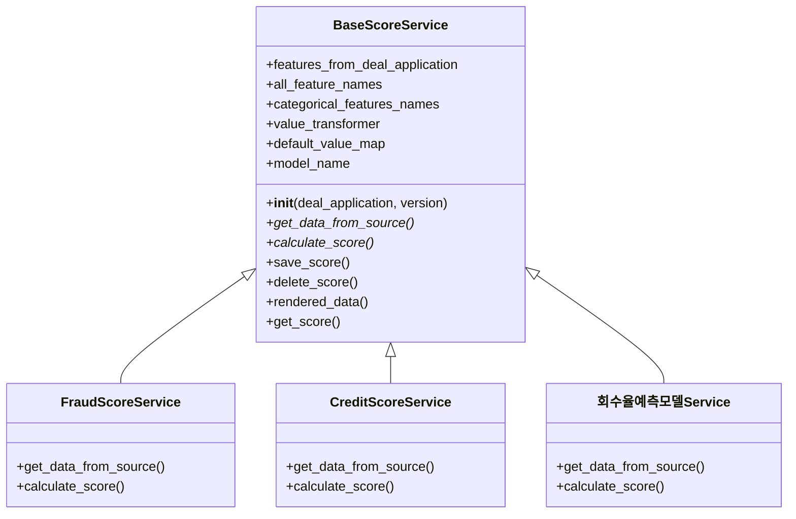
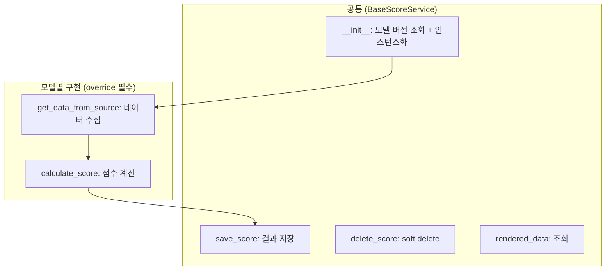
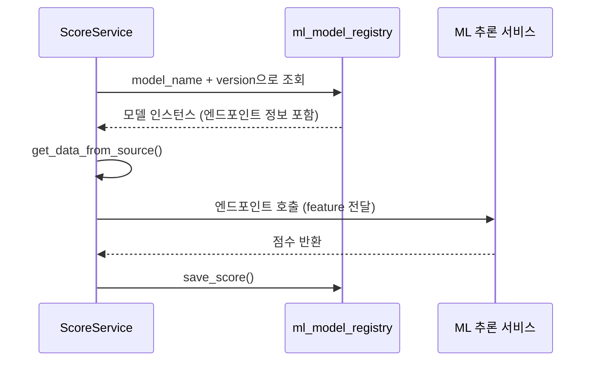
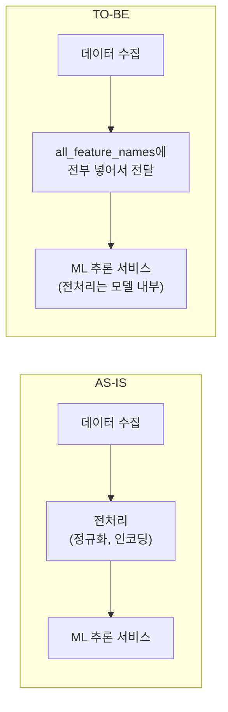
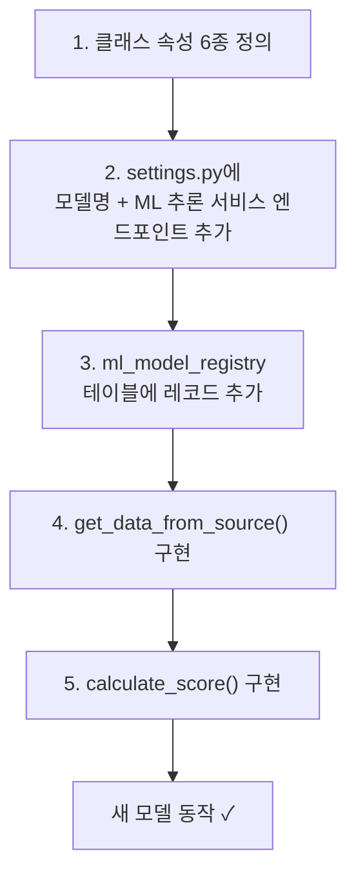

## 배경

대출 심사 시스템에는 여러 종류의 신용평가 모델이 존재한다. 사기 탐지 모델, 신용 점수 모델, 회수율 예측 모델 등 각각 다른 데이터를 입력받고, 다른 방식으로 점수를 계산하지만, **"데이터를 모아서 → 점수를 계산하고 → 결과를 저장한다"**는 전체 흐름은 동일하다.

문제는 모델이 추가될 때마다 비슷한 코드가 반복되고, 모델별로 다른 방식으로 구현되어 있어 유지보수가 어려웠다는 것이다.

---

## 해결: BaseScoreService 추상 클래스

Template Method 패턴을 적용하여, 공통 흐름은 부모 클래스가 정의하고 모델별 차이점만 자식 클래스에서 구현하도록 했다.

### 클래스 속성: "이 모델은 무엇을 사용하는가"

각 서비스 클래스는 6개의 속성을 선언하여 자신이 어떤 데이터를 사용하는지 명시한다.

| 속성 | 역할 |
|------|------|
| `features_from_deal_application` | 대출 신청서에서 가져올 값 |
| `all_feature_names` | 전체 feature 목록 |
| `categorical_features_names` | 범주형 데이터 (enum) |
| `value_transformer` | 값 변환이 필요한 데이터 |
| `default_value_map` | 기본값 매핑 |
| `model_name` | ML 추론 서비스 엔드포인트에서 사용할 모델 이름 |

### 메서드: "공통 흐름" vs "모델별 구현"

`get_data_from_source()`와 `calculate_score()`만 구현하면 새 모델이 동작한다. 나머지는 부모 클래스가 처리한다.

---

## 모델 버전 관리

ML 모델은 버전이 바뀐다. 같은 "사기 탐지"라도 v1과 v2가 다른 feature를 사용하고 다른 ML 추론 서비스 엔드포인트를 호출할 수 있다.

`__init__`에서 `ml_model_registry` 테이블을 조회하여 해당 버전의 모델 인스턴스를 가져온다. 새 버전을 배포하려면 DB에 레코드를 추가하고 설정값만 변경하면 된다.

---

## 데이터 전달 전략: "전처리를 하지 않는다"

초기에는 서비스 레이어에서 데이터 전처리(정규화, 인코딩 등)를 했다. 하지만 이 방식은 모델 버전이 바뀔 때마다 전처리 코드도 수정해야 하는 문제가 있었다.

결정: `all_feature_names`에 파라미터를 전부 넣어 보내고, 전처리는 ML 추론 서비스 모델 내부에서 처리한다. 서비스 레이어는 "데이터를 모아서 보내는 것"에만 집중한다.

---

## 새 모델 추가 체크리스트

시스템이 복잡해지면 "새 모델을 추가하려면 뭘 해야 하지?"가 가장 큰 비용이다. Template Method 패턴 덕분에 이 과정이 정형화되었다.

5단계면 새 모델이 추가된다. 공통 로직(저장, 삭제, 조회, 버전 관리)은 한 줄도 건드리지 않는다.

---

## 느낀 점

### Template Method는 "같은 흐름, 다른 세부사항"에 딱 맞는 패턴이다
"데이터 수집 → 점수 계산 → 저장"이라는 흐름이 모든 모델에 동일하고, 수집/계산 방식만 다르다면 Template Method가 정확한 선택이다. 새 모델 추가 비용이 "클래스 하나 만들기"로 줄어든다.

### 전처리 책임을 모델에 넘기면 서비스가 단순해진다
서비스 레이어가 전처리까지 담당하면 모델 버전마다 코드가 분기된다. "원본 데이터를 모아서 보내고, 전처리는 모델이 알아서 한다"로 역할을 나누면 버전 변경 시 백엔드 코드를 건드릴 필요가 없다.

### 체크리스트의 가치는 패턴이 정착된 후에 나온다
패턴 없이 체크리스트를 만들면 "해야 할 일 목록"이 될 뿐이다. 패턴이 정착된 후의 체크리스트는 "이것만 하면 된다"는 보장이 된다. 차이가 있다.
