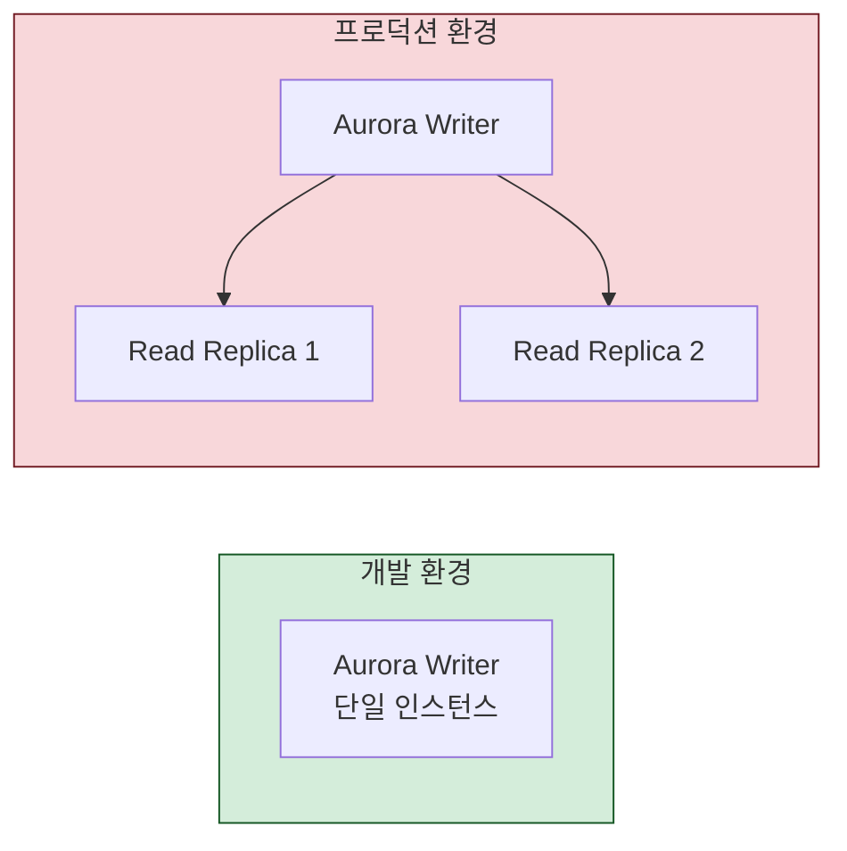
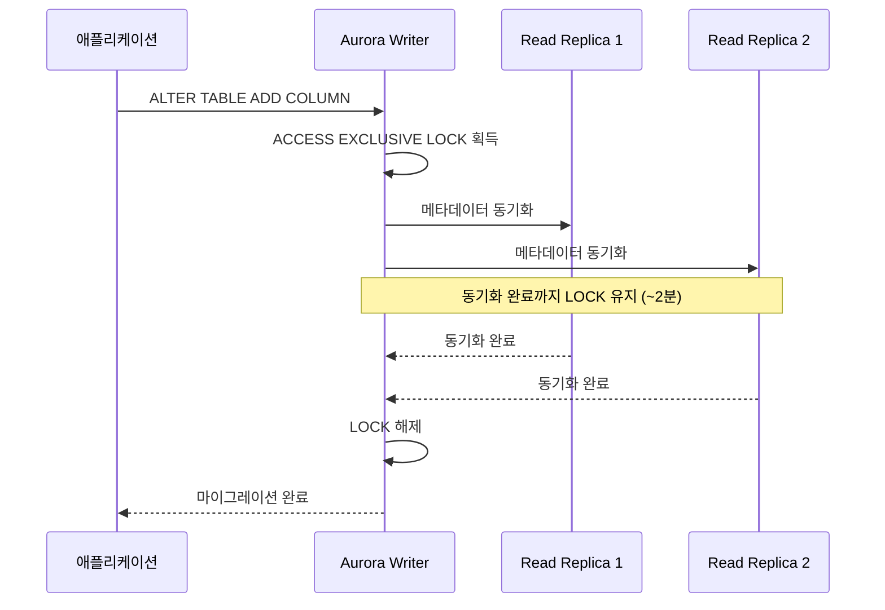
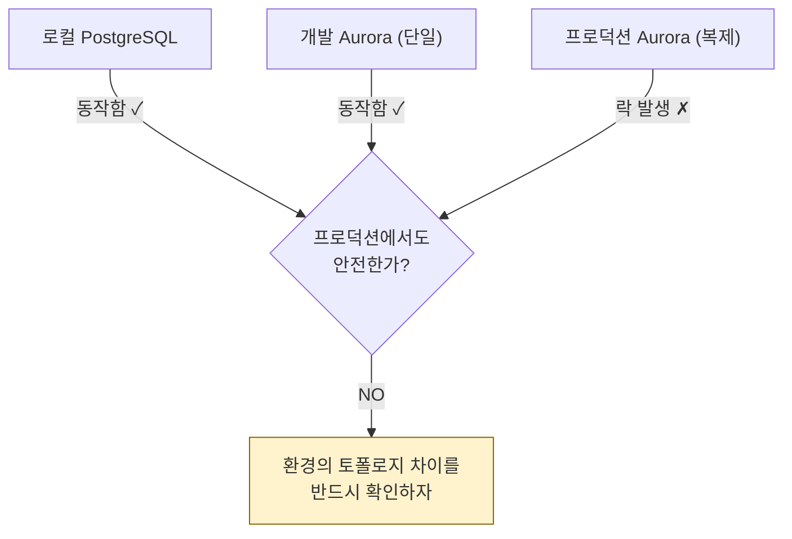

## 사건

운영 중인 테이블에 **90개의 nullable 컬럼**을 추가하는 Django 마이그레이션을 실행했다. `ACCESS EXCLUSIVE LOCK`이 걸리면서 해당 테이블에 의존하는 **모든 요청이 약 2분간 타임아웃**됐다.

```mermaid
gantt
    title 장애 타임라인
    dateFormat HH:mm
    axisFormat %H:%M
    section DB
    마이그레이션 시작 (LOCK 획득) :crit, a1, 14:40, 20min
    section 서비스
    요청 타임아웃 발생 :crit, b1, 14:40, 20min
    section 복구
    마이그레이션 완료 (LOCK 해제) :done, c1, 15:00, 1min
```



---

## 통설: "nullable 컬럼 추가는 안전하다"

PostgreSQL에서 `ALTER TABLE ADD COLUMN`으로 nullable 컬럼(default 없이)을 추가하면 **테이블을 재작성하지 않는다.** 메타데이터만 변경되므로 매우 빠르게 완료되어야 한다.

실제로 직접 SQL을 실행하면:

```sql
ALTER TABLE my_table ADD COLUMN new_col VARCHAR(100);
-- → 45ms에 완료
```

그런데 Django 마이그레이션으로 같은 작업을 실행하면 **약 2분간 락**이 걸렸다.

```text
직접 SQL 실행:       45ms ✓
Django 마이그레이션:  ~2분 ✗  (약 2,600배 차이)
```

왜?

---

## 가설 검증

### 가설 1: ALTER 구문 자체가 락을 유발한다

PostgreSQL 공식 문서에 따르면 nullable 컬럼 추가(default 없음)는 non-blocking이다. 직접 SQL 실행 시 45ms로 확인했다.

**판정: 기각**

### 가설 2: 데이터 볼륨이 원인이다

개발 DB에 프로덕션과 동일한 데이터를 복제한 뒤 마이그레이션을 실행했지만, 2분 락이 재현되지 않았다.

**판정: 기각**

### 가설 3: Aurora 레플리카 동기화가 원인이다

개발과 프로덕션의 핵심 차이를 분석했다:





Aurora는 DDL 실행 시 레플리카와 자동으로 동기화한다. 이 동기화가 완료될 때까지 `ACCESS EXCLUSIVE LOCK`이 해제되지 않는 것으로 추정된다.

**판정: 유력** (개발 DB에 레플리카를 추가하여 추가 검증 필요)

---

## 교훈

### 1. 로컬/개발 환경 검증 ≠ 프로덕션 보장



"nullable 컬럼 추가는 안전하다"는 **단일 인스턴스 기준**의 이야기다. 레플리카가 있는 환경에서는 동작이 달라질 수 있다.

### 2. 대량 DDL 실행 전략

90개 컬럼을 한 번에 추가하는 것 자체가 위험하다. 안전한 접근법:

```sql
-- 방법 1: lock_timeout으로 장시간 락 방지
SET lock_timeout = '5s';
ALTER TABLE my_table ADD COLUMN new_col INTEGER;
-- 5초 내 락 획득 못하면 실패 → 재시도

-- 방법 2: 배치 분할 (90개를 10개씩 나눠서 실행)

-- 방법 3: 저트래픽 시간대 실행
```

### 3. 클라우드 매니지드 DB의 특수성

| 항목 | 바닐라 PostgreSQL | Aurora |
|------|-------------------|--------|
| nullable 컬럼 추가 | 메타데이터만 변경, 즉시 완료 | 레플리카 동기화 대기 가능 |
| DDL 실행 범위 | 단일 인스턴스 | 클러스터 전체에 영향 |
| 테스트 재현 | 단일 인스턴스로 충분 | 동일한 레플리카 구성 필요 |

---

## 느낀 점

"안전하다고 알려진" 작업이라도 프로덕션 환경의 특수성을 고려해야 한다. 클라우드 매니지드 DB(Aurora, Cloud SQL 등)는 바닐라 PostgreSQL과 다른 동작을 할 수 있다.

DDL 실행 전에는 **프로덕션과 동일한 토폴로지**(레플리카 포함)에서 테스트하는 것이 가장 확실하다. 못하겠으면 최소한 `lock_timeout`을 설정하고 저트래픽 시간대에 실행하자.
