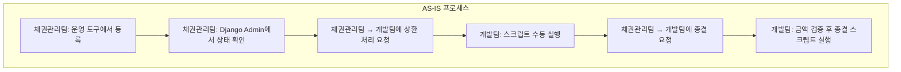
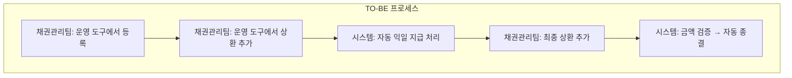
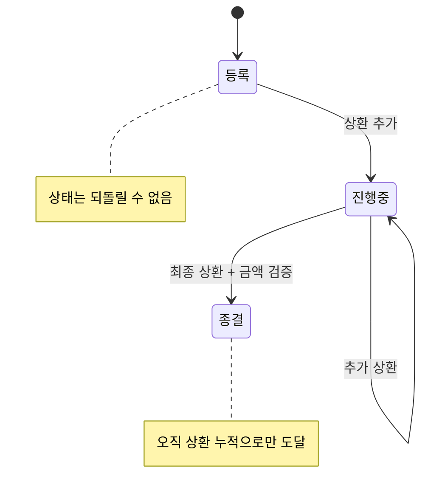
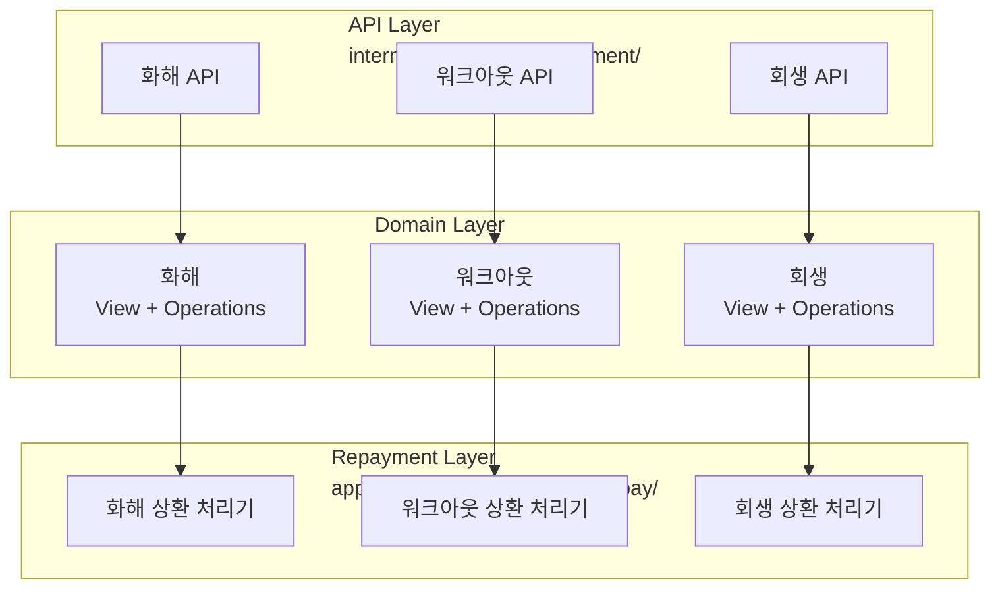
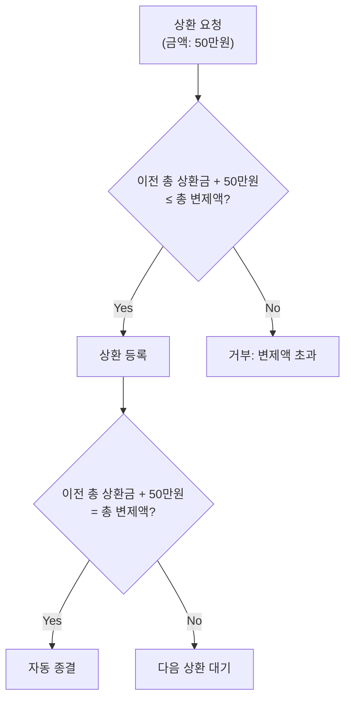

## 배경

대출 연체 후에는 화해(합의), 워크아웃(자율 채무조정), 회생(법원 개입) 세 가지 후처리 프로세스가 있다. 이 세 프로세스의 공통점은 **등록 → 상환 → 종결**이라는 생명주기를 갖는다는 것이다.

문제는 이 워크플로우가 여러 도구와 팀에 분산되어 있었다는 점이다.

### AS-IS: 3개 도구, 2개 팀



- 채권관리팀이 운영 도구과 Django Admin을 오가며 관리
- 상환과 종결은 반드시 개발팀에 요청해야 함
- 개발팀이 수동으로 스크립트를 실행

### TO-BE: 1개 도구, 1개 팀



---

## 핵심: 3개 프로세스의 공통 패턴 추출

화해, 워크아웃, 회생은 법적 절차와 관련 기관이 다르지만, **백엔드 관점에서의 생명주기는 동일**하다.



| 규칙 | 설명 |
|------|------|
| 상태 불가역 | 이전 단계로 되돌릴 수 없음 (건너뛰기는 가능) |
| 순차 상환 | 상환 회차는 순차 증가만 허용 |
| 금액 검증 | 상환 금액 + 이전 총 상환금 ≤ 총 변제액 |
| 자동 종결 | 총 상환금 = 변제예정금액일 때만 종결 (수동 종결 불가) |
| 자동 지급 | 상환 등록 시 익일 자동 지급 처리 |

이 규칙들을 코드에 넣으면 **운영팀이 실수할 수 없는 구조**가 된다.

---

## 백엔드 아키텍처: 3개 도메인 × 공통 패턴



각 레이어의 역할:

| 레이어 | 역할 | 예시 |
|--------|------|------|
| **API** | URL 라우팅, 인증 | `POST /post_management/workout/repayment/` |
| **View** | DTO 변환, 입력 검증 | 요청 데이터 → 내부 객체 |
| **Operations** | 핵심 비즈니스 로직 | 상태 전이 규칙, 금액 검증 |
| **Repayment** | 상환 처리 | 금액 기록, 자동 지급, 자동 종결 |

---

## 비즈니스 규칙의 코드화

### 상태 불가역

```python
# 상태를 되돌리려는 시도 차단
def validate_status_transition(current, new):
    STATUS_ORDER = ['registered', 'in_progress', 'closed']
    if STATUS_ORDER.index(new) <= STATUS_ORDER.index(current):
        raise ValidationError("상태를 이전 단계로 되돌릴 수 없습니다")
```

### 상환 금액 검증



### 자동 종결 조건

```python
def process_repayment(plan, amount):
    # 금액 검증
    if plan.total_repaid + amount > plan.projected_amount:
        raise ValidationError("총 변제액을 초과합니다")
    
    # 상환 기록
    plan.add_repayment(amount)
    
    # 자동 종결 판단
    if plan.total_repaid == plan.projected_amount:
        plan.close()  # 수동 종결 API 없음 — 오직 이 경로로만
```

"종결" 상태를 수동으로 변경하는 API는 아예 존재하지 않는다. 오직 상환 누적이 변제예정금액과 일치할 때만 시스템이 자동으로 종결한다. 이렇게 하면 금액 불일치 상태의 종결이 원천적으로 불가능하다.

---

## 실제 운영에서 나온 피드백

운영 배포 후 채권관리팀에 교육을 진행하고 피드백을 받았다.

### 추가 요구사항: 당일 지급

기존 설계는 "익일 지급"이었는데, 운영에서 "오늘 등록한 상환을 오늘 지급해야 하는" 케이스가 있었다. 당일 지급 기능을 추가했다.

### 운영 버그 사례

운영 배포 후 채권관리팀이 직접 시스템을 사용하다가 에러를 발견:

> "규보님이 7월에 상환등록/지급준비 작업 가능하다고 하셔서 직접 수행하려 했으나 잘못된 요청이라는 오류 메세지가 나옵니다."

본인이 만든 시스템을 운영팀이 실제로 사용하면서 발견한 엣지 케이스. 당일 핫픽스로 해결했다.

---

## 느낀 점

### "수동 요청 → 스크립트 실행"은 기술 부채의 냄새다
운영팀이 개발팀에 요청하고, 개발팀이 스크립트를 실행하는 구조는 양쪽 모두에게 부담이다. 비즈니스 규칙을 코드에 넣고 UI를 제공하면, 운영팀은 자율적으로 일하고 개발팀은 본업에 집중할 수 있다.

### 상태 머신의 핵심은 "못 하게 하는 것"이다
"무엇을 할 수 있는가"보다 "무엇을 할 수 없는가"를 정의하는 것이 중요하다. 상태를 되돌릴 수 없게, 금액을 초과할 수 없게, 수동 종결을 할 수 없게 만들면 운영 실수가 원천 차단된다.

### 3개 도메인의 공통 패턴을 먼저 찾아라
화해/워크아웃/회생을 각각 따로 설계했으면 3배의 코드와 3배의 버그가 생겼을 것이다. 비즈니스 규칙이 동일하다면 백엔드 구조도 동일해야 한다. 차이가 있는 부분만 분리하면 된다.
