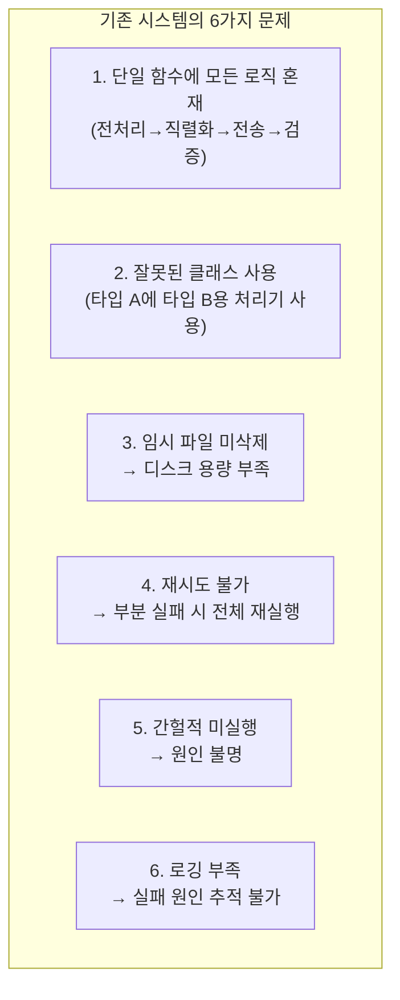
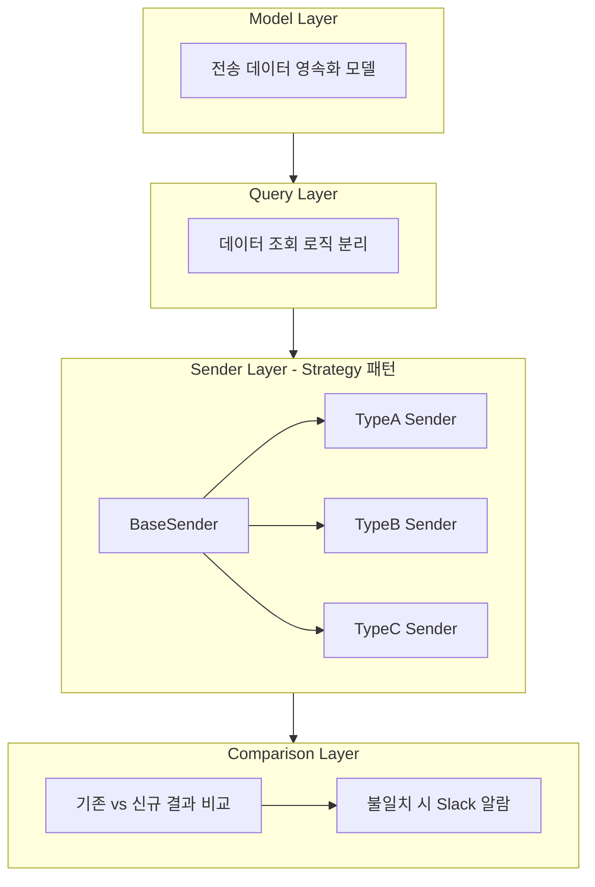
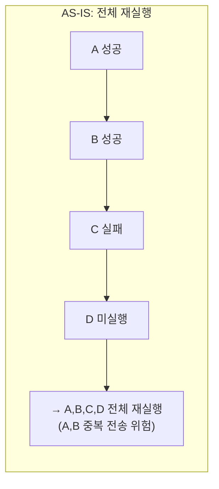
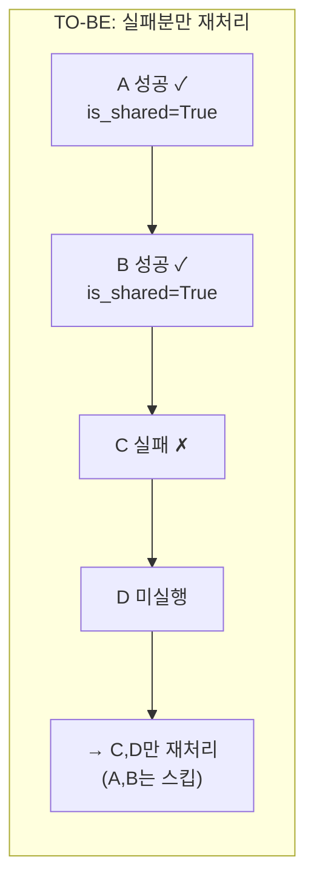
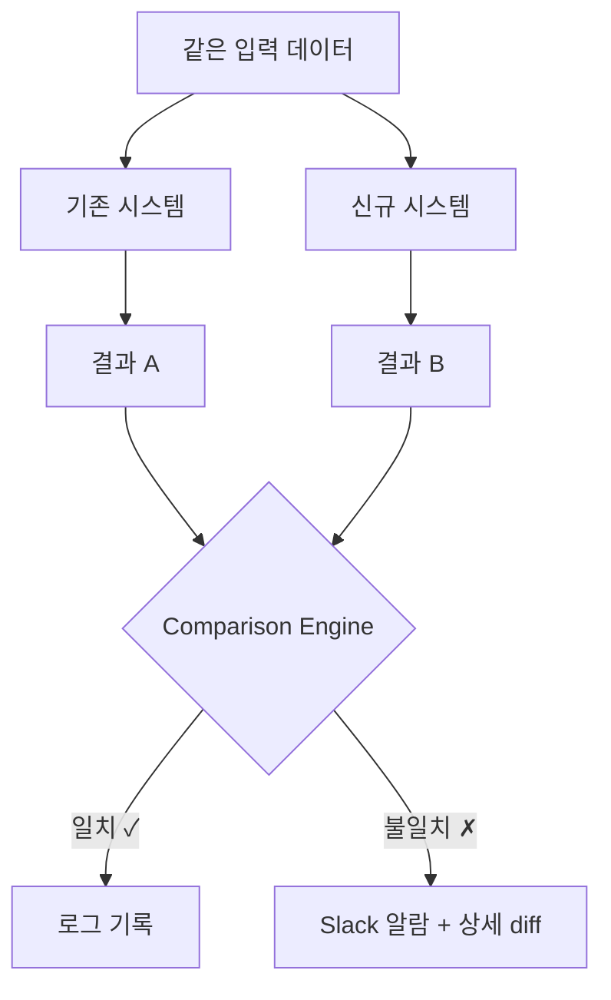
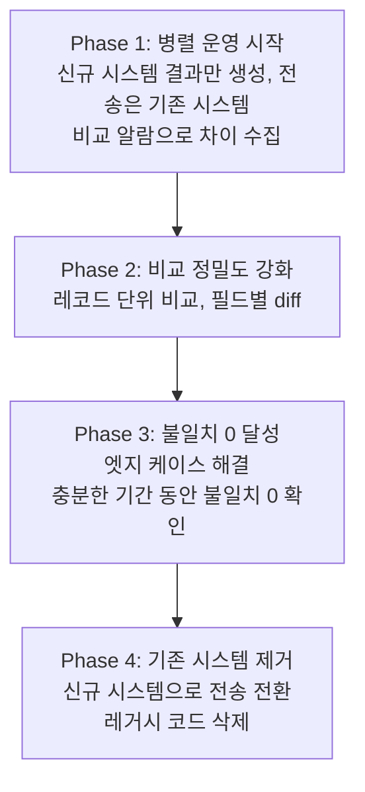

## 배경

금융 기관에 일일 데이터를 전송하는 배치 태스크를 리팩토링했다. 금융 데이터 전송이라 정확성이 생명이고, 한 건이라도 틀리면 규제 이슈로 이어질 수 있는 시스템이다.

### 기존 시스템의 문제점



특히 **문제 4번**(재시도 불가)이 운영 부담이 컸다. 새벽에 배치가 부분 실패하면, 이미 성공한 건까지 다시 전송해야 했고, 중복 전송 위험도 있었다.

---

## 해결: 4계층 아키텍처

기존 단일 함수를 4개 계층으로 분리했다.



### Strategy 패턴 Sender

전송 타입마다 전처리 방식이 다른데, 기존에는 if-else 분기로 처리하고 있었다.

```python
# AS-IS: if-else 분기 (확장할 때마다 기존 코드 수정)
def send_daily():
    if record_type == 'A':
        data = process_type_a(records)  # 실은 타입 B 처리기를 쓰고 있었음 (버그)
    elif record_type == 'B':
        data = process_type_b(records)
    elif record_type == 'C':
        ...

# TO-BE: Strategy 패턴 (새 타입은 새 클래스만 추가)
class TypeASender(BaseSender):
    record_info_class = TypeARecordInfo  # 올바른 처리기

    def preprocess(self, records):
        ...

    def serialize(self, data):
        ...
```

새 전송 타입이 추가되면 기존 코드 변경 없이 새 Sender 클래스만 만들면 된다.

### 멱등성과 부분 실패 복구





성공한 전송에 `is_shared=True` 플래그를 마킹하여, 재실행 시 실패한 건만 재처리한다. 이 플래그 하나가 새벽 장애 대응의 스트레스를 크게 줄여줬다.

---

## 핵심 전략: 비교 알람 시스템

레거시를 한 번에 교체하는 것은 위험하다. 특히 금융 데이터에서 "아마 맞을 것이다"는 통하지 않는다.

**기존 시스템과 새 시스템을 병렬로 운영하면서 결과를 비교**하는 방식으로 안전하게 마이그레이션했다.



### 마이그레이션 4단계



### 비교 알람이 찾아낸 엣지 케이스

비교 과정에서 예상치 못한 케이스를 발견했다:

```text
09:00  대출 등록 (등록 레코드 생성)
15:00  당일 상환 (상환 레코드 생성)
23:00  일일 배치 실행

→ 기존 시스템: 등록/상환을 별도로 처리
→ 신규 시스템: 하나의 트랜잭션으로 처리
→ 결과 불일치 → Slack 알람 → 원인 분석 → 로직 수정
```

비교 알람이 없었다면 이 엣지 케이스는 프로덕션에서 발견됐을 것이다. 테스트 코드만으로는 실제 데이터의 모든 조합을 커버할 수 없기 때문이다.

---

## 느낀 점

### 비교 알람은 대규모 리팩토링의 안전벨트다
"새 코드가 기존과 동일한 결과를 내는가?"를 자동으로 검증함으로써 리팩토링에 대한 확신을 가질 수 있었다. 금융 시스템에서는 특히 이 방법이 효과적이다.

### Strategy 패턴은 "같은 일을 다른 방식으로"에 잘 맞는다
전송 타입별로 전처리가 다른 경우, if-else 분기보다 구현체 분리가 유지보수에 유리하다. 기존 코드에서 타입 A에 타입 B 처리기를 쓰는 버그도 이 리팩토링으로 발견됐다.

### 멱등성은 배치 시스템의 생명줄이다
부분 실패 시 "그냥 재실행하면 된다"라고 말할 수 있게 되면, 새벽 장애 대응이 완전히 달라진다.

### 점진적 마이그레이션 > 빅뱅 전환
빅뱅 전환의 유혹은 강하다 — "어차피 두 시스템 운영하는 게 더 복잡하잖아." 하지만 정확성이 중요한 시스템에서 빅뱅은 도박이다. 병렬 운영 기간을 충분히 갖는 것이 결국 더 빠른 길이었다.
