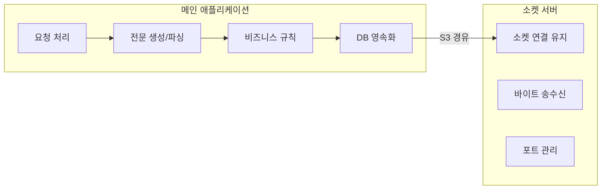
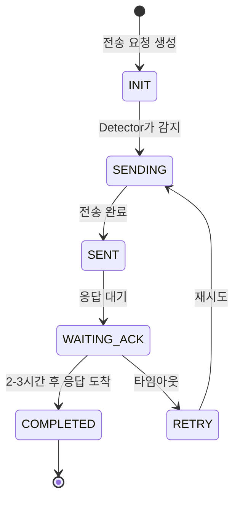
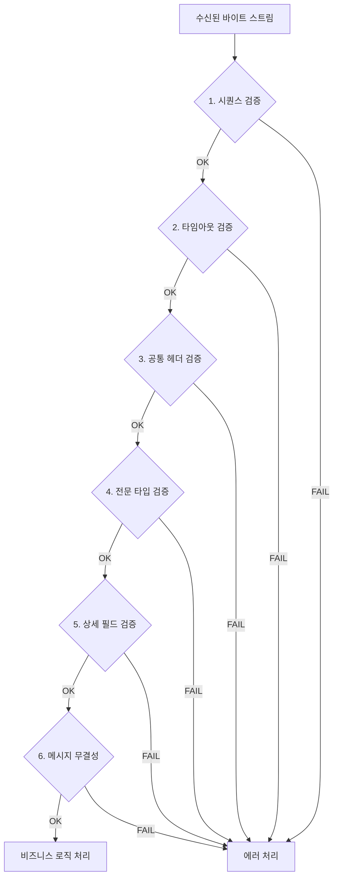
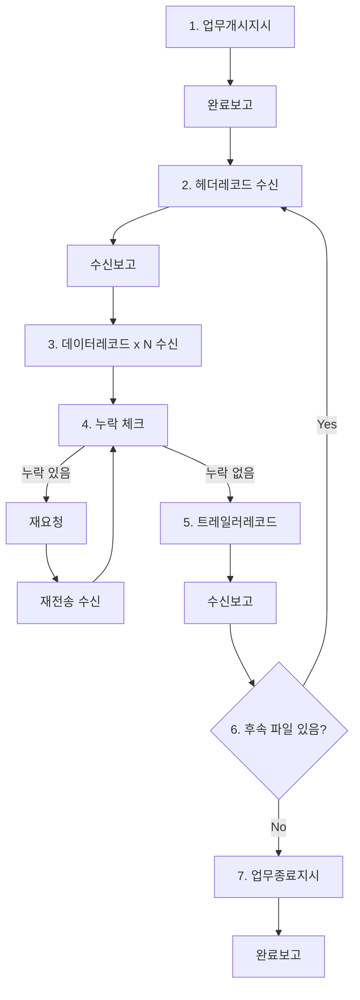
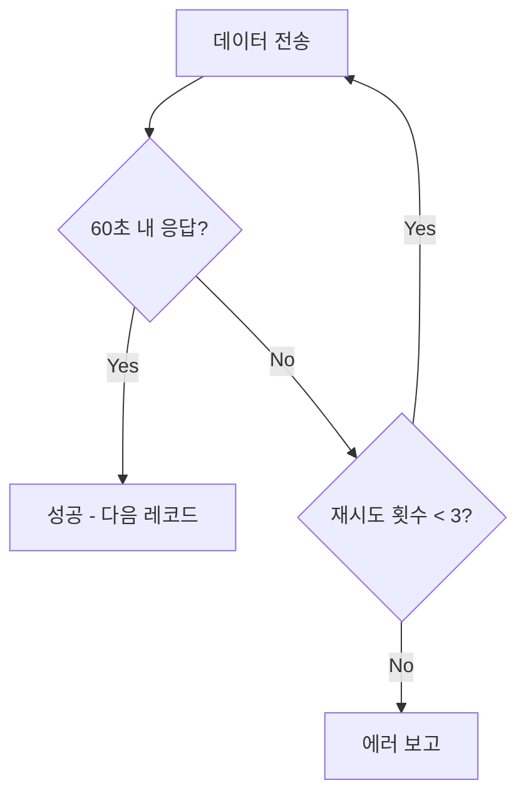
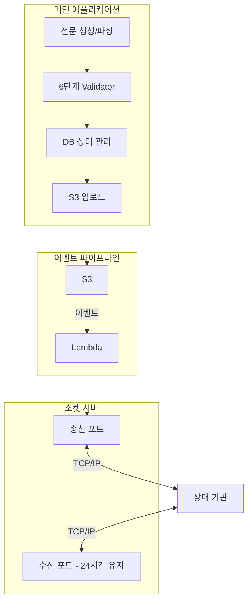

## 배경

금융 기관과 파일 전문(전자문서)을 주고받는 시스템을 새로 설계했다. 기존에는 Windows 전용 프로그램을 통해 담당자가 수동으로 파일을 전송/수신하고 있었는데, 이를 **24시간 자동화된 소켓 기반 시스템**으로 전환하는 프로젝트였다.

### 요구사항과 제약조건

- **3가지 양방향 프로세스**: 변동 데이터 수신, 선택적 수신 요청, 집중 데이터 수신
- **순차 처리 필수**: 초기화 → 전송 → 보고 단계가 반드시 순서대로 진행되어야 함
- **동시 소켓 연결 1개 제한**: 한 번에 하나의 파일만 전송 가능
- **비동기 응답**: 상대 기관의 응답이 2-3시간 뒤 별도 포트로 도착

이 제약조건들이 설계를 흥미롭게 만든 핵심 요인이다.

---

## 설계 결정 1: 비즈니스 로직과 통신의 분리

메인 애플리케이션은 "무엇을 보낼지" 결정하고, 소켓 서버는 "어떻게 보낼지"만 담당한다. 왜 이렇게 분리했냐면:

- **소켓 서버**는 특정 포트에서 장시간 연결을 유지해야 하는 반면, **비즈니스 로직**은 요청-응답 패턴이다
- 각각 독립적으로 배포하고 장애를 격리할 수 있다
- 소켓 서버에 문제가 생겨도 비즈니스 로직은 계속 동작하고, 복구 후 재전송하면 된다

---

## 설계 결정 2: DB 기반 이벤트 아키텍처

메시지 큐(RabbitMQ, SQS 등) 대신 **DB 테이블을 이벤트 저장소로 활용**했다.

Detector라는 프로세스가 DB를 주기적으로 폴링하여 특정 상태의 레코드를 발견하면 해당 함수를 실행하고, 상태를 업데이트한다.

**왜 MQ 대신 DB를 선택했나?**

| 비교 항목 | 메시지 큐 | DB 기반 이벤트 |
|-----------|----------|---------------|
| 순차 처리 | 순서 보장 설정 필요 | 상태 머신으로 자연스럽게 보장 |
| 비동기 응답 (2-3h) | 메시지 TTL 관리 필요 | DB에 영속화되어 시간 무관 |
| 중단/재개 | 별도 체크포인트 구현 | 상태만 보면 어디서든 재개 가능 |
| 추가 인프라 | MQ 서버 필요 | 기존 DB 활용 |

"폴링은 안티패턴"이라는 편견을 버리면 설계 선택지가 넓어진다. 이 경우처럼 순차 처리 제약이 강하고 비동기 응답을 기다려야 할 때, DB 상태 머신이 MQ보다 단순하고 안정적이었다.

---

## 설계 결정 3: S3 이벤트 파이프라인

메인 앱에서 소켓 서버로 데이터를 전달하는 방식으로 직접 API 호출 대신 S3 이벤트 트리거를 선택했다.

**직접 API 호출 대비 장점:**

- **장애 복구 단순화**: API 호출 실패 시 재시도 로직이 복잡해지지만, S3에 파일이 남아있으므로 실패한 이벤트만 재처리하면 된다
- **결합도 감소**: 메인 앱은 S3에 파일만 올리면 끝. 소켓 서버의 존재를 알 필요 없다
- **자동 로깅**: S3 이벤트와 Lambda 실행 로그가 자동으로 남는다

"파일이 있으면 처리한다"는 단순한 계약만으로 두 시스템이 느슨하게 연결된다.

---

## 6단계 메시지 검증 체계

소켓 통신은 HTTP와 달리 프레임 경계가 없다. 바이트 스트림을 직접 파싱해야 하므로 다층 검증이 필수다.

각 단계가 독립적으로 실패를 감지하므로, 문제 발생 시 어느 레벨에서 실패했는지 즉시 파악할 수 있다.

---

## 파일 수신 프로세스

파일 수신은 7단계로 구성되며, 누락 데이터 재요청과 파일 연속 수신을 처리한다.

### 송신 재시도 로직

60초 무응답 시 재시도하며 최대 3회 시도한다. 이벤트 큐 기반으로 관리하여 부분 실패 시에도 성공한 전송은 보존된다.

---

## 전체 아키텍처 요약

---

## 느낀 점

- **DB 기반 상태 머신**은 MQ 없이도 이벤트 드리븐 패턴을 구현할 수 있는 실용적인 방법이다. 순차 처리 제약이 있고 비동기 응답을 기다려야 할 때 특히 유용하다.

- **S3 이벤트 트리거**는 시스템 간 결합도를 낮추면서 장애 복구를 단순화한다. 복잡한 재시도 로직 대신 "파일이 있으면 처리한다"는 단순한 계약이면 충분하다.

- **소켓 통신은 HTTP와 질적으로 다르다.** 프레임 경계 없음, 바이트 파싱, 연결 상태 관리 등 저수준 문제가 많다. 검증 레이어를 충분히 쌓는 것이 장기 운영의 핵심이다.

- 수동 작업에서 자동화 시스템으로의 전환은 기술적 도전뿐 아니라 **실패 모드를 미리 정의하고 각각에 대한 복구 전략을 설계하는 것**이 핵심이다.
