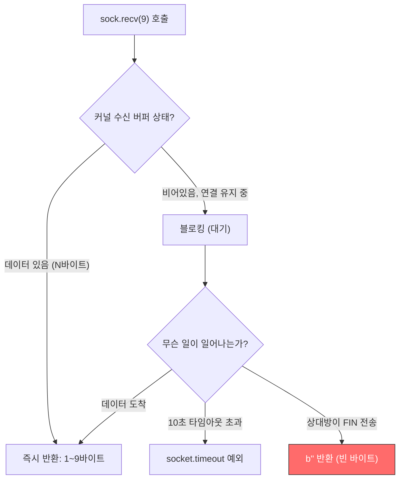
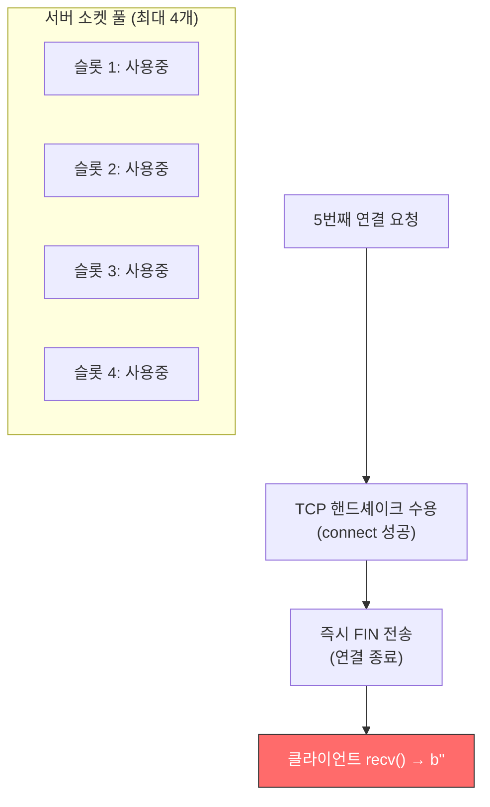
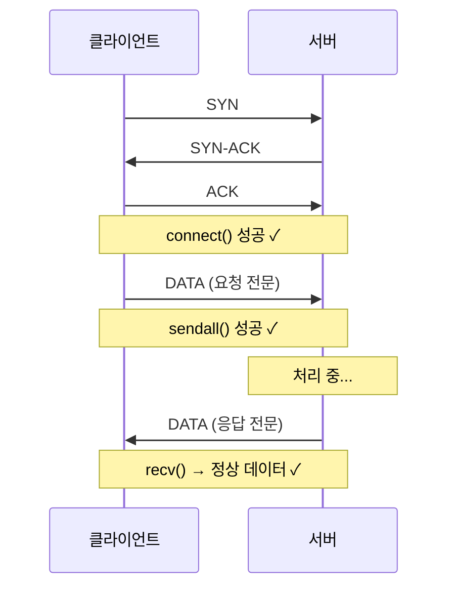
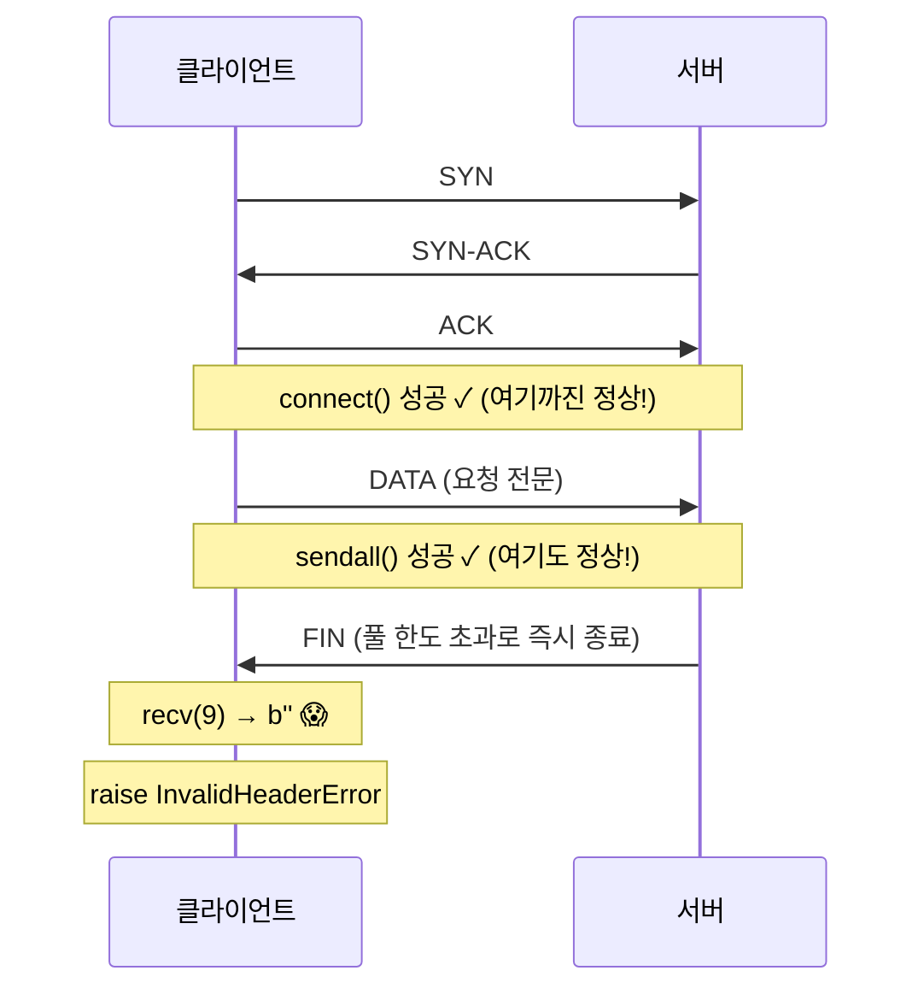
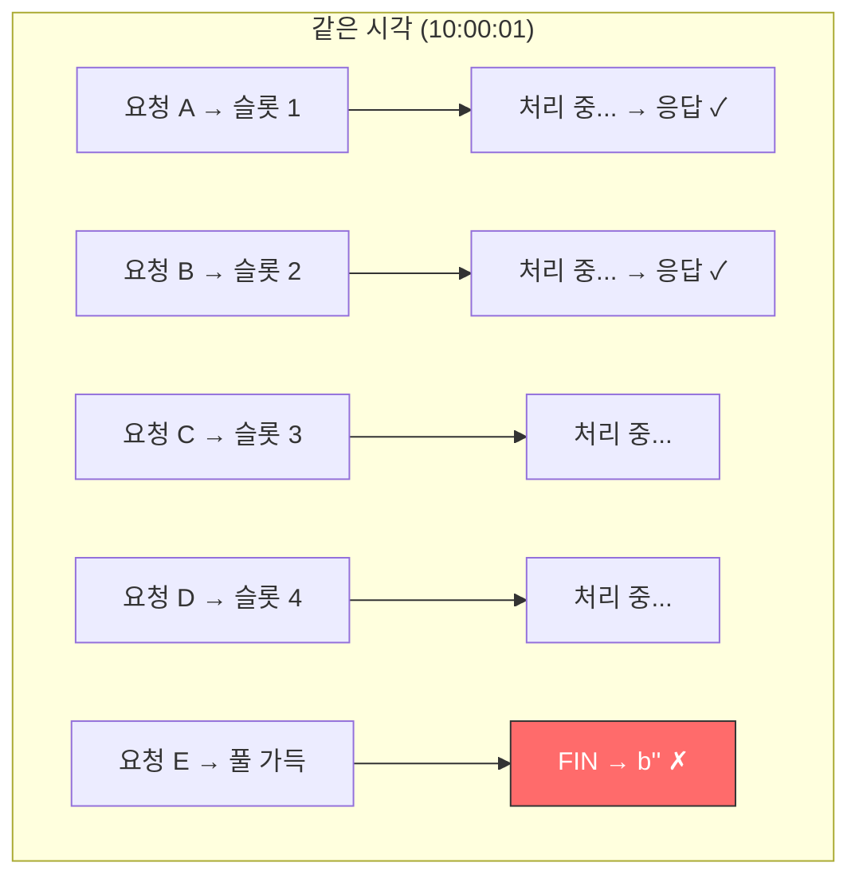
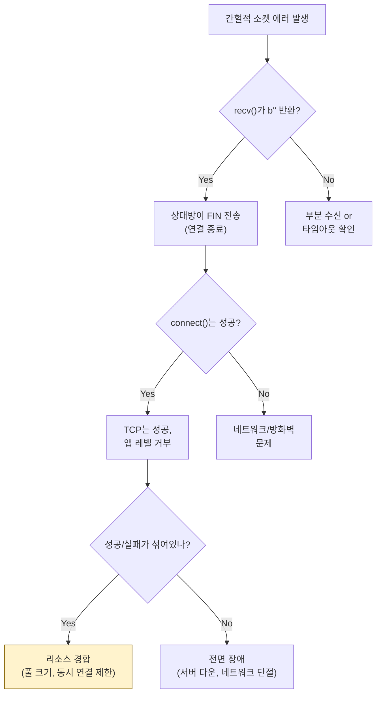

## 문제 상황

외부 기관과의 소켓 통신에서 간헐적으로 `InvalidHeaderError: b''`가 발생했다. 빈 바이트를 수신하는 에러로, 발생 패턴이 불규칙적이었다.

---

## 소켓 코드 분석

기본 통신 구조:

```python
with socket.socket(socket.AF_INET, socket.SOCK_STREAM) as sock:
    sock.settimeout(10)  # 10초 타임아웃
    sock.connect((SERVER_IP, PORT))
    sock.sendall(encoded_request)
    header = sock.recv(9)  # 최대 9바이트 수신
    if len(header) != 9:
        raise InvalidHeaderError(header)  # ← 여기서 b'' 발생
```

---

## recv()의 실제 동작 이해

`sock.recv(9)`는 **"정확히 9바이트를 읽어라"가 아니다.** OS 시스템 콜 `recv()`의 래퍼이며, **"최대 9바이트를 읽어라"**이다.



**핵심 구분:**

| 상황 | 결과 | 의미 |
|------|------|------|
| 타임아웃 | `socket.timeout` **예외** 발생 | 상대방이 **응답을 안 하는 것** |
| 연결 종료 | `b''` **반환** (예외 아님!) | 상대방이 **명시적으로 연결을 끊은 것** |

이 차이를 모르면 디버깅 방향이 완전히 달라진다.

---

## 가설 검증

### 가설 1: 요청 과다로 서버 과부하

에러 발생 시점의 요청량을 분석했다:

```text
시간대      요청/초    성공    실패
────────────────────────────────
10:00:00    2         2      0
10:00:01    3         2      1  ← b'' 발생
10:00:02    1         1      0
10:00:03    2         1      1  ← b'' 발생
10:00:04    2         2      0
```

1-3 req/sec로 정상 범위이고, **같은 시간대에 성공과 실패가 공존**한다. 서버 과부하가 원인이라면 특정 시점 이후 모두 실패해야 한다.

**판정: 기각**

### 가설 2: 서버 소켓 풀 관리 문제

상대 기관 확인 결과:



**판정: 유력**

---

## TCP 레벨에서 무슨 일이 일어나는가

### 정상 케이스 (풀 여유 있음)



### 문제 케이스 (풀 가득 참)



**요점**: `connect()`와 `sendall()`이 모두 성공하기 때문에 네트워크 문제가 아닌 것처럼 보인다. 하지만 **TCP 핸드셰이크(OS 커널 레벨)와 애플리케이션 레벨 수용은 별개**다.

---

## 왜 성공과 실패가 같은 시간에 섞여있었나



기존 연결이 슬롯을 아직 점유하고 있을 때 새 연결이 도착하면, 일부는 성공하고 일부는 실패한다. 이것이 "간헐적 실패"의 원인이었다.

---

## 대응

```python
header = sock.recv(9)
if not header:
    # b'' → 상대방이 연결을 종료한 경우
    # "헤더가 이상하다"가 아니라 "연결이 끊겼다"
    raise ConnectionClosedError(
        "서버가 연결을 종료함 - 소켓 풀 초과 가능성"
    )
if len(header) < 9:
    # 부분 수신 → 나머지를 추가로 읽어야 함
    remaining = 9 - len(header)
    header += sock.recv(remaining)
```

---

## 소켓 디버깅 체크리스트



---

## 느낀 점

### recv()가 b''를 반환하면 상대가 연결을 끊은 것이다
타임아웃(`socket.timeout` 예외)과 연결 종료(`b''` 반환)는 전혀 다른 시그널이다. 이 구분을 모르면 디버깅 방향이 완전히 틀어진다.

### connect() 성공이 통신 성공을 보장하지 않는다
TCP 3-way 핸드셰이크는 OS 커널 레벨에서 처리된다. 애플리케이션이 연결을 수용한 뒤 바로 닫을 수 있다. "connect 됐으니 네트워크는 문제 없다"는 위험한 가정이다.

### 간헐적 에러는 리소스 한도를 의심하라
"가끔 실패한다"는 패턴은 동시성 제한, 풀 크기, rate limit 등 리소스 경합 문제인 경우가 많다. 전면 실패가 아니라 부분 실패라면 상대방의 리소스 한도를 먼저 확인하자.

### Python socket은 OS syscall의 얇은 래퍼다
Python의 `socket` 모듈은 추상화가 거의 없다. OS의 `recv()` 시스템 콜이 어떻게 동작하는지 이해해야 Python 소켓 코드도 제대로 디버깅할 수 있다.
