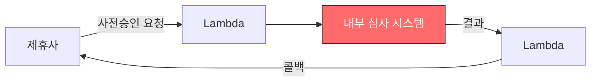
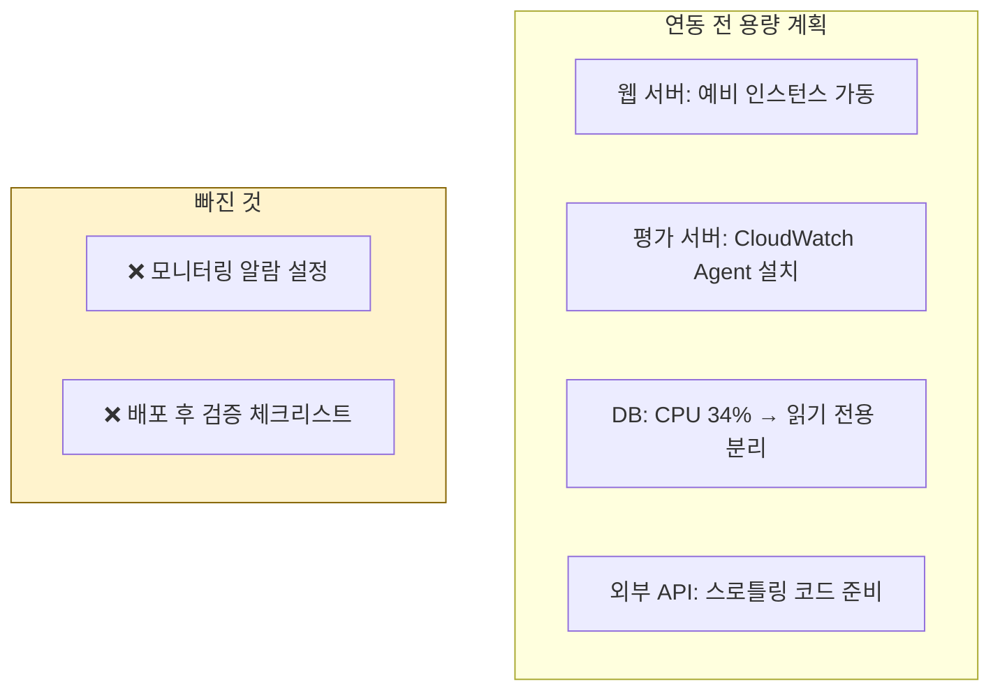
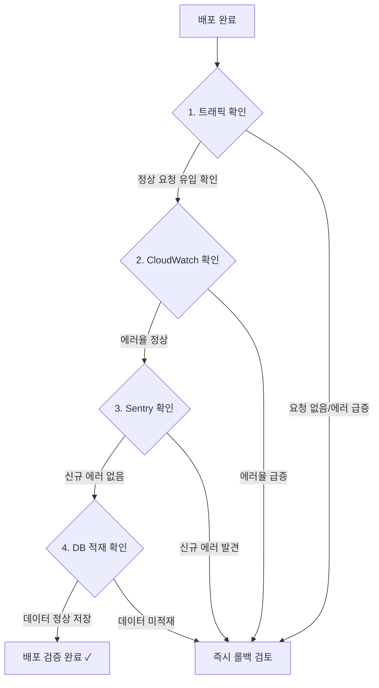
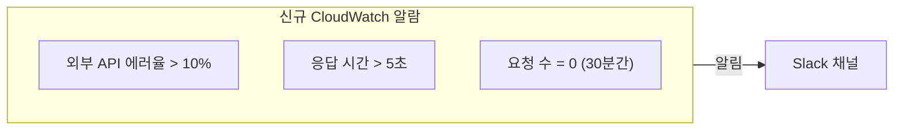

## 사건 개요

| 항목 | 내용 |
|------|------|
| 장애 시간 | 금요일 18:30 ~ 월요일 12:53 |
| 지속 시간 | **약 66시간** |
| 영향 범위 | 외부 제휴사 대출 사전승인 요청 전체 실패 |
| 근본 원인 | 외부 데이터 포맷 변경(v2)으로 인한 Serializer 불일치 |

---

## 시스템 구성

제휴사와의 대출 사전승인 연동은 Lambda를 프록시로 두고, 내부 심사 시스템이 처리하는 구조였다.



문제는 내부 심사 시스템(빨간색)에서 발생했다.

---

## 무슨 일이 있었나

### 근본 원인: Serializer 타입 불일치

건강보험 데이터를 제공하는 외부 API가 v2로 업데이트되면서 **응답 형식이 리스트에서 딕셔너리로 변경**됐다.

```python
# === v1: 리스트 형태 ===
health_data = [
    {"year": 2025, "month": 1, "amount": 150000},
    {"year": 2025, "month": 2, "amount": 160000},
]
Serializer(data=health_data, many=True)  # OK ✓


# === v2: 딕셔너리 형태로 변경 ===
health_data = {
    "insurance_type": "health",
    "payments": [
        {"year": 2025, "month": 1, "amount": 150000},
    ]
}
Serializer(data=health_data, many=True)  # FAIL ✗
# → TypeError: "item list expected, got dict"
```

Django REST Framework의 `many=True`는 내부적으로 `ListSerializer`를 사용하며, 입력이 반드시 리스트여야 한다. dict를 전달하면 즉시 실패한다.

### 추가 버그: 빈 문자열 처리

```python
{"expired_date": None}       # → None 허용 → OK
{"expired_date": "2025-12-31"} # → 날짜 파싱 성공 → OK
{"expired_date": ""}          # → 빈 문자열 파싱 실패 → ValidationError
```

외부 API에서 "값 없음"을 `None` 대신 빈 문자열(`""`)로 보내는 경우가 있었다.

---

## 왜 66시간이나 걸렸나

이 장애의 진짜 교훈은 버그 자체가 아니라 **발견까지 걸린 시간**에 있다.

```mermaid
gantt
    title 장애 타임라인 (66시간)
    dateFormat YYYY-MM-DD
    axisFormat %m/%d (%a)
    section 장애
    장애 시작 (금 18:30)         :crit, f1, 2025-11-07, 3d
    section 모니터링
    Sentry 알람 지연 + 주말      :crit, s1, 2025-11-07, 3d
    section 복구
    출근 후 발견 + 핫픽스 배포    :done, m1, 2025-11-10, 1d
```

### 모니터링 사각지대

| 모니터링 도구 | 상태 | 문제 |
|--------------|------|------|
| **Sentry** | 에러 수집 O, 알람 **2일 지연** | 알림 임계값 설정 미비 |
| **CloudWatch** | 에러 로그 O, **알람 미설정** | 외부 API 전용 모니터링 없음 |
| **개발자** | 금요일 퇴근 | 주말간 확인 불가 |

에러는 실시간으로 기록되고 있었지만, **아무도 알림을 받지 못했다.**

---

## 사전 용량 계획은 했었다

제휴사 연동 전에 인프라 용량 계획을 수립했다:



인프라가 **버틸 수 있는지**는 확인했지만, 문제 발생 시 **알려주는 시스템**은 없었다. "용량 계획"과 "모니터링"은 별개의 문제다.

---

## 재발 방지: 배포 후 4단계 체크리스트

이 사건 이후 도입한 필수 체크리스트:



### 추가 모니터링 조치



---

## 느낀 점

### 1. "잘 되는 것 같다"는 감각을 믿지 말자
특히 외부 연동은 실제 트래픽이 들어와야만 문제를 발견할 수 있다. Lambda 뒤에 숨어있는 서비스는 직접 호출하지 않으면 에러를 알 수 없다.

### 2. Sentry만 믿으면 안 된다
Sentry는 에러를 **수집**하지만, 알림 **전달**에는 지연이 있을 수 있다. 인프라 레벨 모니터링(CloudWatch 등)이 1차 방어선이어야 한다. Sentry는 2차다.

### 3. 금요일 저녁 배포는 피하자
모니터링 없이 주말을 넘기면 66시간 장애가 된다. 배포 타이밍만 화~목 오전으로 바꿔도 대부분의 장애를 반나절 내에 잡을 수 있다.

### 4. `many=True`는 입력 타입에 민감하다
Django REST Framework의 `many=True`는 내부적으로 `ListSerializer`를 사용한다. 외부 API 응답은 언제든 바뀔 수 있으므로, 방어적으로 타입을 체크하는 것이 안전하다:

```python
# 방어적 처리 예시
if isinstance(health_data, dict):
    health_data = [health_data]
serializer = MySerializer(data=health_data, many=True)
```
