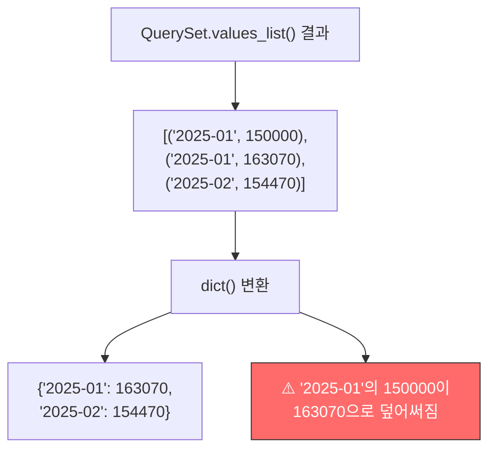
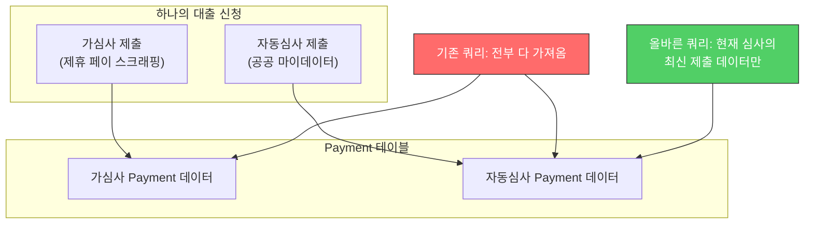
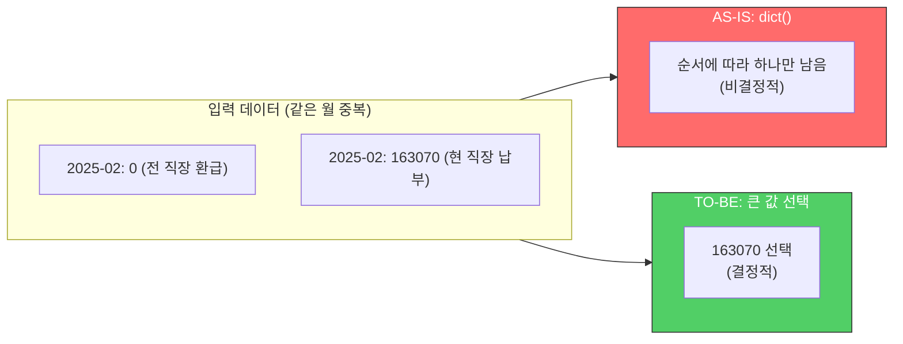

## 문제 발견

대출 심사 시스템에서 건강보험 납부 데이터를 외부 평가 엔진에 전달하는 로직에 버그가 있었다. **같은 신청 건에 대해 심사 경로(가심사/자동심사)에 따라 다른 값이 전달**되고 있었다.

```text
-- 자동심사 (공공 마이데이터)
"HEALTH_INSURANCE": "0,0,0,0,0,0,0,0,-56460,163070,163070,0,0,0,..."

-- 가심사 (제휴 페이 스크래핑)
"HEALTH_INSURANCE": "0,154470,154470,154470,154470,...,163070,163070,..."
```

DB에 저장된 원본 데이터는 동일했다. **전달 로직에서 데이터가 달라지고 있었다.**

---

## 원인 분석

### 버그 1: dict() 변환 시 값 덮어쓰기

```python
payments = dict(
    self.health_insurance_payments.values_list(
        "payment_month", "employee_health_notice_amount",
    )
)
```

이 코드의 문제는 `dict()`에 있다.



`dict()`에 동일 키의 튜플을 전달하면 **나중에 나온 값이 이전 값을 덮어쓴다.** 건강보험 데이터에서는 같은 월(payment_month)에 여러 데이터가 존재할 수 있다:

- 겸직 (두 직장에서 동시 납부)
- 이직 (전 직장 환급 + 현 직장 납부)
- 가심사/자동심사별 별도 데이터

```python
# dict()의 동작
dict([("a", 1), ("a", 2)])  # → {"a": 2}  (1이 사라짐)

# 의도한 동작
# 같은 월에 여러 값이 있으면 큰 값을 선택해야 함
```

### 버그 2: 심사 프로세스 무시

```python
@property
def health_insurance_payments(self):
    return Payment.objects.filter(
        cert__submission__deal_application=self._deal_application,
        payment_month__gte=self.start_year_month,
    )
```

이 쿼리는 **현재 진행 중인 심사 프로세스와 무관하게 모든 제출 데이터를 가져온다.**



가심사와 자동심사의 데이터가 섞여서 QuerySet에 들어오고, `dict()` 변환 시 순서에 따라 어떤 값이 살아남는지가 달라졌다.

---

## 해결

### 수정 1: 최신 제출 데이터만 조회

```python
@property
def health_insurance_submission(self):
    return self.health_insurance_submissions.latest("created")
```

현재 심사 경로에 해당하는 **가장 최신 제출 데이터**에 연결된 Payment만 가져오도록 필터링했다.

### 수정 2: 같은 월 데이터는 큰 값 선택

`dict()` 대신 명시적인 집계 로직을 구현했다.

```python
# AS-IS: dict() - 나중 값이 덮어씀 (비결정적)
payments = dict(queryset.values_list("payment_month", "amount"))

# TO-BE: 같은 월에 여러 값이면 큰 값 선택 (결정적)
result = {}
for month, amount in queryset.values_list("payment_month", "amount"):
    if month not in result or amount > result[month]:
        result[month] = amount
```



**왜 큰 값?** 겸직(두 직장 동시 납부)의 경우 소득이 높은 직장 기준으로 보는 것이 보수적이며, 환급(-금액)보다 실제 납부 금액이 더 의미 있는 데이터이기 때문이다.

---

## 교훈

### 1. dict()로 QuerySet을 변환할 때 키 중복을 확인하라

```python
# 안전하지 않음 - 키가 유니크하다는 보장이 없으면
dict(queryset.values_list("key", "value"))

# 대안 1: 키 유니크성 확인
assert queryset.values("key").distinct().count() == queryset.count()

# 대안 2: 명시적 집계
from collections import defaultdict
grouped = defaultdict(list)
for key, value in queryset.values_list("key", "value"):
    grouped[key].append(value)
```

### 2. ORM 쿼리의 필터링 범위를 의심하라

"이 쿼리가 가져오는 데이터가 정확히 필요한 범위인가?" 이 질문을 항상 하자. 특히 하나의 엔티티(대출 신청)에 여러 컨텍스트(가심사/자동심사)의 데이터가 연결될 수 있는 구조에서는, 현재 컨텍스트에 맞는 필터링이 반드시 필요하다.

### 3. 금융 데이터에서 "비결정적"은 버그다

`dict()` 변환의 결과가 QuerySet 순서에 의존한다는 것은, **같은 입력에 대해 다른 결과가 나올 수 있다**는 뜻이다. 일반적인 앱에서는 큰 문제가 아닐 수 있지만, 대출 심사처럼 결과가 승인/거절에 직결되는 시스템에서 비결정적 동작은 심각한 버그다.
