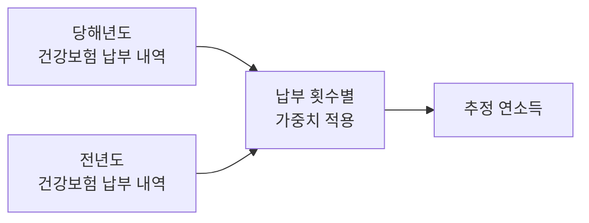
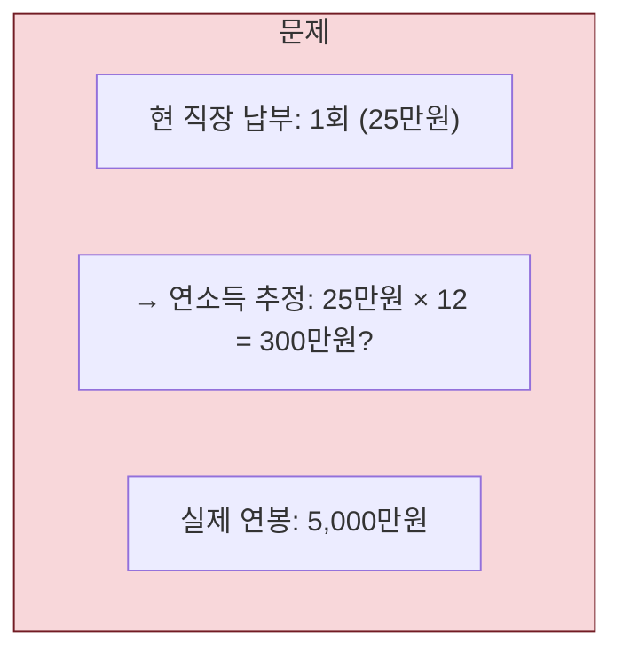
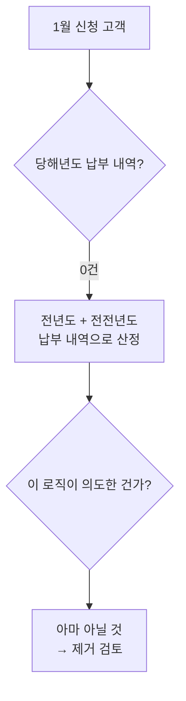
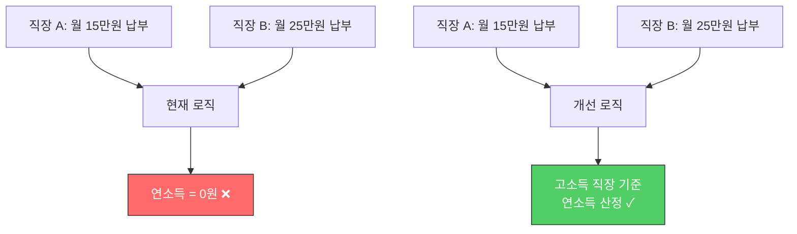
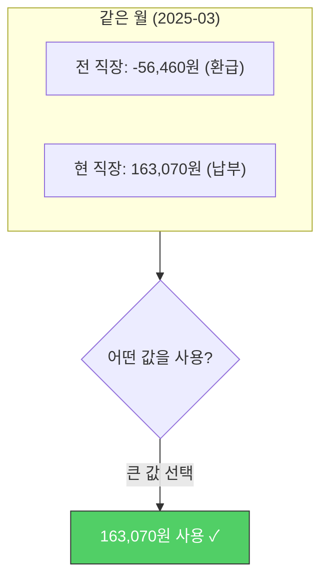
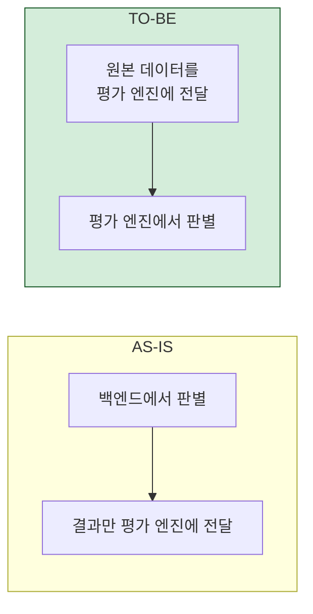
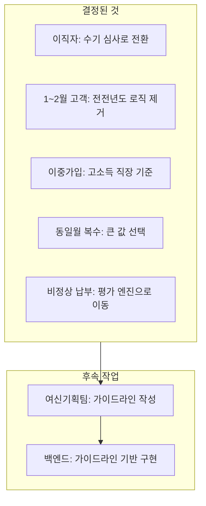

## 배경

대출 심사에서 연소득은 핵심 지표다. 건강보험 납부 데이터로 연소득을 추정하는 로직이 있는데, 현실 세계의 복잡한 상황들이 이 로직을 계속 깨뜨렸다.

여신기획팀, 신용분석팀, 백엔드 엔지니어가 모여서 엣지케이스들을 하나씩 정리한 과정을 기록한다.

---

## 기본 로직

건강보험료는 소득에 비례하므로, 납부 금액에서 역으로 소득을 추정할 수 있다. 당해년도와 전년도 납부 내역을 합산하고, 납부 횟수에 따라 가중치를 부여한다.

단순해 보이지만, 현실에서는 이런 일들이 벌어진다.

---

## 엣지케이스 1: 최근 이직자

**상황**: 2개월 전에 이직한 사람. 현 직장 건강보험료 납부 내역이 1회뿐이다.

1회 납부 금액에 대한 의존도가 과도하다. 또한 전 직장 소득은 전혀 반영되지 않는다.

**결정**: 크게 고려하지 않기로 했다. 이런 케이스는 수기 심사로 돌린다. 모든 예외를 코드로 처리하려 하면 오히려 정상 케이스의 정확도가 떨어진다.

> "모든 것을 자동화하려 하지 말자. 수기 심사로 돌리는 것도 하나의 설계 결정이다."

---

## 엣지케이스 2: 1~2월 유입 고객

**상황**: 1월이나 2월에 대출을 신청한 고객은 당해년도 납부 내역이 0건이다.

전전년도까지 거슬러 올라가는 로직이 있었는데, 이것이 의도된 설계인지 아무도 확신하지 못했다. 여신기획팀 확인 결과: "없어도 될 것 같다."

**결정**: 제거하기로 했다. 불필요한 로직은 유지 비용만 늘린다.

---

## 엣지케이스 3: 건강보험 이중가입자 (겸직)

**상황**: 두 곳에서 동시에 일하는 사람. 건강보험이 이중으로 가입되어 있다.

기존 로직에서는 이중가입자의 연소득이 **0원**으로 산출되고 있었다. 두 건의 납부 데이터가 서로를 상쇄시키는 구조적 버그였다.

**결정**: 고소득 직장 기준으로 산정하기로 했다. 이를 위해 심사 화면에서 건강보험 정보를 변경하고 심사를 재실행하는 기능이 필요하다.

---

## 엣지케이스 4: 동일월 복수 납부 내역

같은 월에 여러 납부 내역이 있는 경우의 우선순위 문제:

이직 시 전 직장 보험료가 환급되면서 마이너스 금액이 발생하고, 동시에 현 직장 보험료가 부과된다. 같은 월에 양수/음수 값이 공존할 때 **큰 값을 선택**하기로 했다.

이 문제는 이전에 발견한 [`dict() 변환 버그`](/posts/python-dict-변환의-함정-금융-데이터-집계-버그/)와 직접 연결된다.

---

## 추가 논의: 코드 위치 변경

비정상 납부 판별 로직(2개월 미납, 환급, 1.2배 초과 납부 등)이 백엔드 코드에 있었는데, 이를 **평가 엔진으로 이동**하기로 결정했다.

비정상 납부 기준은 여신 정책에 따라 자주 바뀐다. 이 로직이 백엔드에 있으면 정책 변경마다 배포가 필요하지만, 평가 엔진에 있으면 엔진 설정만 변경하면 된다.

---

## 최종 정리

---

## 느낀 점

### 비즈니스 규칙은 코드보다 어렵다
`if-else`를 잘 짜는 것보다 "이 경우에 어떻게 해야 하는가?"를 정의하는 것이 더 어렵다. 이직자의 1회 납부 내역을 12배 해서 연소득으로 추정해야 하는가? 이건 코딩 문제가 아니라 비즈니스 판단의 문제다.

### "자동화하지 않는 것"도 설계 결정이다
모든 엣지케이스를 코드로 처리하려는 유혹이 있다. 하지만 발생 빈도가 낮고 판단이 복잡한 케이스는 수기 심사로 돌리는 것이 더 나은 선택일 수 있다. 자동화의 범위를 정하는 것 자체가 설계다.

### 다직종 회의의 가치
엔지니어 혼자서는 "이중가입자의 연소득이 0원"이라는 버그를 발견할 수 없었다. 여신기획팀이 실제 심사 사례를 가져오고, 신용분석팀이 모델 관점을 제시하고, 엔지니어가 구현 가능성을 판단하는 — 이 조합이 있어야 올바른 규칙이 나온다.
