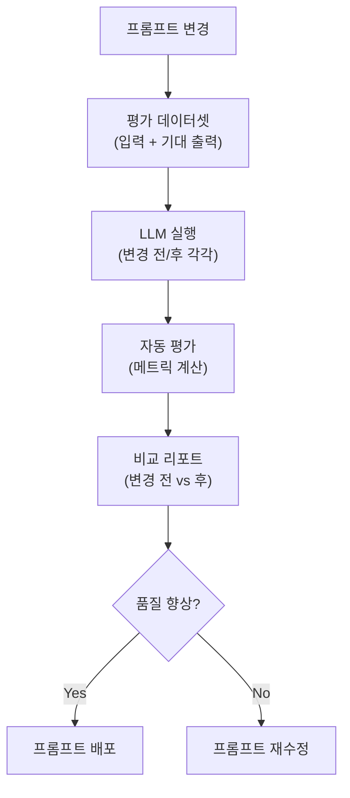
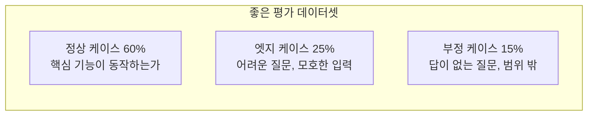
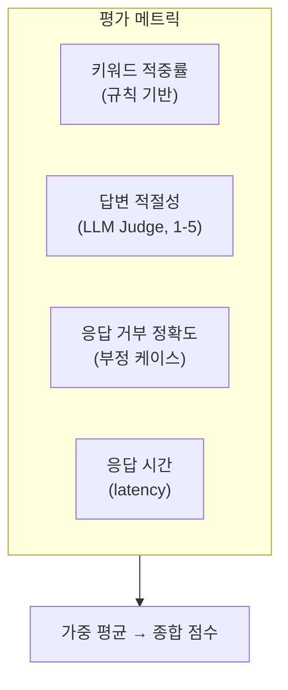
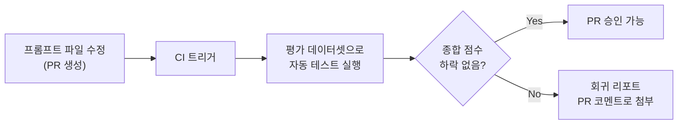

## 문제

프롬프트를 수정할 때마다 "이번 수정이 전체적으로 더 나아졌는가?"를 판단하기 어렵다. 특정 케이스에서 좋아지면 다른 케이스에서 나빠지기도 한다.

전통적인 소프트웨어는 유닛 테스트로 회귀를 잡을 수 있지만, LLM 출력은 비결정적이다. 같은 프롬프트에 같은 입력을 넣어도 다른 출력이 나올 수 있다.

**프롬프트 변경의 품질을 체계적으로 측정하는 파이프라인**이 필요하다.

---

## 평가 파이프라인 아키텍처



---

## 1단계: 평가 데이터셋 구축

평가의 품질은 데이터셋의 품질에 달려있다. "좋은 답변이란 무엇인가?"를 먼저 정의해야 한다.

```python
# 평가 데이터셋 구조
eval_dataset = [
    {
        "input": "DB 마이그레이션 시 락 발생하면 어떻게 대응하나요?",
        "expected_keywords": ["lock_timeout", "저트래픽 시간대", "레플리카"],
        "expected_behavior": "구체적인 SQL 명령어를 포함한 대응 방법 제시",
        "category": "troubleshooting",
        "difficulty": "medium",
    },
    {
        "input": "안녕하세요",
        "expected_behavior": "업무 관련 질문을 안내",
        "category": "off-topic",
        "difficulty": "easy",
    },
    # ... 50-100개
]
```

### 데이터셋 구성 원칙



부정 케이스가 중요하다. "이 질문에는 답하지 말아야 한다"를 테스트하지 않으면, 프롬프트 수정 후 hallucination이 증가해도 알 수 없다.

---

## 2단계: 자동 평가 메트릭

LLM 출력을 자동으로 평가하는 여러 방법이 있다.

### 규칙 기반 메트릭

```python
def evaluate_response(response: str, expected: dict) -> dict:
    scores = {}
    
    # 1. 키워드 포함 여부
    if "expected_keywords" in expected:
        found = sum(1 for kw in expected["expected_keywords"] 
                    if kw.lower() in response.lower())
        scores["keyword_recall"] = found / len(expected["expected_keywords"])
    
    # 2. 응답 길이 적절성
    word_count = len(response.split())
    scores["length_appropriate"] = 1.0 if 50 < word_count < 500 else 0.5
    
    # 3. 출처 포함 여부 (RAG의 경우)
    scores["has_source"] = 1.0 if "[출처:" in response else 0.0
    
    return scores
```

### LLM-as-Judge (LLM으로 LLM 평가)

규칙으로 잡기 어려운 "답변의 질"은 다른 LLM에게 평가를 맡긴다.

```python
def llm_judge(question: str, response: str, criteria: str) -> float:
    judge_prompt = f"""
다음 응답을 1-5점으로 평가하세요.

질문: {question}
응답: {response}

평가 기준: {criteria}

점수만 숫자로 답하세요.
"""
    result = claude.messages.create(
        model="claude-sonnet-4-20250514",
        messages=[{"role": "user", "content": judge_prompt}]
    )
    return float(result.content[0].text.strip())
```

### 메트릭 조합



| 메트릭 | 측정 방법 | 가중치 |
|--------|----------|--------|
| 키워드 적중률 | 기대 키워드 포함 비율 | 0.2 |
| 답변 적절성 | LLM Judge 1-5점 | 0.4 |
| 거부 정확도 | 부정 케이스에서 정확히 거부 | 0.2 |
| 응답 시간 | p95 latency | 0.2 |

---

## 3단계: A/B 비교 리포트

프롬프트 변경 전/후를 동일 데이터셋으로 실행하고 비교한다.

```python
def compare_prompts(prompt_a: str, prompt_b: str, dataset: list) -> dict:
    results_a, results_b = [], []
    
    for case in dataset:
        # 동일 입력에 대해 각 프롬프트로 실행
        resp_a = run_with_prompt(prompt_a, case["input"])
        resp_b = run_with_prompt(prompt_b, case["input"])
        
        # 평가
        score_a = evaluate_response(resp_a, case)
        score_b = evaluate_response(resp_b, case)
        
        results_a.append(score_a)
        results_b.append(score_b)
    
    return {
        "prompt_a_avg": mean([r["total"] for r in results_a]),
        "prompt_b_avg": mean([r["total"] for r in results_b]),
        "improved_cases": count_improved(results_a, results_b),
        "regressed_cases": count_regressed(results_a, results_b),
        "details": zip(dataset, results_a, results_b),
    }
```

### 리포트 예시

```text
=== 프롬프트 A/B 비교 리포트 ===

종합 점수: A=3.42 → B=3.78 (+10.5%)

카테고리별:
  troubleshooting: 3.5 → 4.1 (+17.1%) ✓
  how-to:          3.8 → 3.9 (+2.6%)  ✓
  off-topic:       2.9 → 2.7 (-6.9%)  ✗ ← 회귀 발생

회귀 케이스 (2건):
  [off-topic] "오늘 날씨 어때?" → 거부해야 하는데 답변함
  [off-topic] "점심 뭐 먹지?" → 거부해야 하는데 답변함

결론: off-topic 거부 로직 보강 후 배포 권장
```

---

## 4단계: CI에 통합

프롬프트 파일이 변경되면 자동으로 평가 파이프라인이 실행되도록 한다.



프롬프트도 코드다. 코드에 테스트가 있듯이, 프롬프트에도 테스트가 있어야 한다.

---

## 느낀 점

### 프롬프트 엔지니어링은 실험 과학이다
"이 프롬프트가 더 좋을 것 같다"는 직감은 대부분 틀린다. 평가 데이터셋으로 측정해보면 예상과 다른 결과가 나오는 경우가 많다. 측정 없는 프롬프트 수정은 도박이다.

### LLM-as-Judge는 놀랍도록 잘 작동한다
LLM에게 "이 답변이 좋은가?"를 판단하게 하는 것이 비합리적으로 느껴질 수 있지만, 실제로 사람의 판단과 높은 상관관계를 보인다. 특히 평가 기준을 명확히 제시할 때 더 정확하다.

### 부정 케이스가 프롬프트의 진짜 품질을 결정한다
"잘 답변하는가"보다 "답변하지 말아야 할 때 거부하는가"가 프로덕션에서 더 중요하다. Hallucination은 잘못된 답변보다 해로울 수 있다.

### 평가 파이프라인은 처음에 투자할 가치가 있다
프롬프트 1-2개일 때는 사람이 눈으로 확인해도 된다. 하지만 프롬프트가 10개를 넘어가고, 각각 여러 케이스를 처리해야 하면 자동화 없이는 불가능하다. 일찍 투자할수록 이후의 반복 비용이 줄어든다.
