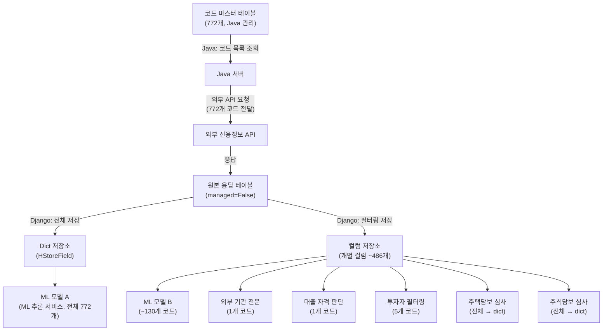
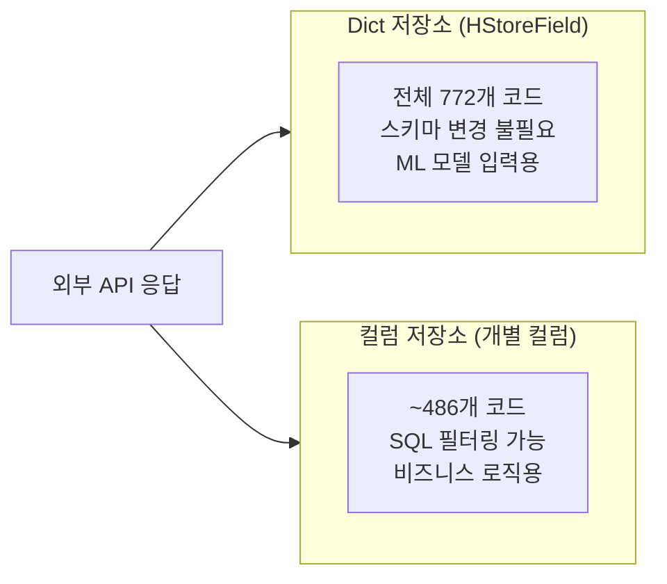
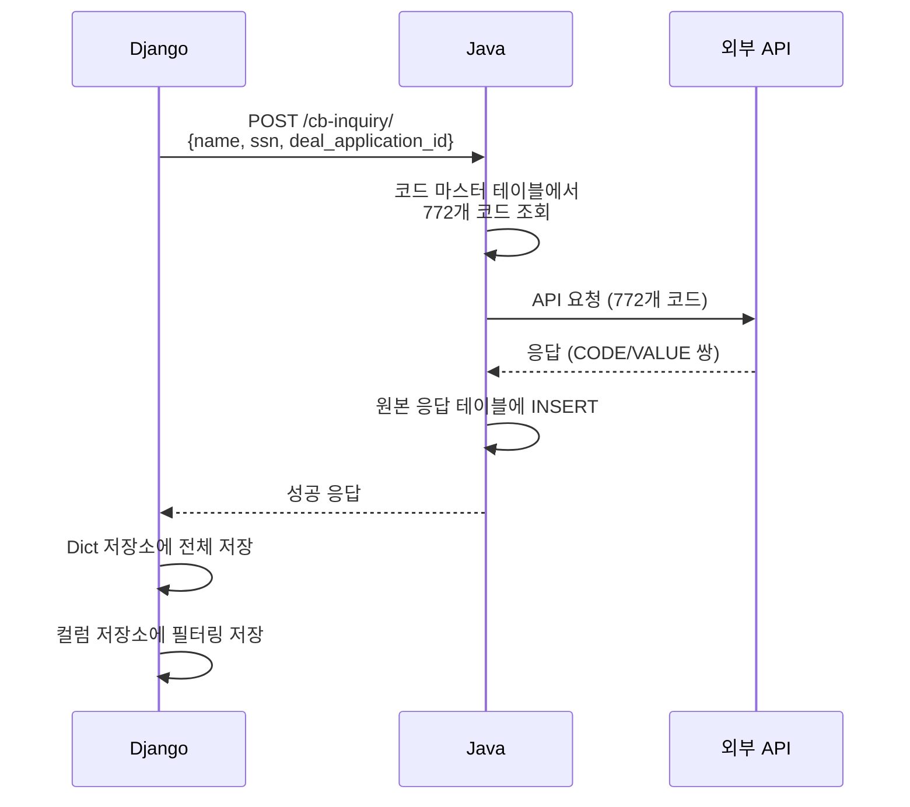
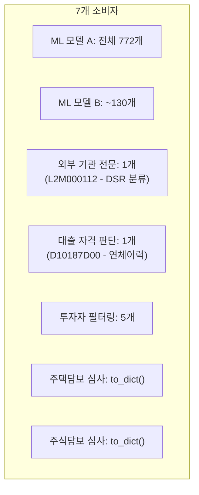
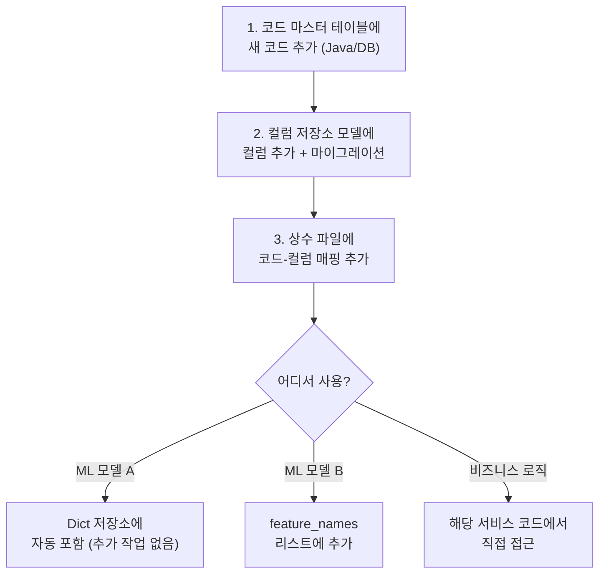

## 배경

신용평가에 사용되는 신용 프로파일 데이터는 외부 신용정보 기관의 API를 통해 조회한다. 772개의 코드를 요청하면 각 코드에 대한 응답값이 돌아오고, 이 데이터가 시스템 내 **7개의 서로 다른 소비자**에게 전달된다.

문제는 이 파이프라인이 **Python(Django)과 Java 두 언어에 걸쳐 있고**, 소비자마다 필요한 데이터 형태가 다르다는 것이다.

---

## 전체 데이터 흐름



---

## 핵심 설계 결정: 왜 두 가지 저장 방식인가

같은 데이터를 **두 가지 다른 형태**로 저장한다:

### 저장소 1: HStoreField (Dict 형태)

```python
class CpsDataDict(models.Model):
    data = HStoreField()  # {"CODE_001": "1234", "CODE_002": "5678", ...}
```

| 장점 | 단점 |
|------|------|
| 772개 코드를 한 번에 저장/조회 | 개별 코드로 필터링 어려움 |
| 스키마 변경 없이 코드 추가 가능 | 타입 안전성 없음 (모든 값이 문자열) |
| ML 모델에 통째로 전달하기 좋음 | SQL WHERE 조건 사용 불편 |

### 저장소 2: 개별 컬럼

```python
class CpsDataColumns(models.Model):
    d10187d00 = models.CharField(...)  # 연체이력
    l2m000112 = models.CharField(...)  # DSR 분류
    # ... ~486개 컬럼
```

| 장점 | 단점 |
|------|------|
| 개별 코드로 WHERE 가능 | 코드 추가 시 마이그레이션 필요 |
| 타입 체크 가능 | 컬럼 수가 매우 많음 |
| Django ORM과 자연스럽게 사용 | 전체를 dict로 변환하려면 추가 로직 필요 |



**왜 둘 다 필요한가?** 소비자마다 데이터 접근 패턴이 다르기 때문이다:

- **ML 모델**: "772개 코드를 통째로 줘" → Dict 저장소
- **비즈니스 로직**: "연체이력 코드가 특정 값인 건만 찾아줘" → 컬럼 저장소

---

## 크로스 언어 경계 관리



### 중간 테이블: managed=False

Java가 원본 응답을 저장하는 테이블은 Django에서 `managed=False`로 선언한다.

```python
class ExternalCreditRaw(models.Model):
    class Meta:
        managed = False  # Django가 이 테이블의 스키마를 관리하지 않음
        db_table = 'external_credit_raw'
```

이렇게 하면:
- **Java**: 테이블 구조를 관리하고, 데이터를 INSERT
- **Django**: 테이블 구조는 건드리지 않고, SELECT만 수행

두 언어가 같은 테이블을 공유하되, 소유권은 명확히 나뉜다.

---

## 7개 소비자의 데이터 사용 패턴



| 소비자 | 사용 코드 수 | 접근 방식 | 저장소 |
|--------|-------------|----------|--------|
| ML 모델 A (ML 추론 서비스) | 전체 772개 | 통째로 전달 | Dict |
| ML 모델 B | ~130개 | feature_names 리스트로 필터 | 컬럼 |
| 외부 기관 전문 | 1개 | 특정 코드 직접 접근 | 컬럼 |
| 대출 자격 판단 | 1개 | 특정 코드 직접 접근 | 컬럼 |
| 투자자 필터링 | 5개 | 특정 코드들 접근 | 컬럼 |
| 주택담보 심사 | 전체 | to_dict() 변환 | 컬럼 |
| 주식담보 심사 | 전체 | to_dict() 변환 | 컬럼 |

---

## 새 코드 추가 시 체크리스트

시스템이 복잡해지면 "이걸 추가하려면 어디를 고쳐야 하지?"가 가장 큰 고통이다. 그래서 코드 추가 절차를 체크리스트로 문서화했다.



---

## 느낀 점

### 같은 데이터의 "두 가지 뷰"가 필요할 때
하나의 원본 데이터를 소비자 패턴에 맞게 변환하여 저장하는 것은 정규화 원칙에 어긋나 보이지만, 실용적인 선택이었다. ML 모델에게는 dict를, 비즈니스 로직에게는 컬럼을 제공함으로써 각 소비자가 자연스러운 방식으로 데이터에 접근할 수 있다.

### managed=False는 크로스 언어 경계의 좋은 도구
Django와 Java가 같은 DB를 공유할 때, `managed=False`로 소유권을 명확히 하면 마이그레이션 충돌 없이 협업할 수 있다. "이 테이블은 Java 것이고, Django는 읽기만 한다"는 계약.

### 체크리스트는 복잡한 시스템의 생존 도구
코드 추가 하나에 4개 파일을 수정해야 하는 시스템에서, 체크리스트 없이는 반드시 하나를 빠뜨린다. 문서화의 ROI가 가장 높은 곳은 이런 "여러 곳을 동시에 바꿔야 하는" 절차다.
