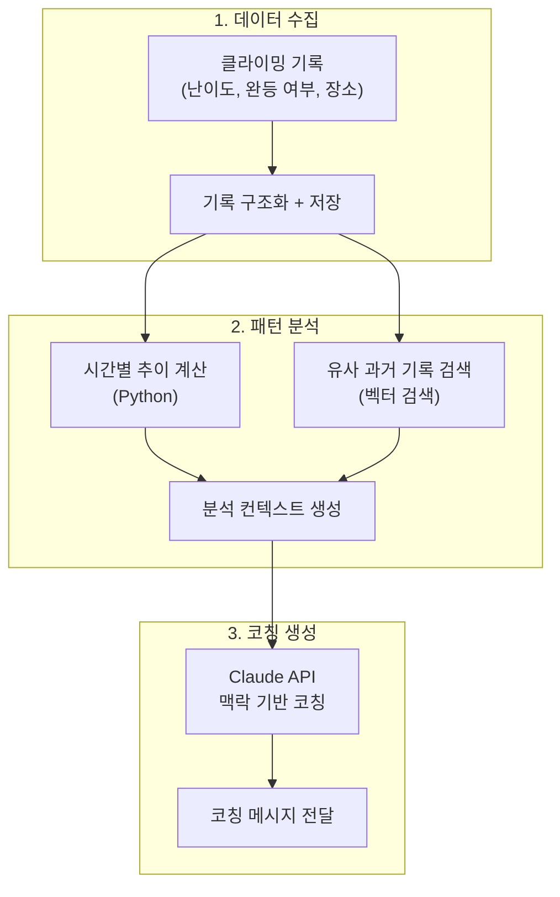
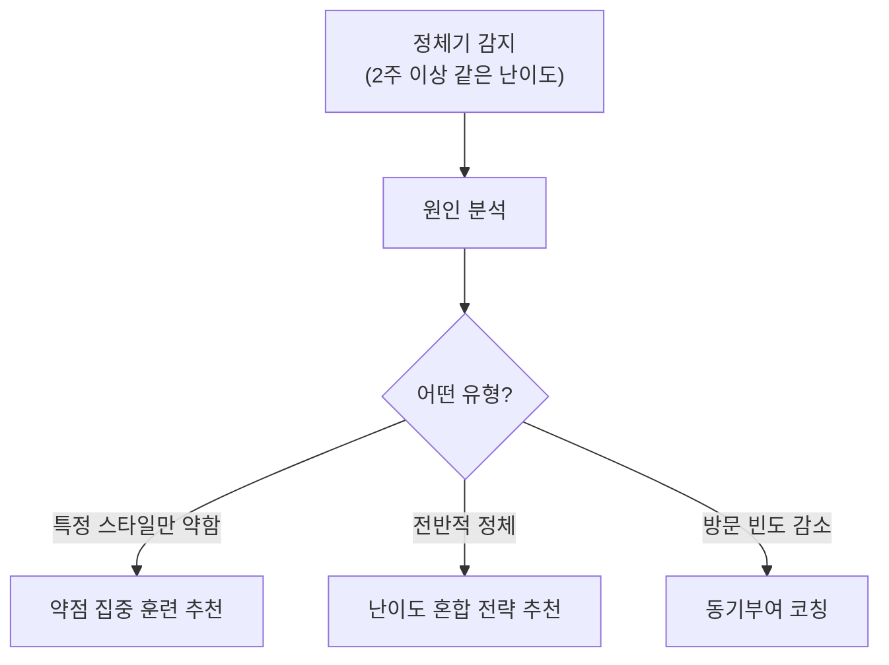
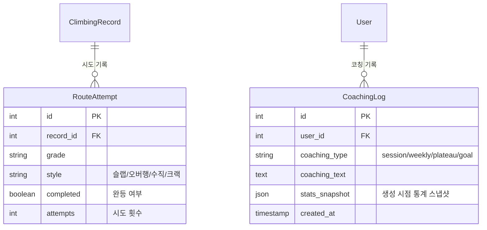

## 배경

예전에 설계만 해두고 구현하지 못했던 클라이밍 SNS 앱(CliInfo)이 있다. 최근 LifeRPG를 만들면서 "자연어 파싱 → 맥락 코칭" 패턴을 구현했는데, 문득 이 패턴을 클라이밍 앱에 붙이면 꽤 재미있겠다는 생각이 들었다.

클라이밍 기록이 쌓이면 "다음에 뭘 해야 성장할 수 있는가?"를 AI가 분석해주는 코칭 시스템. 아직 구현하지는 않았지만, 설계를 구체화해봤다.

---

## 문제: 클라이밍의 성장은 "보이지 않는다"

클라이밍은 성장이 비선형적이다:

- 초보자는 빠르게 난이도가 올라가지만, 중급부터 **정체기**가 길다
- 같은 난이도라도 슬랩/오버행/크랙 등 **스타일별 실력 차이**가 크다
- "열심히 하고 있는데 늘지 않는 것 같다"는 착각이 동기를 죽인다

단순히 "이번 달 빨강 10개 클리어"만으로는 성장을 체감할 수 없다. **어떤 유형을 잘하고, 어디가 약하고, 다음에 뭘 해야 하는지**를 알려주는 코칭이 필요하다.

---

## 아키텍처: 3단계 코칭 파이프라인



### LLM 호출 경계

LifeRPG에서 확립한 원칙을 그대로 적용한다: **확실한 것은 코드로, 판단이 필요한 것은 LLM으로.**

| 처리 | 방식 | 이유 |
|------|------|------|
| 주간 완등 수 집계 | **코드** | 단순 SQL 집계 |
| 난이도별 완등률 계산 | **코드** | 공식이 정해져 있음 |
| 정체기 감지 | **코드** | 2주 이상 같은 난이도에 머물면 정체 |
| 약점 분석 코칭 | **LLM** | "슬랩은 잘하는데 오버행이 약하다"는 해석이 필요 |
| 다음 목표 추천 | **LLM** | 현재 수준 + 취약점을 종합한 판단 필요 |
| 동기부여 메시지 | **LLM** | 매번 다른 자연스러운 표현 |

---

## 코칭 타입 4가지

### 1. 세션 코칭 — "오늘 얼마나 잘했나?"

클라이밍 후 기록을 남기면 즉시 피드백:

```text
📊 오늘의 클라이밍 요약
성수 클라이밍파크 | 2시간 30분

완등: 빨강 3 / 파랑 5 / 초록 2
실패: 빨강 2 (시도 5 중)

💬 "빨강 완등률이 60%로 지난주(40%) 대비 올라갔어.
    특히 오버행 빨강을 처음 클리어했는데, 
    2주 전에 실패했던 루트랑 비슷한 홀드 배치야. 확실히 늘었다."
```

### 2. 주간 코칭 — "이번 주 전체를 보면?"

```text
📈 이번 주 성장 리포트

방문: 3회 (성수 2, 강남 1)
총 완등: 28개 (지난주 대비 +5)

난이도 분포:
  초록 ████████░░  80% 완등률
  파랑 ██████░░░░  60% 완등률  ← 안정권
  빨강 ███░░░░░░░  30% 완등률  ← 도전 중

💬 "파랑이 60%로 안정권에 들어왔어. 
    이제 빨강에 더 시간을 투자할 타이밍이야.
    특히 빨강 중에서도 슬랩 루트를 집중적으로 해보는 건 어때?
    네 초록/파랑 기록을 보면 슬랩 성향이 강한데, 
    빨강 슬랩부터 공략하면 자연스럽게 올라갈 거야."
```

### 3. 정체기 코칭 — "왜 안 느는 것 같지?"



```text
💬 "3주째 파랑에서 머물고 있는데, 기록을 보면 원인이 보여.
    파랑 실패 기록 8개 중 6개가 오버행이야.
    슬랩/수직벽은 거의 다 클리어하는데, 오버행에서 막히고 있어.
    
    제안: 이번 주는 초록 오버행을 10개 이상 풀어봐.
    쉬운 난이도에서 오버행 자세를 잡으면, 
    파랑 오버행도 자연스럽게 클리어될 거야."
```

### 4. 목표 코칭 — "빨강 클리어까지 얼마나 남았나?"

```text
🎯 목표: 빨강 첫 완등

현재 상태:
  빨강 시도 12회, 완등 0회
  파랑 완등률 65% (안정권 진입)

예상 달성 시기: 3~4주 후
근거: 파랑 완등률이 70%를 넘으면 빨강 첫 완등이 나오는 패턴이 있음

💬 "파랑을 좀 더 다져야 해. 65%면 거의 다 왔어.
    이번 주 파랑 10개 이상 시도하면 70% 넘길 수 있을 거야.
    그러면 빨강도 슬슬 풀리기 시작할 거야."
```

---

## 프롬프트 설계

코칭 품질은 프롬프트에 달려있다. 핵심은 **정량 데이터를 먼저 계산하고, 해석만 LLM에게 맡기는 것**이다.

```python
def generate_coaching(user_id: int, coaching_type: str) -> str:
    # 1. 정량 데이터 계산 (코드)
    stats = calculate_stats(user_id)  # 난이도별 완등률, 추이, 스타일 분포
    recent = get_recent_records(user_id, days=14)
    plateau = detect_plateau(user_id)  # 정체기 여부
    
    # 2. 프롬프트 구성
    prompt = f"""너는 경험 많은 클라이밍 코치야.

사용자 현재 상태:
- 주력 난이도: {stats['main_grade']}
- 난이도별 완등률: {stats['grade_completion']}
- 최근 2주 방문 횟수: {stats['visit_count']}
- 스타일별 성적: 슬랩 {stats['slab_rate']}%, 오버행 {stats['overhang_rate']}%, 수직 {stats['vertical_rate']}%
- 정체기 여부: {plateau['is_plateau']} ({plateau['duration']}일째)

최근 기록:
{format_records(recent)}

코칭 규칙:
1. 숫자를 근거로 말해 (체감이 아니라 데이터 기반)
2. 칭찬과 개선점을 균형있게
3. 구체적인 다음 행동을 제안 (추상적 조언 금지)
4. 3-4문장으로 짧게
5. 반말, 친근한 톤"""
    
    response = claude.messages.create(
        model="claude-sonnet-4-20250514",
        messages=[{"role": "user", "content": prompt}]
    )
    return response.content[0].text
```

### 프롬프트에서 중요한 것

- **정량 데이터를 미리 계산**: LLM에게 "기록을 분석해줘"가 아니라 "이 수치를 해석해줘"
- **구체적 행동 제안 강제**: "더 열심히 하세요" 같은 코칭은 무의미
- **톤 지정**: 클라이밍 커뮤니티는 반말 + 친근한 톤이 자연스러움

---

## 데이터 모델 확장

기존 CliInfo 스키마에 코칭용 필드 추가:



`stats_snapshot`에 코칭 생성 시점의 통계를 JSON으로 저장한다. 나중에 "2달 전 코칭과 지금을 비교"할 때 유용하다.

---

## LifeRPG 패턴의 재사용

이 설계에서 LifeRPG의 패턴이 그대로 재사용된 부분:

| LifeRPG 패턴 | 클라이밍 코칭 적용 |
|-------------|-----------------|
| LLM 호출 3곳 제한 | 집계는 코드, 해석만 LLM |
| 파싱 결과 캐싱 | 통계 스냅샷 저장 |
| 맥락 있는 피드백 | 과거 기록 대비 성장/정체 분석 |
| 준비도 시스템 | 목표 달성까지 예상 기간 계산 |

같은 AI 패턴이 "개인 성장 에이전트" → "클라이밍 코칭"으로 도메인만 바뀌어 적용될 수 있다. **패턴이 재사용 가능하다는 것은 설계가 올바르다는 신호**라고 생각한다.

---

## 느낀 점

### 과거 프로젝트를 AI 관점에서 다시 보면 새로운 가능성이 보인다
당시에는 "기록 + SNS"로만 생각했던 앱이, LLM을 얹으면 "AI 코치"가 된다. 기술 환경이 바뀌면 예전에 포기했던 아이디어도 다시 살아날 수 있다.

### 도메인 지식이 AI 코칭의 품질을 결정할 것이다
"오버행이 약하다"를 알려면 클라이밍을 이해해야 한다. LLM은 범용 지식이 있지만, 클라이밍의 구체적 맥락(슬랩 vs 오버행, 난이도 체계, 정체기 패턴)은 프롬프트에 명시적으로 제공해야 한다.

### 같은 패턴을 다른 도메인에 적용하는 것이 가장 빠른 학습이다
LifeRPG에서 만든 "파싱 → 분석 → 코칭" 패턴을 클라이밍에 적용해보니 설계가 빠르게 나왔다. 실제로 구현까지 해볼 가치가 있는 방향이라고 생각한다.
