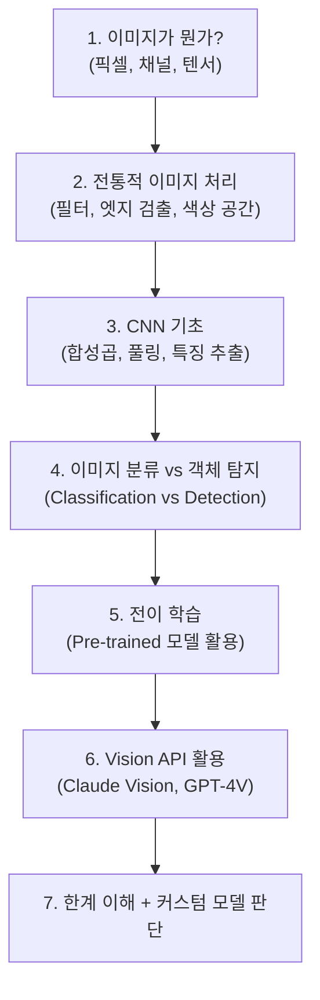
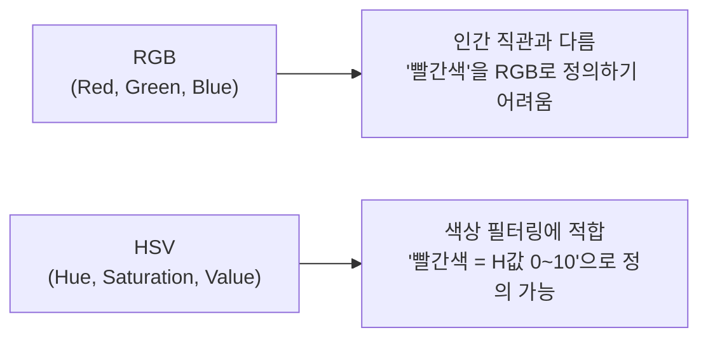
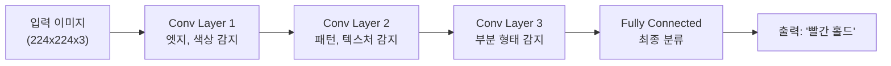
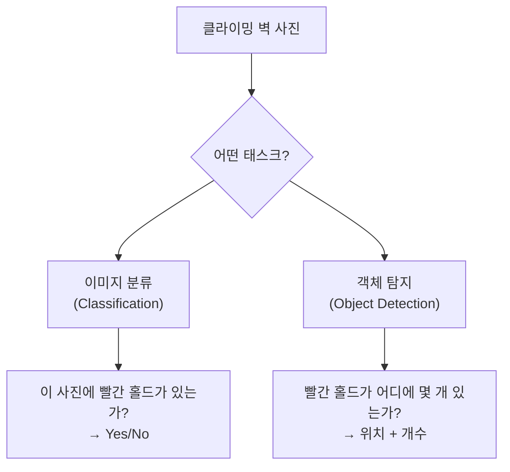
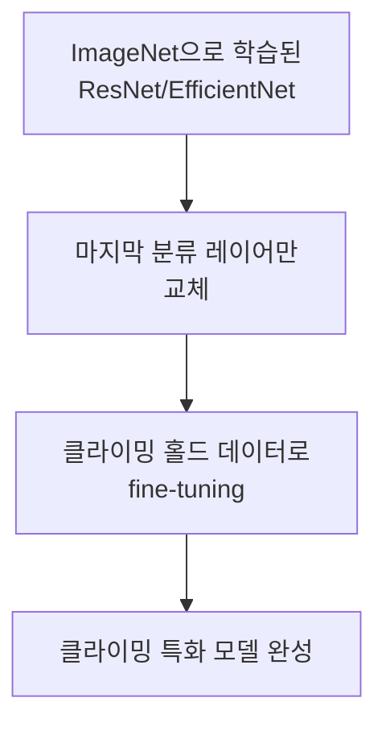
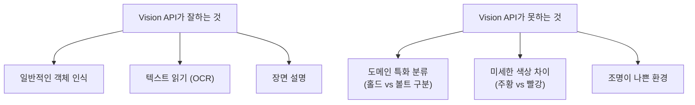

## 왜 CV를 공부해야 할까

예전에 만들다 만 클라이밍 앱에 AI를 붙이면 뭘 할 수 있을까 고민하다 보니, "사진에서 홀드 색상을 자동 인식"이라는 아이디어가 나왔다. 그런데 나는 백엔드 엔지니어지 ML 엔지니어가 아니다. Vision API를 그냥 호출하면 되는 거 아닌가? 싶지만, 기초를 모르면 왜 실패하는지도 모르고 프롬프트도 제대로 못 쓸 것 같다.

CV를 "전문가 수준으로" 배울 생각은 없다. **Vision API를 제대로 쓰기 위한 최소한의 기초**가 뭔지 정리해봤다. 이 로드맵대로 공부하면 약 16시간이면 될 것 같다.

---

## 학습 로드맵



전체를 깊게 파는 게 아니라, **각 단계에서 "이것이 왜 필요한지"만 이해하고 다음으로 넘어가는** 방식으로 학습했다.

---

## 1단계: 이미지의 본질 — 픽셀과 텐서

컴퓨터에게 이미지는 **숫자 배열(텐서)**이다.

```text
흑백 이미지 (3x3):     컬러 이미지 (3x3):
┌─────────────┐        ┌─────────────────────┐
│ 0   128  255 │        │ R채널 │ G채널 │ B채널 │
│ 64  192   32 │        │ (3x3) │ (3x3) │ (3x3) │
│ 128  96  160 │        └─────────────────────┘
└─────────────┘         → shape: (3, 3, 3)
→ shape: (3, 3)
```

- 각 픽셀은 0-255 사이의 정수
- 컬러 이미지는 RGB 3개 채널 → (높이, 너비, 3)의 3차원 텐서
- **4000x3000 사진 = 3600만 개의 숫자** → 이걸 그대로 LLM에 넣으면 비용이 폭발

핵심 인사이트: **이미지를 리사이즈하는 것은 비용 최적화의 기본이다.** Vision API에 원본을 그대로 보내면 토큰 수가 불필요하게 많아진다.

---

## 2단계: 전통적 이미지 처리 — 색상 공간

클라이밍 홀드 색상을 인식하려면 **색상 공간(Color Space)**을 이해해야 한다.



| 색상 공간 | 장점 | 클라이밍 적용 |
|----------|------|-------------|
| **RGB** | 표준, 입력/출력 기본 | 화면에 표시할 때 |
| **HSV** | 색상(H)으로 필터링 쉬움 | 홀드 색상 분류할 때 |
| **LAB** | 조명 변화에 강건 | 어두운 클라이밍장에서 |

```python
import cv2
import numpy as np

# 이미지 읽기 + HSV 변환
img = cv2.imread('climbing_wall.jpg')
hsv = cv2.cvtColor(img, cv2.COLOR_BGR2HSV)

# 빨간색 홀드 필터링 (HSV 범위)
lower_red = np.array([0, 100, 100])
upper_red = np.array([10, 255, 255])
mask = cv2.inRange(hsv, lower_red, upper_red)

# 빨간색 영역의 픽셀 수
red_pixels = cv2.countNonZero(mask)
```

이 정도만 알아도 "Vision API가 색상을 왜 틀렸는지" 디버깅할 수 있다. 조명이 어두우면 HSV의 V(밝기)가 낮아져서 색상 판별이 어려워진다는 것을 이해할 수 있다.

---

## 3단계: CNN 기초 — 왜 신경망이 이미지를 잘 인식하는가



CNN(Convolutional Neural Network)의 핵심:

- **합성곱(Convolution)**: 작은 필터를 이미지 위에서 슬라이딩하며 특징 추출
- **계층적 특징 학습**: 저수준(엣지) → 중수준(패턴) → 고수준(객체)
- **풀링(Pooling)**: 공간 크기를 줄여 계산 효율화

**왜 이걸 알아야 하는가?** Vision API가 내부적으로 이런 구조를 사용한다. "왜 비슷한 색상을 혼동하는지", "왜 작은 홀드를 놓치는지"를 이해하려면 CNN이 어떻게 동작하는지 감을 잡아야 한다.

---

## 4단계: 이미지 분류 vs 객체 탐지

클라이밍 벽 사진 분석에는 두 가지 접근이 가능하다:



| 태스크 | 출력 | 클라이밍 활용 |
|--------|------|-------------|
| **분류** | "이 사진은 빨강 루트" | 단순, 정확도 높음, 루트 한 개만 판별 |
| **탐지** | "빨강 홀드 8개, 위치 (x,y)" | 복잡, 여러 루트 동시 판별 |
| **세그멘테이션** | "이 픽셀은 빨강 홀드" | 가장 정확, 가장 복잡 |

MVP에서는 **분류 수준**으로 충분하다. "이 사진에 어떤 색상의 루트가 있는가?"만 판별하면 된다. Vision API가 이 정도는 해준다.

---

## 5단계: 전이 학습 — 커스텀 모델이 필요할 때

Vision API의 한계가 명확해지면 커스텀 모델이 필요하다. 이때 **처음부터 학습하는 게 아니라 전이 학습(Transfer Learning)**을 사용한다.



```python
import torch
from torchvision import models

# Pre-trained ResNet 로드
model = models.resnet50(pretrained=True)

# 마지막 레이어만 교체 (1000개 클래스 → 8개 홀드 색상)
model.fc = torch.nn.Linear(model.fc.in_features, 8)

# 기존 레이어는 동결, 마지막만 학습
for param in model.parameters():
    param.requires_grad = False
model.fc.requires_grad_(True)
```

전이 학습이면 **수백 장의 이미지로도 쓸만한 모델**을 만들 수 있다. 수만 장이 필요한 처음부터 학습과는 비교할 수 없는 효율이다.

### 학습 데이터 확보 전략

커스텀 모델을 만들려면 데이터가 필요하다:

| 전략 | 데이터 양 | 현실성 |
|------|---------|--------|
| 직접 촬영 + 라벨링 | 수백 장 가능 | 노동 집약적 |
| 앱 사용자의 수정 데이터 | 앱이 있어야 함 | **가장 이상적** |
| 크라우드소싱 | 커뮤니티 필요 | 장기적 |

**앱의 "제안 + 사용자 수정" 플로우가 자연스럽게 학습 데이터를 생성한다.** Vision API가 "빨강 3개"라고 제안하고 사용자가 "빨강 2개, 주황 1개"로 수정하면, 이 수정이 곧 라벨링 데이터가 된다.

---

## 6단계: Vision API 활용 — 실무에서의 선택

위의 기초를 이해한 상태에서 Vision API를 보면, 이것이 어떤 것을 잘하고 못하는지 판단할 수 있다.



**기초를 알면 프롬프트가 달라진다:**

```text
❌ (기초 없이): "이 사진에서 색상을 분석해줘"

✅ (기초 있으면): "이 볼더링 벽 사진에서 홀드를 분석해줘.
   주의: 홀드와 볼트(회색 육각 나사)를 구분할 것.
   조명이 어두우므로 채도가 낮은 색상도 고려할 것.
   테이프 마킹은 홀드 색상이 아닌 루트 구분용임."
```

CNN이 어떻게 색상을 인식하는지 알면, "조명이 어두우면 채도가 낮아진다"는 것을 프롬프트에 명시할 수 있다.

---

## 학습 계획 정리

공부할 순서와 자료를 정리해봤다:

| 순서 | 주제 | 자료 | 예상 시간 |
|------|------|------|----------|
| 1 | 이미지 기초 | OpenCV 공식 튜토리얼 (Python) | 3시간 |
| 2 | 색상 공간 | OpenCV HSV 필터링 실습 | 2시간 |
| 3 | CNN 개념 | 3Blue1Brown "Neural Networks" 시리즈 | 2시간 |
| 4 | CNN 실습 | PyTorch 공식 튜토리얼 (이미지 분류) | 4시간 |
| 5 | 전이 학습 | PyTorch Transfer Learning 튜토리얼 | 3시간 |
| 6 | Vision API | Claude/GPT-4V 문서 + 실험 | 2시간 |
| **합계** | | | **~16시간** |

**16시간이면 "Vision API를 제대로 쓸 수 있는 수준"에 도달할 수 있을 것 같다.** CV 전문가가 아니라, API 사용자로서 올바른 판단을 내릴 수 있는 수준이 목표다.

---

## 이 로드맵을 정리하면서 느낀 것

### 기초를 모르면 API도 제대로 못 쓸 것이다
Vision API는 블랙박스다. 하지만 내부에서 뭘 하는지 대략적으로 이해하면, 왜 실패하는지 진단하고 프롬프트로 보완할 수 있을 것이다. "그냥 API 호출하면 되지"라는 태도로는 80%의 정확도에서 멈출 게 뻔하다.

### 백엔드 엔지니어에게 ML 기초는 투자 가치가 있다
ML 전문가가 될 필요는 없다. 하지만 CNN이 뭔지, 전이 학습이 뭔지 정도는 알아야 "이 문제에 커스텀 모델이 필요한가, API로 충분한가"를 판단할 수 있다. 이 판단 능력이 없으면 매번 ML 엔지니어에게 물어봐야 한다.

### 실용적 목표가 학습 효율을 결정한다
"CV를 공부하자"는 끝이 없다. "클라이밍 홀드 색상을 Vision API로 인식하고 싶다"는 목표가 있으면 뭘 공부해야 하는지가 명확해진다. 목표 없는 학습은 시간 낭비고, 목표 있는 학습은 16시간이면 문을 열 수 있다.
