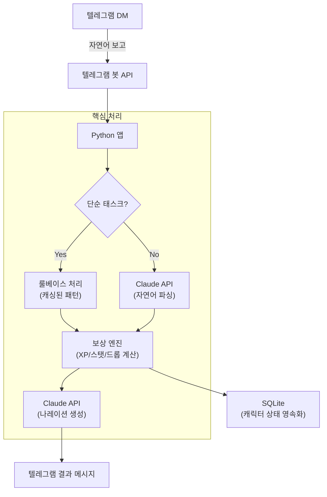
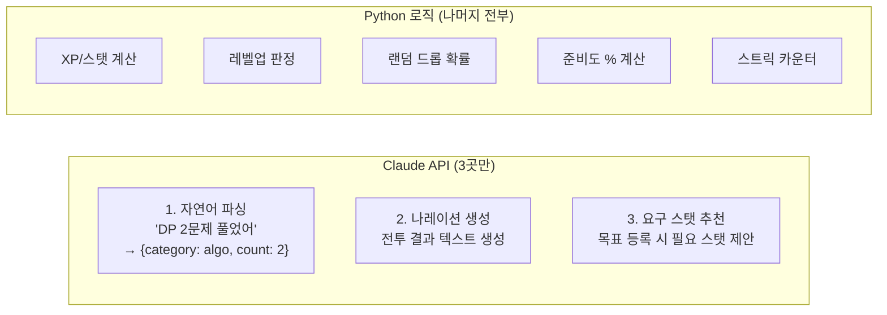
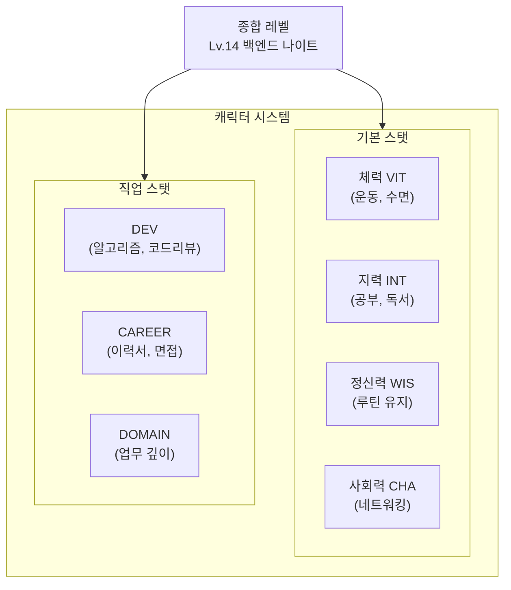
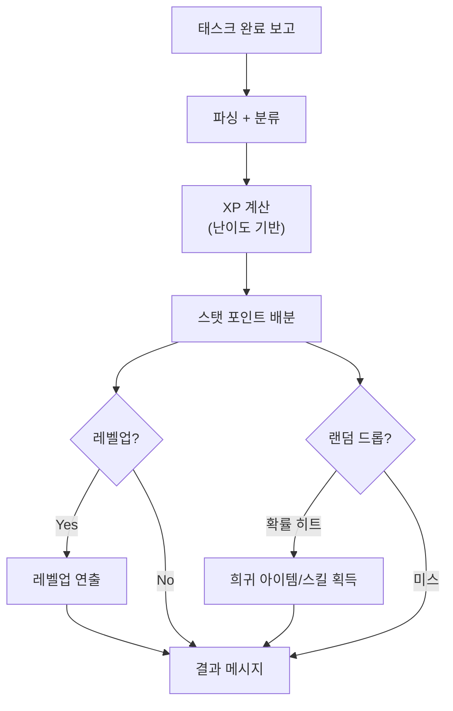
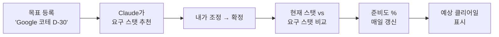
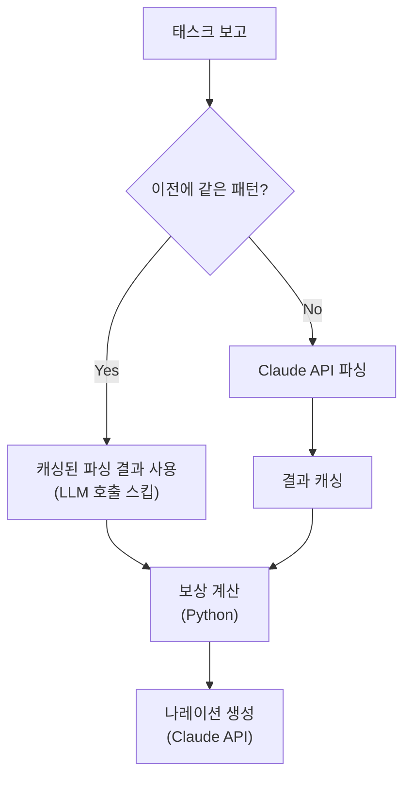
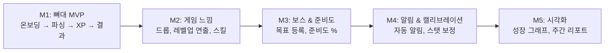

## 프로젝트 소개

LifeRPG는 현실의 자기 성장을 방치형 RPG처럼 느끼게 해주는 개인 성장 에이전트다. 텔레그램으로 "오늘 알고리즘 2문제 풀었어"라고 보고하면, Claude가 맥락을 이해하고 RPG식 전투 결과 + 스탯 변화 + 랜덤 드롭을 돌려준다.

```text
나: 오늘 NeetCode DP 2문제 풀었어

⚔️  [전투 결과]
메모리 릭 슬라임 x2 처치!

DEV  +4  |  INT  +2  |  경험치 +120
🎲 드롭: [희귀] '재귀 검' — DP 패턴을 꿰뚫는 자에게만

━━━━━━━━━━━━━━━━━━━━━
Lv.14 백엔드 나이트
████████░░  80%  (다음 레벨까지 24 xp)
```

기존 습관 앱(Habitica 등)과의 차이점:
- **수동 체크박스가 아니라 자연어 보고** → Claude가 파싱
- **고정 세계관이 아니라 내 직업 기반 세계관** → "백엔드 개발자"면 레거시 코드 골렘을 처치
- **단순 +XP가 아니라 맥락 있는 피드백** → "3일 연속 DP네, 슬슬 고급 패턴 보일 때다"

---

## 아키텍처



### 핵심 설계 결정: LLM 호출을 3곳으로 제한

Claude API 호출은 비용이 든다. 매번 호출하면 API 비용이 빠르게 증가하고, 응답 시간도 느려진다. 그래서 **LLM이 반드시 필요한 3곳에만 호출**하고, 나머지는 Python 로직으로 처리한다.



| 처리 영역 | 방식 | 이유 |
|----------|------|------|
| 자연어 파싱 | **LLM** | "DP 2문제"를 구조화하려면 자연어 이해가 필요 |
| XP/스탯 계산 | **코드** | 공식이 정해져 있으므로 결정론적 처리 |
| 나레이션 생성 | **LLM** | 매번 다른 재미있는 텍스트를 만들어야 함 |
| 레벨업/드롭 | **코드** | 확률 계산은 정확해야 함 |
| 요구 스탯 추천 | **LLM** | "구글 코테 D-30"에 필요한 스탯은 LLM이 추론 |
| 준비도 계산 | **코드** | 현재 스탯 vs 요구 스탯 갭은 단순 산술 |

이 원칙은 사내에서 진행한 파라미터 변경 자동화 Agent에서도 동일하게 적용했다. **확실한 것은 코드로, 판단이 필요한 것은 LLM으로.**

---

## 캐릭터 시스템: 2중 레벨 구조



종합 레벨과 스탯별 개별 레벨이 동시에 존재한다. RPG에서 "전사 Lv.50인데 마법 스탯은 Lv.3"인 것처럼, "종합 Lv.14인데 DEV는 Lv.20이고 CHA는 Lv.5"가 가능하다.

---

## 보상 엔진: 즉각적 도파민



단순히 "+10 XP"만 주는 것이 아니라:

- **난이도 기반 XP**: "DP 문제"는 "물 마시기"보다 높은 XP
- **스트릭 보너스**: 연속 일수에 따라 보너스 배율
- **랜덤 드롭**: 슬롯머신 원리 — 예측 불가능한 보상이 습관 형성에 가장 효과적
- **스킬 언락**: DP 50문제 달성 시 "DP 해독자" 영구 스킬 획득

---

## 준비도 시스템: 목표와 현재의 갭



"지금 나는 목표에 얼마나 가까운가?"를 수치로 보여준다. 매일 태스크를 수행하면 스탯이 오르고, 준비도 %가 올라간다. 목표까지의 거리를 객관적으로 파악할 수 있다.

---

## 기술 스택과 선택 근거

| 레이어 | 선택 | 근거 |
|--------|------|------|
| **언어** | Python | Django 4년 경험, 빠른 개발 |
| **저장소** | SQLite | 1인 사용 MVP, 복잡한 DB 불필요 |
| **LLM** | Claude Sonnet (Anthropic API) | 사내에서 1년+ 사용 경험, prompt caching 활용 |
| **인터페이스** | 텔레그램 봇 API | 모바일/데스크톱 모두 사용, 별도 앱 개발 불필요 |
| **스케줄러** | APScheduler | 아침/점심 알림, 주간 리포트 |

### 왜 텔레그램인가

별도 앱을 만들면:
- iOS/Android 개발 필요 → MVP 시간 3배 이상
- 앱 설치 → 사용 장벽 높음
- 푸시 알림 인프라 구축 필요

텔레그램이면:
- 봇 API로 30분 만에 인터페이스 완성
- 이미 설치된 앱에서 바로 사용
- 푸시 알림 기본 제공
- 마크다운, 이모지 지원으로 RPG 연출 가능

---

## 비용 최적화 전략



"알고리즘 2문제 풀었어" 같은 반복 패턴은 한 번 파싱하면 결과를 캐싱한다. 매번 LLM을 호출하는 것보다 비용이 크게 줄어든다.

추정 월 비용:
- 하루 5~10회 보고 기준
- 파싱: 캐시 히트율 60% 가정 → 월 ~120회 호출
- 나레이션: 매번 호출 → 월 ~300회
- Claude Sonnet 기준 월 $5 미만

---

## 개발 마일스톤



**원칙: M1 끝나기 전에 M2 안 본다.** Scope creep이 사이드 프로젝트를 죽이는 가장 큰 원인이다.

---

## 실무 연결: 사이드 프로젝트에서 배운 것이 업무에 적용되는 방식

이 프로젝트를 설계하면서 만든 원칙들이 사내 프로젝트에도 그대로 적용됐다:

| LifeRPG 설계 원칙 | 사내 적용 사례 |
|------------------|-------------|
| LLM 호출을 3곳으로 제한 | AI Agent에서 결정론적/LLM 경계 분리 |
| 단순 태스크는 룰베이스 | 정형 패턴 70%는 코드로, 30%만 LLM |
| 파싱 결과 캐싱 | prompt caching으로 API 비용 최적화 |
| SQLite로 시작 → 필요시 확장 | pgvector로 시작 → 필요시 전용 벡터 DB |

사이드 프로젝트는 "나를 위해 만드는 것"이지만, 설계 사고는 어디에서든 재사용된다.

---

## 느낀 점

### 개인 프로젝트의 가장 큰 장점은 "전체를 소유하는 경험"이다
회사에서는 시스템의 일부를 담당한다. 개인 프로젝트에서는 기획 → 설계 → 구현 → 운영 전체를 경험한다. 이 전체 시야가 회사에서 더 나은 설계 결정을 내리는 데 도움이 된다.

### LLM API 비용 최적화는 설계 단계에서 결정된다
구현 후에 비용을 줄이려 하면 어렵다. 처음부터 "어디에 LLM을 쓰고 어디에 안 쓸 것인가"를 결정하면 비용과 성능 모두 잡을 수 있다.

### 텔레그램 봇은 과소평가된 프로토타이핑 도구다
별도 앱을 만들지 않고도 완전한 대화형 인터페이스를 구현할 수 있다. MVP 단계에서 UI 개발에 시간을 쓰는 것보다 핵심 로직에 집중하는 게 낫다.
