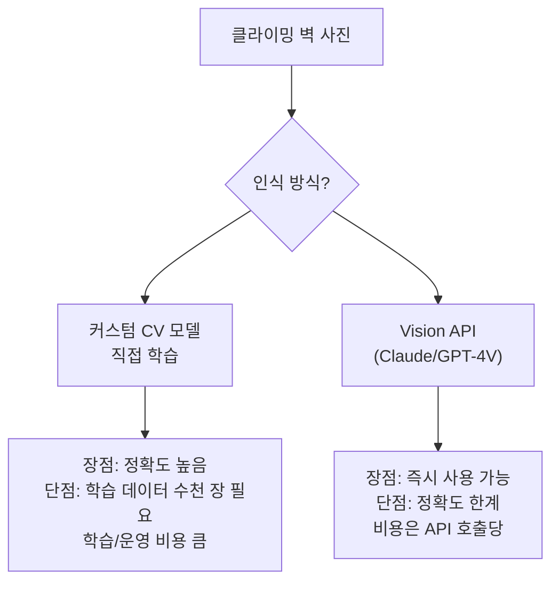
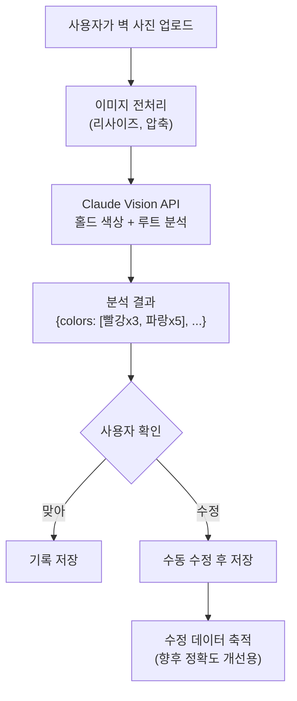
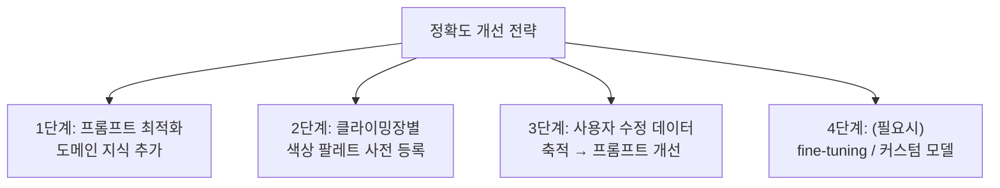
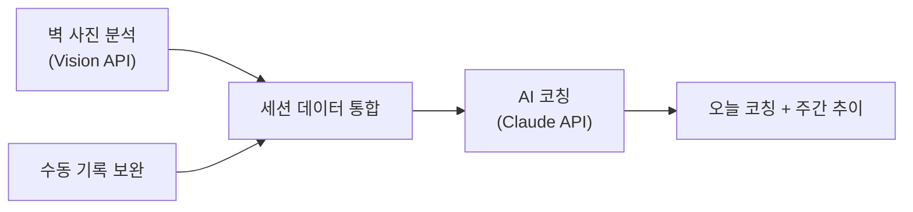

## 발단

예전에 만들다 만 클라이밍 앱을 AI 시대에 다시 생각해보는 시리즈(?)의 두 번째. 코칭 기능을 고민하다 보니 더 근본적인 문제가 떠올랐다 — 기록 자체가 귀찮다는 것.

클라이밍이 끝나고 "빨강 3개, 파랑 5개, 초록 2개"를 일일이 입력하는 건 번거롭다. 대부분의 사용자는 3일이면 포기할 것이다. 그런데 클라이머들은 벽 사진을 거의 항상 찍는다. Vision API로 **사진에서 홀드 색상과 루트를 자동으로 인식**할 수 있다면? 이게 가능한 건지, 한계는 뭔지 정리해봤다.

---

## 접근: Vision API vs 커스텀 모델



**MVP에서는 Vision API를 선택했다.** 커스텀 모델은 학습 데이터를 모으는 것부터 난관이다. 전국 클라이밍장마다 벽 구성, 홀드 색상, 조명이 다르다. Vision API로 시작하고, 정확도 한계가 명확해지면 커스텀 모델을 검토한다.

---

## 시스템 설계



### 핵심 설계 결정: "제안 + 확인" 패턴

Vision API의 인식이 100% 정확할 수 없다. 그래서 **자동 입력이 아니라 자동 "제안"**으로 설계했다.

```text
📸 사진 분석 결과

감지된 루트:
  🔴 빨강 x3 (확신도 높음)
  🔵 파랑 x5 (확신도 높음)  
  🟢 초록 x2 (확신도 중간)
  ⚪ 흰색 x1 (확신도 낮음 — 조명 반사일 수 있음)

맞나요? [확인] [수정]
```

사용자가 수정하면 그 데이터가 축적되어 프롬프트 개선의 근거가 된다.

---

## Vision API 프롬프트 설계

클라이밍 벽 사진 분석은 일반적인 이미지 설명과 다르다. 도메인 특화 프롬프트가 필요하다.

```python
def analyze_climbing_wall(image_base64: str, gym_name: str = None) -> dict:
    prompt = """이 사진은 실내 클라이밍(볼더링) 벽이다.

분석해야 할 것:
1. 벽에 있는 홀드(손잡이)의 색상별 개수
2. 같은 색상의 홀드가 하나의 루트(경로)를 구성함
3. 루트의 대략적 난이도 추정 (홀드 간격, 각도, 위치 기반)

주의사항:
- 홀드와 볼트(회색 고정용 나사)를 구분할 것
- 테이프 표시와 홀드 색상을 구분할 것
- 벽 자체의 색상과 홀드 색상을 구분할 것
- 조명에 의한 색상 왜곡 가능성 고려

응답 형식 (JSON):
{
  "routes": [
    {"color": "빨강", "hold_count": 8, "estimated_difficulty": "중급"},
    {"color": "파랑", "hold_count": 10, "estimated_difficulty": "초급"}
  ],
  "wall_angle": "오버행 약 15도",
  "confidence": "medium",
  "notes": "조명이 어두워 일부 색상 판별이 불확실"
}"""

    response = claude.messages.create(
        model="claude-sonnet-4-20250514",
        messages=[{
            "role": "user",
            "content": [
                {"type": "image", "source": {"type": "base64", "data": image_base64}},
                {"type": "text", "text": prompt}
            ]
        }]
    )
    return json.loads(response.content[0].text)
```

### 프롬프트에서 도메인 지식이 중요한 이유

일반적인 Vision 프롬프트("이 사진에서 색상을 분석해줘")로는:
- **볼트(고정 나사)를 홀드로 오인**
- **벽 색상과 홀드 색상 혼동**
- **테이프 마킹을 별도 홀드로 인식**

클라이밍을 아는 사람만 알 수 있는 구분점을 프롬프트에 명시해야 정확도가 올라간다.

---

## 정확도 한계와 대응 전략

Vision API로 클라이밍 벽을 분석할 때의 현실적 한계:

| 케이스 | 난이도 | 대응 |
|--------|--------|------|
| 단색 홀드, 정면 사진 | 쉬움 (정확도 높음) | 그대로 사용 |
| 비슷한 색상 (주황 vs 빨강) | 중간 | 클라이밍장별 색상 팔레트 사전 등록 |
| 어두운 조명, 측면 사진 | 어려움 | 사용자 수정 유도 + 확신도 표시 |
| 볼륨(큰 홀드) + 작은 홀드 혼재 | 어려움 | "볼륨은 루트의 일부"라고 프롬프트에 명시 |



---

## 비용 최적화

사진 분석은 Vision API 비용이 가장 큰 부분이다.

| 전략 | 효과 |
|------|------|
| **이미지 리사이즈** | 원본 4000x3000 → 1024x768로 축소. 토큰 수 대폭 감소 |
| **캐싱** | 같은 클라이밍장 같은 벽 구역의 사진은 루트가 비슷 → 이전 분석 결과 참조 |
| **배치 처리** | 여러 사진을 한 세션 끝에 모아서 한 번에 분석 |
| **선택적 분석** | 사용자가 원할 때만 사진 분석 (자동 실행 X) |

추정 비용: 하루 3-5장 사진 분석 기준 월 $2-3

---

## 세션 자동 요약과의 연결

사진 인식 결과를 AI 코칭 시스템과 연결하면 더 풍부한 코칭이 가능하다:



```text
📸 + 📊 오늘의 클라이밍 리포트

[사진 분석] 성수파크 A벽
  빨강 x3 완등, 파랑 x5 완등, 빨강 x2 실패

[코칭]
"오늘 찍은 A벽 사진을 보니 빨강 실패 2개가 둘 다 오버행 구간이네.
지난주에도 A벽 오버행에서 같은 패턴으로 떨어졌어.
다음에 A벽 갈 때 오버행 초록부터 워밍업으로 3개 풀고 시작해봐."
```

---

## 실현 가능성 판단

Vision API로 시작하면 구현 자체는 빠르다. 하지만 정확도에 한계가 있을 거고, 그때 커스텀 모델이 필요해진다. 그러려면 학습 데이터(클라이밍 벽 사진 + 정답 라벨)가 수천 장 필요한데, 이건 앱이 어느 정도 사용자를 확보한 뒤에야 가능하다.

결론적으로 **Vision API → 사용자 수정 데이터 축적 → 커스텀 모델** 순서가 현실적이다. 지금 당장은 Vision API만으로도 "수동 입력 10개 → 수정 2개"로 줄일 수 있으면 충분한 가치가 있다.

---

## 느낀 점

### "만들 수 있을까?"보다 "만들 가치가 있을까?"가 먼저다
Vision API가 있으니 기술적으로는 가능하다. 문제는 클라이머들이 정말 이 기능을 원하느냐다. 내가 클라이머로서 "사진 찍고 자동 입력"이 되면 확실히 쓸 것 같다. 이 확신이 있으니 구현할 가치가 있다.

### 도메인을 아는 사람이 프롬프트를 써야 한다
"사진에서 색상을 분석해줘"와 "볼더링 벽에서 홀드 색상을 분석해줘. 볼트와 테이프는 제외"는 결과가 완전히 다를 것이다. AI 기능의 품질은 프롬프트에 담긴 도메인 지식의 깊이에 비례한다.

### 완벽한 자동화가 아니라 "스마트 제안"이 현실적이다
100% 정확한 인식은 불가능하다. "제안 + 사용자 확인" 패턴이 더 현실적이고, 사용자 수정 데이터가 쌓이면 그것 자체가 향후 모델 개선의 자산이 된다.
