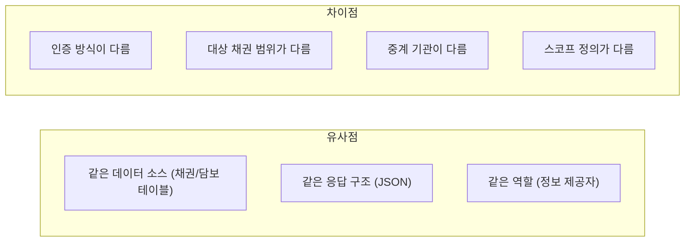
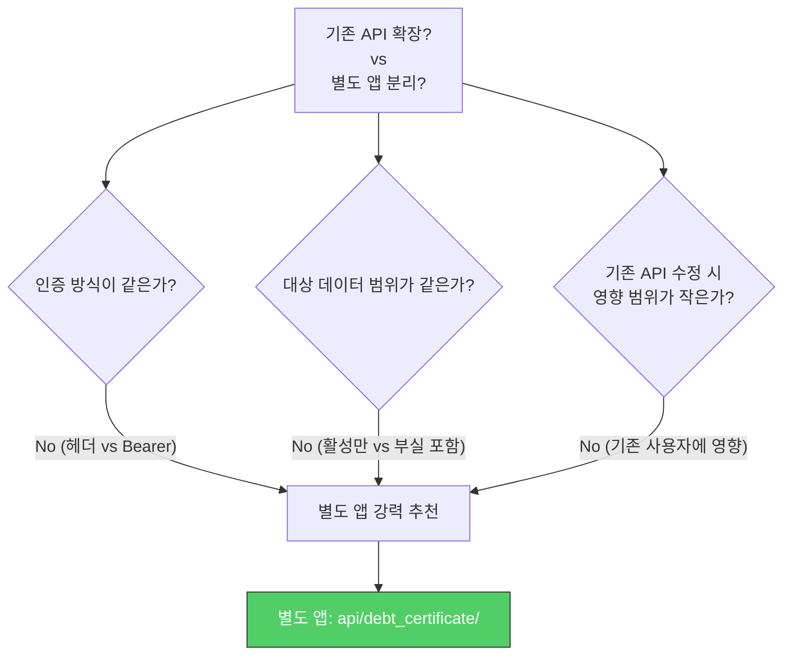
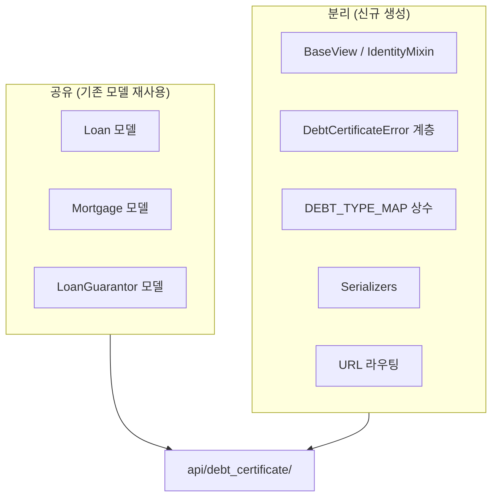
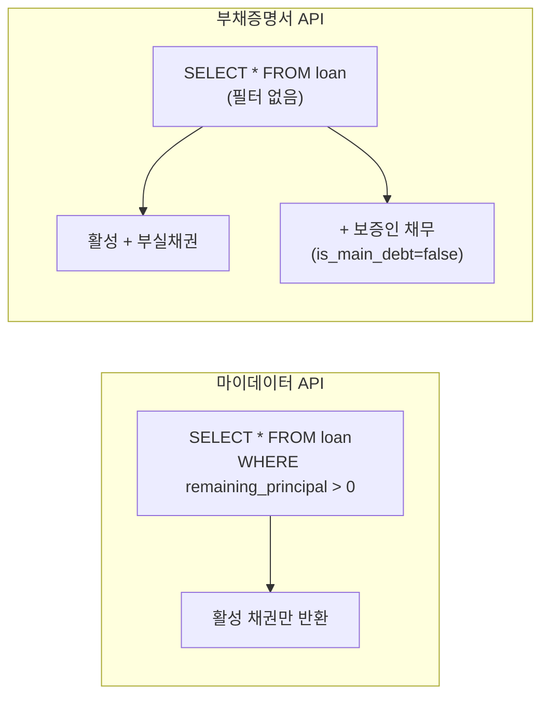
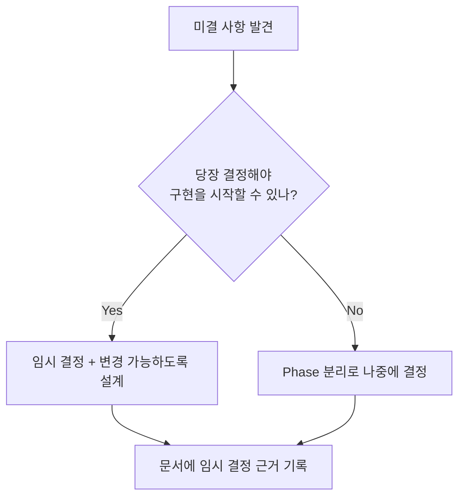

## 문제

새로운 부채증명서 API를 구현해야 했다. 이미 시스템에는 유사한 역할의 마이데이터 API(`api/mydata/v2/`)가 존재했다. 둘 다 **외부 요청에 대해 내부 채권/담보/보증 정보를 응답하는 API**다.

핵심 질문: **기존 마이데이터 API를 확장할 것인가, 별도 앱으로 분리할 것인가?**

---

## 유사점과 차이점 비교



| 항목 | 마이데이터 API | 부채증명서 API |
|------|--------------|---------------|
| **인증** | `x-user-ci` 헤더 | `Authorization: Bearer` 토큰 |
| **대상 채권** | 활성 채권만 (`잔액 > 0`) | 부실채권 포함, 보증인 채무 포함 |
| **요청자** | 마이데이터 사업자 | 신용정보 종합포털 (본인 전용) |
| **중계 기관** | 금융 중계기관 | 거점중계기관 |
| **스코프** | `all_asset` | 별도 신규 스코프 |

---

## 판단: 별도 앱으로 분리



**별도 앱을 선택한 이유:**

1. **인증 방식 차이**: 미들웨어/데코레이터 레벨에서 완전히 다른 처리가 필요
2. **데이터 범위 차이**: 마이데이터는 `remaining_principal > 0` 필터가 핵심 전제. 이를 제거하면 기존 API의 동작이 변경됨
3. **독립적 배포**: 부채증명서 API의 버그가 마이데이터 API에 영향을 주면 안 됨
4. **모델 변경 없음**: 새 API는 기존 모델을 읽기 전용으로 조회만 하므로, 모델을 공유하되 뷰/시리얼라이저는 분리

---

## 설계: 공유할 것과 분리할 것



### 디렉토리 구조

```text
api/debt_certificate/
├── constants.py        # 상품코드 매핑 (DEBT_TYPE_MAP)
├── exceptions.py       # 전용 에러 계층
├── pagination.py       # 페이지네이션 믹스인
├── validators.py       # 헤더/파라미터 검증
├── views/
│   ├── base.py         # BaseView, IdentityMixin (Bearer 토큰 인증)
│   ├── debts.py        # GET /debts (채권 조회)
│   ├── collateral.py   # POST /debts/security (담보 조회)
│   ├── guarantee.py    # POST /debts/guarantee (보증 조회)
│   └── notification.py # POST /debts/notification (발급 알림)
├── serializers/
├── urls.py
└── tests/
```

### 핵심 차이: 대상 채권 범위



마이데이터에서는 **잔액이 0보다 큰 활성 채권**만 반환하지만, 부채증명서에서는 **부실채권(연체/상각)과 보증인 채무**까지 포함해야 한다. 같은 모델이지만 쿼리가 근본적으로 다르다.

---

## 설계 과정에서 발견한 미결 사항들

실제 설계를 진행하면서 **즉시 답을 내릴 수 없는 질문들**이 나왔다. 이런 미결 사항을 어떻게 관리하느냐가 설계 문서의 가치를 결정한다.

| 미결 사항 | 왜 어려운가 | 임시 결정 |
|-----------|------------|----------|
| 인증 방식 (JWT vs OAuth2 vs 중계기관 전문) | 상대 기관의 최종 스펙이 미확정 | JWT 기반으로 먼저 구현, 추후 변경 가능하도록 추상화 |
| 내부 PK를 외부에 노출해도 되는가 | 보안 검토 필요 | 별도 관리번호 체계 검토 중 |
| 부실채권의 정확한 범위 | 상각/대위변제/매각 등 법적 정의 확인 필요 | 비즈니스팀에 확인 요청 |
| 이자를 실시간 계산 vs 마지막 정산 기준 | 실시간 계산은 성능 부하, 정산 기준은 정확도 손실 | 마지막 정산 기준으로 시작, 요구 시 캐시 기반 실시간 전환 |



---

## 상품코드 매핑: 외부 규격과 내부 모델의 변환

외부 기관의 상품 분류 체계와 내부 데이터 모델이 다를 때, 명시적인 매핑 테이블이 필요하다.

```python
DEBT_TYPE_MAP = {
    "개인신용대출":    "5101",  # P2P 개인 신용
    "법인신용대출":    "5102",  # P2P 법인 신용
    "부동산PF":       "5201",  # P2P 부동산 PF
    "부동산담보":      "5202",  # P2P 부동산 담보
    "어음매출채권":    "5203",  # P2P 어음/매출채권
    "기타담보":        "5299",  # P2P 기타 담보
}
```

이런 매핑을 코드에 상수로 두면:
- 변환 로직이 한 곳에 집중되어 관리가 쉽다
- 새 상품 타입 추가 시 매핑만 추가하면 된다
- 잘못된 매핑을 테스트로 검증할 수 있다

---

## 느낀 점

### "비슷하다"와 "같다"를 구분하라
유사한 API를 만들 때 가장 위험한 판단은 "비슷하니까 기존 걸 확장하자"다. 인증/데이터 범위/배포 독립성 중 하나라도 다르면 별도 앱을 강력히 고려해야 한다. 기존 API에 조건문을 추가하는 것은 단기적으로 빠르지만, 장기적으로 양쪽 모두의 유지보수를 어렵게 만든다.

### 모델은 공유하되, 뷰는 분리하라
DB 모델(테이블)은 공유하고 뷰/시리얼라이저를 분리하면, 데이터 중복 없이 서로 다른 접근 패턴을 구현할 수 있다. 특히 "읽기 전용" API라면 모델을 건드릴 필요가 전혀 없다.

### 미결 사항을 숨기지 말고 문서화하라
"이건 아직 모르겠다"를 문서에 적는 것은 약점이 아니라 강점이다. 미결 사항과 임시 결정의 근거를 기록하면, 나중에 결정할 때 맥락을 잃지 않는다. 그리고 설계 리뷰에서 팀원들이 "이 부분은 어떻게 할 건데?"라고 물었을 때 이미 고민했다는 것을 보여줄 수 있다.
