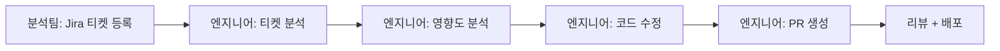
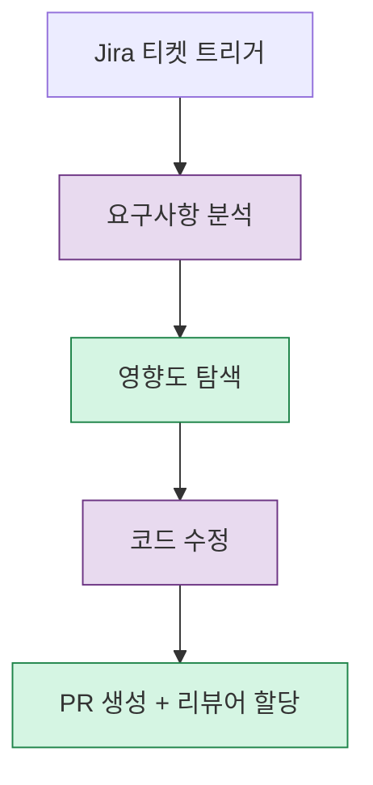
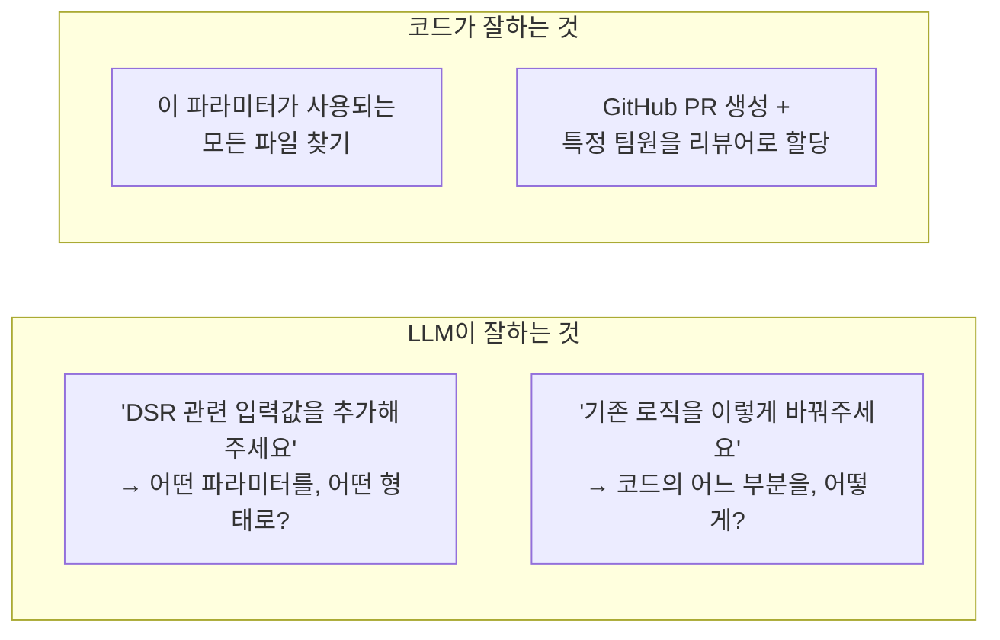
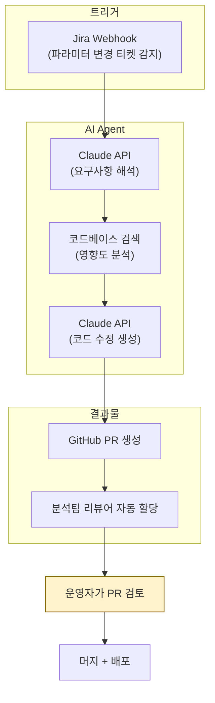

## 배경

사내 신용평가 모델에는 수십 개의 입력 파라미터가 있다. 신용분석팀에서 "이 파라미터를 추가해주세요", "이 필터링 규칙을 바꿔주세요" 같은 변경 요청이 정기적으로 들어온다.

기존 흐름:



문제는 변경 요청의 **70~80%가 정형화된 패턴**이라는 것이다:
- input 파라미터 추가/삭제
- 필터링 규칙 추가/변경
- 기존 값의 계산 로직 수정

이런 패턴은 본질적으로 **사람이 아니라 에이전트가 처리할 수 있는 영역**인데, 매번 엔지니어 시간을 소비하고 있었다.

---

## 접근: 문제를 의제화하고 합의를 이끌어내기

기술적 해결보다 먼저 한 것은 **팀 합의**다. AI Agent 도입은 엔지니어 혼자 결정할 문제가 아니다.

1. 팀의 AI 도입 흐름 안에서 "이 영역이 자동화에 적합하다"는 것을 데이터로 보여줌
2. 최근 6개월 파라미터 변경 티켓을 분류 → 70~80%가 정형 패턴임을 확인
3. 팀장 합의 도출 → MVP 구현 승인

"기술적으로 가능하니까 해보겠습니다"가 아니라 "이 문제가 반복되고 있고, 이 방식으로 해결할 수 있습니다"로 접근했다.

---

## 설계: 결정론적 처리와 LLM 처리의 경계

AI Agent 설계에서 가장 중요한 결정은 **LLM에게 맡길 부분과 코드로 처리할 부분을 명확히 나누는 것**이다.



| 단계 | 처리 방식 | 이유 |
|------|----------|------|
| **요구사항 분석** | LLM | 자연어 티켓을 구조화된 변경 사항으로 해석 |
| **영향도 탐색** | 결정론적 (코드) | 코드베이스 검색, 의존성 추적은 정확해야 함 |
| **코드 수정** | LLM | 변경 의도를 이해하고 적절한 위치에 코드 생성 |
| **PR 생성** | 결정론적 (코드) | GitHub API 호출, 리뷰어 할당은 정확해야 함 |

### 왜 이렇게 나누는가

LLM은 **"의도를 이해하는 것"**에 강하고, **"정확하게 실행하는 것"**에는 약하다.



영향도 탐색을 LLM에게 맡기면 "아마 이 파일에서 쓰일 것 같습니다"라는 추측을 한다. 하지만 코드 검색은 grep 한 번이면 100% 정확한 결과를 준다. **확실한 것은 코드로, 판단이 필요한 것은 LLM으로.**

---

## 아키텍처: 기존 인프라에 붙이기

새로운 인프라를 만드는 것이 아니라, 기존 시스템(Jira, GitHub, 코드베이스)에 Agent를 붙이는 형태로 설계했다.



핵심 설계 원칙:
- **사람이 최종 검토한다**: Agent가 PR을 생성하지만, 머지는 반드시 사람이 한다
- **기존 인프라 활용**: 새로운 서비스를 띄우지 않고 Jira API + GitHub API + Claude API 조합
- **실패해도 안전하다**: Agent가 잘못된 PR을 만들어도 리뷰에서 잡힘. 최악의 경우 "사람이 직접 하던 것으로 돌아가기"

---

## 구현: Claude API 활용

### 요구사항 해석

```python
# Jira 티켓의 자연어 설명을 구조화된 변경 사항으로 변환
prompt = """
다음 Jira 티켓의 내용을 분석하여 파라미터 변경 사항을 추출하세요.

티켓 내용: {ticket_description}

응답 형식:
- action: add | remove | modify
- parameter_name: ...
- parameter_type: ...
- description: ...
"""
```

### 영향도 탐색 (결정론적)

```python
# LLM이 아니라 코드로 정확하게 검색
def find_impact(parameter_name: str) -> list[str]:
    # 1. 파라미터가 정의된 파일 찾기
    definition_files = grep(parameter_name, "apps/")
    
    # 2. 해당 파라미터를 사용하는 서비스 찾기
    usage_files = grep(parameter_name, "services/")
    
    # 3. 테스트 파일 찾기
    test_files = grep(parameter_name, "tests/")
    
    return definition_files + usage_files + test_files
```

### 코드 수정 생성

영향도 분석 결과를 Claude에게 전달하여, 정확한 위치에 정확한 코드를 생성하도록 한다.

```python
prompt = """
다음 파일들에 파라미터 '{param_name}'을 추가해야 합니다.

영향 받는 파일들:
{impact_files_with_context}

기존 파라미터 추가 패턴을 참고하여 코드 변경 사항을 생성하세요.
"""
```

---

## 현재 진행 상황

### MVP: Claude Code Skills로 구현

현재는 Claude Code의 Skills 기능을 활용하여 파라미터 변경의 일부를 자동화한 상태다. 엔지니어가 Claude Code에서 Skills를 실행하면, 코드베이스를 분석하고 변경 사항을 생성해준다.

```text
현재 흐름 (Skills 적용):
  Jira 티켓 확인 → Claude Code Skills 실행 → 코드 수정 생성 → 엔지니어 검토 → PR
```

완전 자동화는 아니지만, 엔지니어가 직접 코드를 분석하고 수정하는 시간이 크게 줄었다. 현재 이 Skills는 팀 전체에 공유되어 본인뿐 아니라 **모든 팀원이 파라미터 변경 작업 시 사용하고 있다.**

### 향후 방향: 풀 자동화 Agent

위에서 설계한 Jira 트리거 → 자동 분석 → PR 생성 파이프라인은 Skills MVP를 검증한 뒤 다음 단계로 구현할 계획이다. Skills에서 검증된 프롬프트와 도구 구조를 그대로 Agent로 옮기면 된다.

| 단계 | 상태 | 설명 |
|------|------|------|
| 문제 발굴 + 팀 합의 | **완료** | 데이터 기반으로 팀장 합의 도출 |
| Claude Code Skills MVP | **완료** | 엔지니어가 수동 트리거, 코드 생성 자동화 |
| Jira → Agent → PR 자동화 | **설계 완료, 구현 예정** | 트리거부터 PR 생성까지 풀 자동화 |

---

## 느낀 점

### LLM Agent에서 가장 중요한 것은 "경계 설계"다
LLM에게 모든 것을 맡기면 "대부분 맞지만 가끔 틀린" 시스템이 된다. 결정론적으로 처리할 수 있는 부분(코드 검색, API 호출)은 코드로 처리하고, 판단이 필요한 부분(요구사항 해석, 코드 생성)만 LLM에게 맡기면 신뢰성이 크게 올라간다.

### Skills MVP부터 시작하는 게 맞았다
처음부터 풀 자동화 Agent를 만들려 했으면 scope이 너무 커서 진행이 안 됐을 것이다. Claude Code Skills로 "프롬프트와 도구 구조가 실제로 동작하는가"를 먼저 검증하고, 그 위에 자동화를 얹는 방식이 현실적이다.

### 기술보다 합의가 먼저다
"이걸 자동화할 수 있습니다"보다 "이 문제가 반복되고 있고, 이만큼의 시간이 소비되고 있습니다"가 팀을 설득하는 데 훨씬 효과적이다. 데이터로 문제를 보여주고, 해결책을 제안하고, 합의를 이끌어내는 과정이 코딩보다 더 중요했다.

### "사람이 최종 검토한다"는 안전장치가 도입을 가능하게 한다
금융 시스템에서 AI가 자동으로 코드를 수정하고 배포한다? 아무도 동의하지 않을 것이다. 하지만 "AI가 코드를 생성하고 사람이 검토한다"면 리스크는 기존과 동일하면서 속도만 빨라진다. Skills MVP도 이 원칙을 따르고, 향후 Agent도 마찬가지다.
