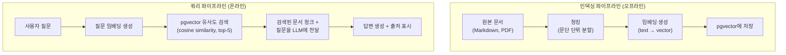
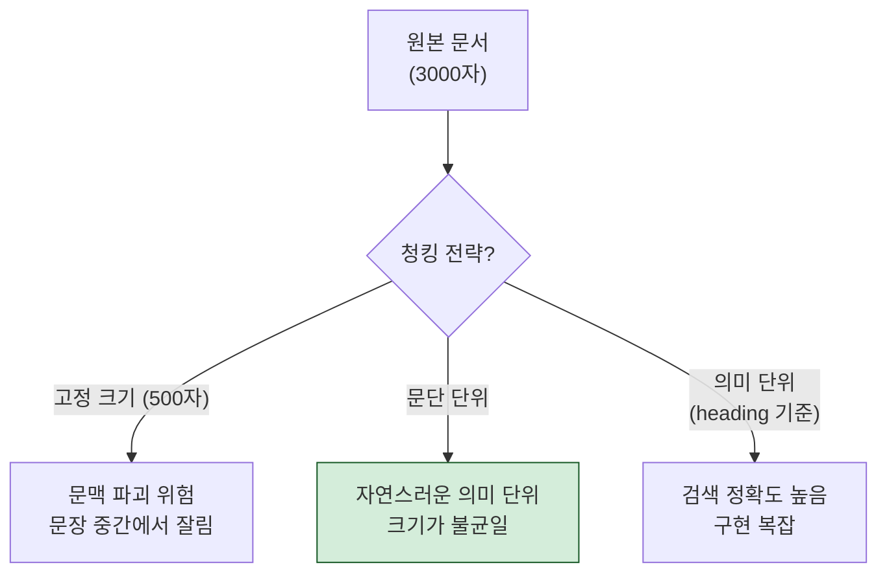
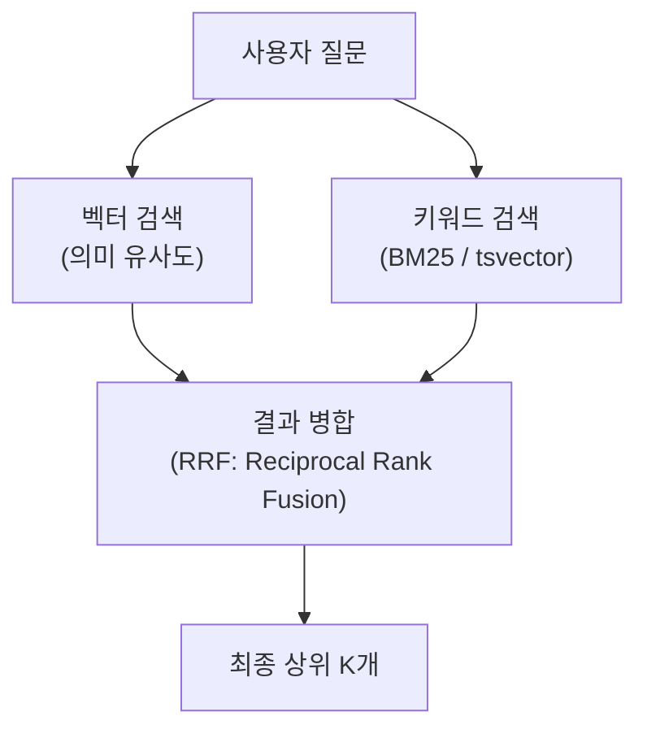

## 배경

사내에 쌓인 Confluence 문서, 장애 보고서, 설계 문서가 수백 개다. 새로운 프로젝트를 시작할 때마다 "이거 전에 누가 정리해놨는데..."하고 문서를 찾지만, 키워드 검색으로는 원하는 문서를 찾기 어렵다.

"장애 대응 시 DB 락 해결 방법"을 찾고 싶은데, 문서 제목은 "2025-04-10 마이그레이션 이슈"라면 키워드 검색으로는 절대 못 찾는다.

RAG(Retrieval-Augmented Generation) 파이프라인을 만들어서 **의미 기반 검색 + LLM 답변 생성**을 구현해봤다.

---

## RAG란 무엇인가


LLM은 학습 데이터에 없는 사내 문서의 내용을 모른다. RAG는 **질문과 관련된 문서를 먼저 검색한 뒤, 그 문서를 컨텍스트로 LLM에 전달**하여 정확한 답변을 생성하는 패턴이다.

핵심 구성 요소:

| 구성 요소 | 역할 | 선택지 |
|----------|------|--------|
| **임베딩 모델** | 텍스트를 벡터로 변환 | OpenAI, Cohere, sentence-transformers |
| **벡터 DB** | 벡터 유사도 검색 | pgvector, Pinecone, Chroma, Qdrant |
| **청킹 전략** | 문서를 적절한 단위로 분할 | 고정 크기, 문단 단위, 의미 단위 |
| **LLM** | 검색 결과 기반 답변 생성 | Claude, GPT-4 |

---

## 아키텍처



### 왜 pgvector인가

| 벡터 DB | 장점 | 단점 |
|---------|------|------|
| Pinecone | 관리형, 스케일 용이 | 비용, 외부 의존성 |
| Chroma | 로컬 개발 편리 | 프로덕션 스케일 한계 |
| **pgvector** | **기존 PostgreSQL에 확장만 추가** | 대규모에서 성능 한계 |

이미 PostgreSQL(Aurora)을 사용하고 있으므로, 별도 인프라 없이 `CREATE EXTENSION vector`만으로 시작할 수 있다. 사내 문서 수백 개 규모에서는 pgvector로 충분하다.

---

## 구현 상세

### 1. 청킹 전략

문서를 어떻게 자르느냐가 검색 품질의 80%를 결정한다.



**문단 단위 청킹을 선택했다.** Markdown 문서는 `##` 헤딩으로 구조화되어 있으므로, 헤딩 단위로 자르면 자연스러운 의미 단위가 된다.

```python
def chunk_markdown(content: str, max_tokens: int = 500) -> list[str]:
    sections = content.split('\n## ')
    chunks = []
    for section in sections:
        if len(section.split()) > max_tokens:
            # 너무 긴 섹션은 문단 단위로 추가 분할
            paragraphs = section.split('\n\n')
            chunks.extend(paragraphs)
        else:
            chunks.append(section)
    return chunks
```

### 2. 임베딩 생성

```python
from anthropic import Anthropic
# 또는 OpenAI의 text-embedding-3-small 사용

def embed_text(text: str) -> list[float]:
    response = openai.embeddings.create(
        model="text-embedding-3-small",
        input=text
    )
    return response.data[0].embedding  # 1536차원 벡터
```

### 3. pgvector 스키마

```sql
CREATE EXTENSION IF NOT EXISTS vector;

CREATE TABLE document_chunks (
    id SERIAL PRIMARY KEY,
    document_title TEXT,
    chunk_text TEXT,
    chunk_index INTEGER,
    embedding vector(1536),  -- 임베딩 벡터
    created_at TIMESTAMP DEFAULT NOW()
);

-- 코사인 유사도 검색을 위한 인덱스
CREATE INDEX ON document_chunks 
    USING ivfflat (embedding vector_cosine_ops)
    WITH (lists = 100);
```

### 4. 검색 + 답변 생성

```python
def search_and_answer(question: str) -> str:
    # 1. 질문을 벡터로 변환
    q_embedding = embed_text(question)
    
    # 2. 유사 문서 검색 (cosine similarity, top-5)
    chunks = db.execute("""
        SELECT chunk_text, document_title,
               1 - (embedding <=> %s::vector) AS similarity
        FROM document_chunks
        ORDER BY embedding <=> %s::vector
        LIMIT 5
    """, [q_embedding, q_embedding])
    
    # 3. LLM에 컨텍스트와 함께 질문
    context = "\n\n".join([
        f"[{c.document_title}]\n{c.chunk_text}" 
        for c in chunks
    ])
    
    response = claude.messages.create(
        model="claude-sonnet-4-20250514",
        messages=[{
            "role": "user",
            "content": f"""다음 문서를 참고하여 질문에 답변하세요.
            
참고 문서:
{context}

질문: {question}

답변 시 출처 문서 제목을 함께 표시하세요."""
        }]
    )
    return response.content[0].text
```

---

## 검색 품질 개선: Hybrid Search

순수 벡터 검색만으로는 한계가 있다. "pgvector"같은 고유명사를 검색할 때 의미 검색보다 키워드 검색이 더 정확하다.



```python
def hybrid_search(question: str, alpha: float = 0.7) -> list:
    # 벡터 검색 결과
    vector_results = vector_search(question, limit=10)
    
    # 키워드 검색 결과 (PostgreSQL full-text search)
    keyword_results = keyword_search(question, limit=10)
    
    # RRF로 점수 병합
    combined = reciprocal_rank_fusion(
        vector_results, keyword_results, 
        alpha=alpha  # 벡터 검색 가중치
    )
    return combined[:5]
```

**Hybrid Search 결과**: 순수 벡터 검색 대비 관련 문서 적중률이 체감상 크게 향상되었다. 특히 시스템명, 에러 코드 같은 고유명사 검색에서 차이가 컸다.

---

## 배운 것

### 청킹이 RAG의 80%다
임베딩 모델이나 벡터 DB 선택보다 **문서를 어떻게 자르느냐**가 검색 품질에 가장 큰 영향을 미친다. 너무 작게 자르면 문맥이 사라지고, 너무 크게 자르면 노이즈가 많아진다. 문서 구조(헤딩, 문단)를 활용한 의미 단위 청킹이 가장 효과적이었다.

### pgvector는 시작하기에 충분하다
수백~수천 개 문서 규모에서는 pgvector로 충분하다. 기존 PostgreSQL 인프라를 그대로 활용할 수 있어서, 별도 벡터 DB를 운영하는 비용이 없다. 규모가 커지면 전용 벡터 DB로 이전하면 된다.

### Hybrid Search는 거의 필수다
의미 검색과 키워드 검색을 결합하면 두 방식의 약점을 서로 보완한다. 특히 도메인 특화 용어가 많은 환경에서는 키워드 검색이 의미 검색보다 정확한 경우가 많다.

### RAG의 한계도 알아야 한다
RAG는 "검색된 문서에 답이 있을 때"만 작동한다. 문서에 없는 내용은 LLM이 추측하거나 거부한다. 답이 없을 때 "해당 문서에서 관련 내용을 찾을 수 없습니다"라고 솔직하게 말하도록 프롬프트를 설계하는 것도 중요하다.
