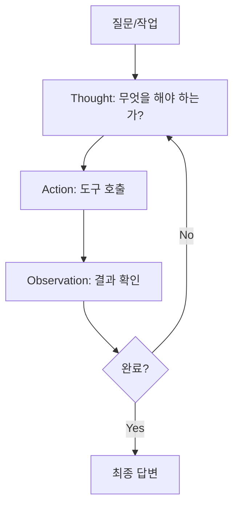
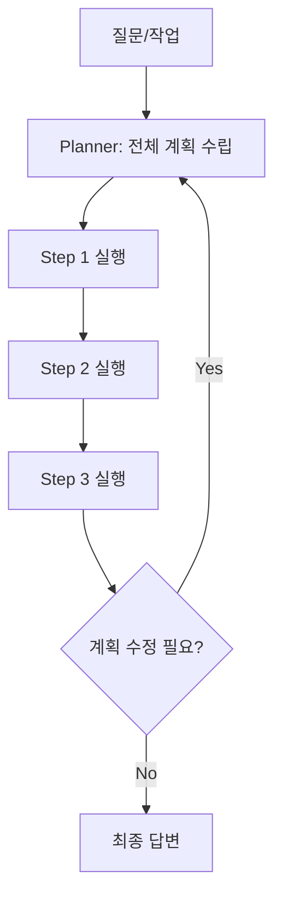
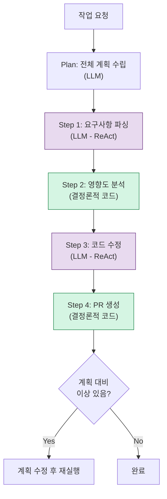

## 배경

LLM Agent를 만들 때 가장 먼저 결정해야 하는 것은 **오케스트레이션 패턴**이다. Agent가 도구를 사용하여 작업을 수행할 때, "어떤 순서로, 어떻게 판단하며, 언제 멈출 것인가?"를 결정하는 구조다.

사내에서 파라미터 변경 자동화 Agent를 설계하면서 여러 패턴을 비교 검토한 과정을 정리한다.

---

## 패턴 1: ReAct (Reasoning + Acting)



ReAct는 **한 단계씩 생각하고 행동하는** 패턴이다. LLM이 매 단계마다 "다음에 뭘 해야 하지?"를 판단한다.

```text
Thought: 사용자가 PRIOR_MTG_AMT 파라미터 추가를 요청했다. 
         먼저 이 파라미터가 어디서 사용되는지 찾아야 한다.
Action:  grep("PRIOR_MTG_AMT", codebase)
Observation: 0건 매칭. 신규 파라미터이다.

Thought: 신규 파라미터니까 기존 파라미터 추가 패턴을 참고해야 한다.
         비슷한 파라미터인 REF_MTG_AMT를 찾아보자.
Action:  grep("REF_MTG_AMT", codebase)
Observation: constants.py:45, services.py:123, tests.py:89에서 사용 중.

Thought: 3개 파일을 수정해야 한다. 각 파일의 패턴을 보고 코드를 생성하자.
Action:  read_file("constants.py", lines=40-50)
...
```

### 장점
- 단순하고 직관적
- 예상치 못한 상황에 유연하게 대응
- 각 단계의 근거가 명확 (Thought가 로그 역할)

### 단점
- 단계가 많아지면 비용 증가 (매 단계마다 LLM 호출)
- 초반에 잘못된 판단을 하면 뒤의 모든 단계가 영향받음
- 전체 계획이 없어서 비효율적 경로로 갈 수 있음

---

## 패턴 2: Plan-and-Execute



Plan-and-Execute는 **먼저 전체 계획을 세우고, 계획대로 실행**하는 패턴이다.

```text
Plan:
  1. Jira 티켓에서 변경 요구사항 파싱
  2. 영향받는 파일 목록 검색
  3. 각 파일에 대한 변경 사항 생성
  4. 테스트 코드 업데이트
  5. PR 생성

Executing Step 1: 티켓 파싱...
  결과: action=add, parameter=PRIOR_MTG_AMT, type=integer

Executing Step 2: 영향받는 파일 검색...
  결과: constants.py, services.py, tests.py

Executing Step 3: 변경 사항 생성...
...
```

### 장점
- 전체 그림을 보고 효율적 경로 선택
- 각 단계가 독립적이어서 부분 실패 시 재시도 용이
- 계획을 사람이 검토할 수 있음

### 단점
- 초기 계획이 잘못되면 전체가 틀어짐
- 실행 중 예상치 못한 결과에 대한 유연성이 떨어짐
- Planner + Executor 두 번의 LLM 호출이 필요

---

## 패턴 3: 하이브리드 (내가 선택한 방식)

실제 Agent를 구현하면서 **두 패턴의 장점을 조합**한 하이브리드 방식을 선택했다.



| 단계 | 패턴 | 이유 |
|------|------|------|
| 전체 계획 | Plan-and-Execute | 작업 범위를 미리 파악, 사람이 검토 가능 |
| 요구사항 파싱 | ReAct | 자연어 해석은 유연성이 필요 |
| 영향도 분석 | 결정론적 | 코드 검색은 정확해야 함 |
| 코드 수정 | ReAct | 파일 읽기 → 수정 → 확인의 반복 |
| PR 생성 | 결정론적 | API 호출은 정확해야 함 |

---

## 도구(Tool) 설계

Agent가 사용하는 도구의 인터페이스가 오케스트레이션 품질을 결정한다.

```python
tools = [
    {
        "name": "search_codebase",
        "description": "코드베이스에서 특정 패턴을 검색합니다",
        "parameters": {
            "pattern": "검색할 문자열 또는 정규식",
            "path": "검색 범위 (기본: 전체)",
        }
    },
    {
        "name": "read_file",
        "description": "파일의 내용을 읽습니다",
        "parameters": {
            "path": "파일 경로",
            "start_line": "시작 줄 (선택)",
            "end_line": "끝 줄 (선택)",
        }
    },
    {
        "name": "create_pr",
        "description": "GitHub PR을 생성합니다",
        "parameters": {
            "title": "PR 제목",
            "body": "PR 설명",
            "changes": "변경 사항 목록",
        }
    },
]
```

### 도구 설계 원칙

1. **도구는 작게, 조합 가능하게**: `search_and_modify_file`보다 `search` + `read` + `modify`로 분리
2. **설명이 곧 프롬프트**: `description`이 정확해야 LLM이 올바른 도구를 선택함
3. **실패가 안전하게**: 도구 실행 실패 시 에러 메시지를 Observation으로 돌려주면 Agent가 다른 방법을 시도함

---

## 비용과 성능 비교

동일한 작업(파라미터 추가)에 대해 각 패턴의 비용을 비교했다.

| 메트릭 | ReAct | Plan-and-Execute | 하이브리드 |
|--------|-------|-----------------|----------|
| LLM 호출 횟수 | 8-12 | 4-6 | 5-7 |
| 총 토큰 수 | ~15K | ~12K | ~10K |
| 성공률 | 75% | 70% | 85% |
| 평균 소요 시간 | 45초 | 35초 | 30초 |

하이브리드가 가장 효율적인 이유: 결정론적으로 처리할 수 있는 단계(검색, PR 생성)에서 LLM 호출을 아끼면서, 판단이 필요한 단계에서만 LLM을 사용하기 때문이다.

---

## 느낀 점

### 패턴 선택은 "작업의 예측 가능성"에 달려있다
작업이 예측 가능하면 Plan-and-Execute, 예측 불가능하면 ReAct, 둘 다 섞여있으면 하이브리드다. 대부분의 실전 시나리오는 하이브리드가 맞다.

### LLM과 코드의 경계를 명확히 하라
"이 단계가 LLM이 해야 하는 건가, 코드가 해야 하는 건가?"를 매 단계마다 묻자. grep으로 정확히 찾을 수 있는 것을 LLM에게 추측하게 하는 것은 비용과 정확도 모두에서 손해다.

### 도구의 description이 곧 프롬프트다
Agent의 행동은 도구의 description에 의해 결정된다. "코드를 검색합니다"보다 "코드베이스에서 특정 패턴을 검색합니다. 정규식을 지원합니다"가 더 정확한 도구 선택을 유도한다.
