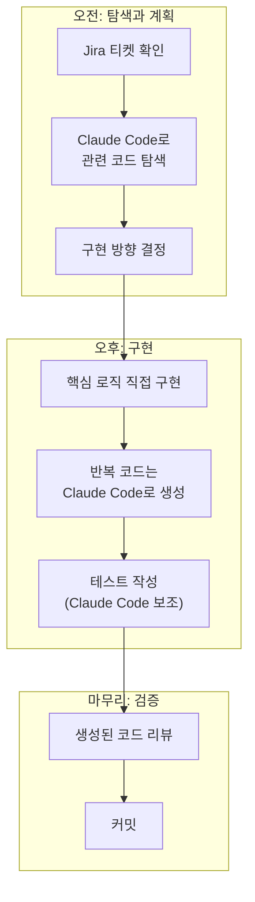

## 배경

2025년 초부터 Claude Code를 개발 워크플로우의 핵심 도구로 사용해왔다. 1년 넘게 매일 사용하면서 "AI 코딩 도구를 어떻게 써야 실제로 생산성이 올라가는가"에 대한 나름의 원칙이 생겼다.

이 글은 "Claude Code가 좋다"는 홍보가 아니라, **어디에 쓰면 효과적이고 어디에 쓰면 오히려 해로운지**를 1년간 체감한 기록이다.

---

## 효과적인 사용 패턴 Top 5

### 1. 코드베이스 탐색: "이 시스템은 어떻게 동작하는가?"

새로운 프로젝트나 레거시 코드를 파악할 때 가장 효과적이다.

```text
"이 모듈에서 건강보험 데이터가 어떻게 처리되는지 흐름을 설명해줘"
"이 함수가 호출되는 모든 경로를 찾아줘"
"이 테이블을 사용하는 쿼리를 전부 찾아서 정리해줘"
```

사람이 grep과 코드 리딩으로 2시간 걸릴 탐색을, 5분 안에 구조화된 설명으로 받을 수 있다.

### 2. 반복적 코드 생성: "이 패턴으로 10개 만들어줘"

이미 패턴이 확립된 코드의 반복 생성에 강하다.

```text
"기존 ReconciliationView와 동일한 패턴으로 RehabilitationView를 만들어줘"
"이 API 엔드포인트에 대한 시리얼라이저와 테스트를 생성해줘"
```

3종 후처리 도메인(화해/워크아웃/회생)처럼 동일 패턴의 코드를 여러 벌 만들어야 할 때, 첫 번째를 사람이 만들고 나머지를 Claude Code에게 맡기면 시간이 크게 줄어든다.

### 3. 버그 디버깅: "이 에러가 왜 발생하는지 분석해줘"

스택 트레이스와 관련 코드를 함께 주면 근본 원인을 빠르게 좁혀준다.

```text
"이 InvalidHeaderError: b''가 발생하는 조건을 코드에서 찾아줘"
"이 쿼리가 왜 N+1 문제를 일으키는지 분석하고 해결책을 제안해줘"
```

### 4. 문서화: "이 코드의 설계 결정을 문서로 정리해줘"

코드를 읽고 설계 의도를 문서로 정리하는 작업. 사람이 하면 귀찮고 미루게 되는 일을 빠르게 처리한다.

### 5. 리팩토링 계획: "이 코드의 문제점과 개선 방향을 분석해줘"

레거시 코드의 구조적 문제를 분석하고 리팩토링 방향을 제안받는 용도.

---

## 비효과적인 사용 패턴

### 1. "전체를 다 만들어줘"

```text
❌ "대출 심사 시스템을 처음부터 설계하고 구현해줘"
```

전체 시스템을 한 번에 만들게 하면 표면적으로 동작하지만 **실제 요구사항과 맞지 않는 코드**가 나온다. 도메인 지식이 없는 상태에서 생성된 코드는 결국 다시 작성하게 된다.

### 2. "이해 없이 코드 복붙"

Claude Code가 생성한 코드를 **이해하지 않고 그대로 사용**하면 나중에 문제가 생겼을 때 디버깅할 수 없다. AI가 생성한 코드도 내가 이해하고 책임져야 하는 코드다.

### 3. "미묘한 비즈니스 로직 판단"

```text
❌ "이중가입자의 건강보험료를 어떻게 처리해야 할까?"
```

이건 코드 문제가 아니라 비즈니스 판단 문제다. AI에게 물어볼 게 아니라 여신기획팀에게 물어봐야 한다.

---

## 워크플로우 통합 방식



핵심 원칙: **판단은 사람이, 실행은 AI가.**

---

## 프롬프트 작성 팁 (1년 경험 기반)

### 컨텍스트를 충분히 제공하라

```text
❌ "이 버그 고쳐줘"

✅ "Payment 모델에서 같은 payment_month에 여러 레코드가 있을 때 
   dict() 변환 시 나중 값이 덮어쓰는 문제가 있어. 
   큰 값을 선택하는 방식으로 수정해줘.
   기존 코드는 apps/health_insurance/utils.py의 45번째 줄이야."
```

### 제약 조건을 명시하라

```text
❌ "API를 만들어줘"

✅ "Django REST Framework로 GET /api/debts/ 엔드포인트를 만들어줘.
   인증은 Bearer 토큰, 응답은 기존 MyDataView와 동일한 패턴,
   단 remaining_principal > 0 필터는 제거해야 해."
```

### 단계적으로 요청하라

```text
❌ "전체 시스템을 리팩토링해줘"

✅ 1단계: "현재 send_daily 함수의 문제점을 분석해줘"
   2단계: "Model/Query/Sender 3계층으로 분리하는 방안을 제안해줘"  
   3단계: "Model 레이어부터 구현해줘"
```

---

## 생산성 변화 체감

정확한 수치 측정은 어렵지만, 체감상:

| 작업 | 이전 | 이후 | 체감 변화 |
|------|------|------|----------|
| 레거시 코드 파악 | 반나절 | 1-2시간 | 큰 개선 |
| 반복 코드 생성 | 수 시간 | 30분 | 큰 개선 |
| 버그 원인 추적 | 상황에 따라 | 30% 단축 | 보통 |
| 핵심 설계 결정 | - | 변화 없음 | 변화 없음 |
| 비즈니스 로직 구현 | - | 변화 없음 | 변화 없음 |

**설계 결정과 비즈니스 로직은 AI로 대체되지 않는다.** 이 부분은 도메인 지식과 이해관계자 소통이 필요한 영역이다. AI는 "실행 속도"를 높여줄 뿐, "올바른 방향"을 결정해주지 않는다.

---

## 느낀 점

### AI 도구의 가치는 "무엇을 시키느냐"에 달렸다
같은 도구를 써도 어떤 사람은 생산성이 2배가 되고, 어떤 사람은 오히려 떨어진다. 차이는 도구 자체가 아니라, 어떤 작업을 AI에게 위임하고 어떤 작업을 직접 하느냐의 판단에 있다.

### "AI가 만든 코드"에 대한 책임은 사람에게 있다
Claude Code가 생성한 코드가 프로덕션에서 버그를 일으키면, 그건 AI의 잘못이 아니라 리뷰하지 않은 사람의 잘못이다. AI는 보조 도구일 뿐이다.

### 1년 사용의 가장 큰 성과는 "프롬프트 감각"이다
어떤 질문을 해야 좋은 답변이 나오는지, 어떤 컨텍스트를 제공해야 하는지에 대한 감각이 생겼다. 이 감각은 Claude Code뿐 아니라 LLM API를 활용한 시스템 설계에도 직접적으로 도움이 된다.
