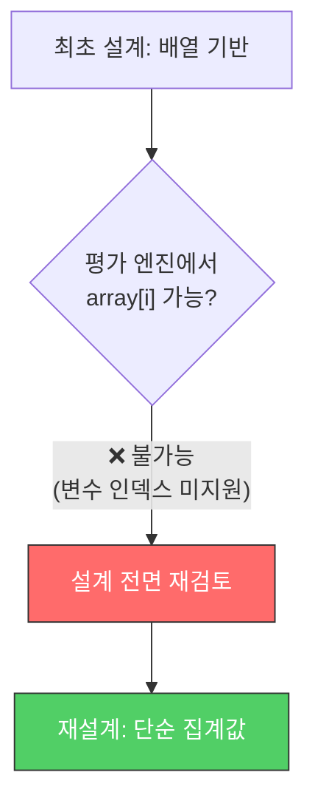
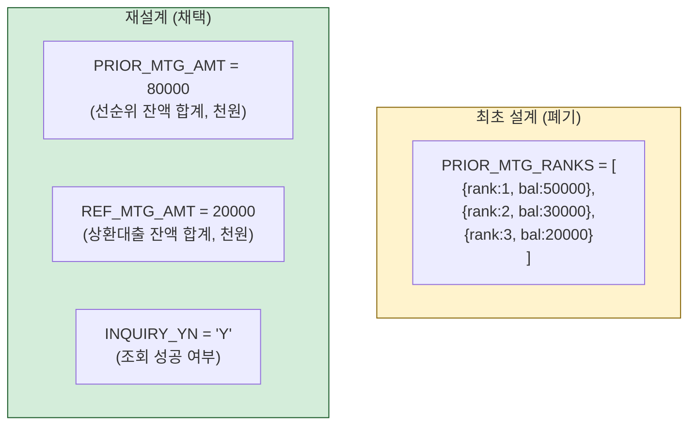
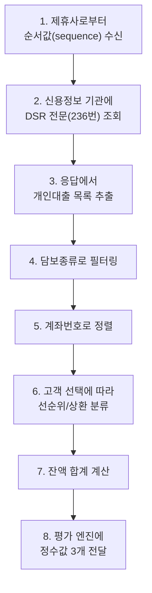
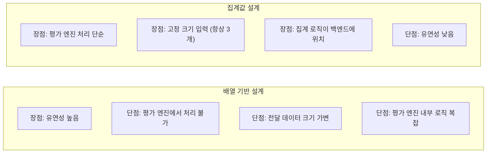

## 배경

부동산 담보대출 비교 서비스를 위해, 외부 신용정보 기관의 데이터를 조회하고 이를 내부 심사 엔진(이하 "평가 엔진")에 전달하는 작업을 했다. 핵심은 **DSR(총부채원리금상환비율) 계산에 필요한 선순위 대출 잔액**을 전달하는 것이었다.

**작업 규모**: 약 2개월 소요 (가장 무게감 있는 평가 엔진 연동 작업)

---

## 최초 설계: 배열 기반 순위 리스트

처음에는 대출 목록을 **배열 형태**로 전달하려 했다. 각 대출의 순위와 잔액을 개별적으로 전달하면 평가 엔진 내부에서 유연하게 활용할 수 있을 것이라 생각했다.

```python
# 최초 설계안: 배열 기반
PRIOR_MTG_RANKS = [
    {"rank": 1, "balance": 50000, "type": "주택담보"},
    {"rank": 2, "balance": 30000, "type": "보금자리론"},
    {"rank": 3, "balance": 20000, "type": "전세자금"},
]
```


논리적으로는 깔끔했다. 하지만...

---

## 제약 발견: 평가 엔진의 배열 처리 한계

개발 중에 평가 엔진(Java 기반 스크립트 엔진)의 **치명적인 제약**을 발견했다.

> **변수 인덱스를 사용한 배열 접근이 불가능하다.**

```java
// 가능: 하드코딩된 인덱스
array[0]  // OK
array[1]  // OK

// 불가능: 변수를 인덱스로 사용
for (int i = 0; i < array.length; i++) {
    array[i]  // ❌ 지원하지 않음
}
```

배열을 전달할 수는 있지만, 루프를 돌며 접근할 수가 없다. 대출 목록의 길이는 고객마다 다르기 때문에 하드코딩된 인덱스로는 처리할 수 없다.



---

## 재설계: 단순 집계값으로 전환

배열 대신 **미리 집계한 단순 정수값**을 전달하기로 했다.



| 입력값 | 설명 |
|--------|------|
| `PRIOR_MTG_AMT` | 고객이 선택한 선순위 대출 잔액 합계 (천원) |
| `REF_MTG_AMT` | 고객이 선택한 상환 대출 잔액 합계 (천원) |
| `INQUIRY_YN` | 신용정보 조회 성공 여부 (Y/N) |

---

## 데이터 처리 파이프라인

재설계 후의 전체 흐름:



### 필터링/정렬 규칙

```text
Step 4: 담보종류 필터링
  → 220 (가계주택담보대출) 또는 245 (전세자금대출)만 추출

Step 5: 계좌번호 기준 정렬
  → 문자열 내림차순 정렬
  → (동일 고객의 대출이 여러 건일 때 일관된 순서 보장)
```

---

## 결과적으로 더 나은 설계가 되었나?



돌이켜보면, 재설계가 오히려 더 나았다:

1. **관심사 분리 개선**: "어떤 대출을 선순위로 볼 것인가"라는 비즈니스 로직이 평가 엔진 스크립트에서 백엔드 코드로 이동했다. 테스트하기 쉽고, 변경하기 쉬운 곳에 로직이 위치하게 된 것이다.

2. **인터페이스 단순화**: 가변 길이 배열 대신 고정된 3개 값을 전달하므로, 연동 스펙이 단순해졌다.

3. **디버깅 용이**: "선순위 잔액 합계가 8천만원"이라는 단일 값은 "3건의 대출 목록"보다 로그에서 확인하기 쉽다.

---

## 느낀 점

### 제약은 나쁜 것만은 아니다
외부 시스템의 제약이 설계를 강제로 단순화시켰다. "배열을 못 쓰니까 집계값으로 가자"는 결정이 결과적으로 관심사 분리와 인터페이스 단순화라는 이점을 가져왔다.

### 복잡한 로직은 제어 가능한 곳에 두자
평가 엔진의 스크립트보다 백엔드 코드가 테스트/디버깅/변경이 훨씬 쉽다. 외부 시스템에 복잡한 로직을 넣으면, 문제가 생겼을 때 원인 파악이 어려워진다.

### 2개월짜리 작업에서 중간에 설계를 바꾸는 용기
이미 배열 기반으로 작업을 시작한 상태에서 재설계를 결정하는 것은 쉽지 않다. 하지만 "지금 바꾸는 비용"은 "나중에 바꾸는 비용"보다 항상 적다. 제약을 발견한 시점에서 바로 방향을 틀었기 때문에 2개월 안에 완료할 수 있었다.
