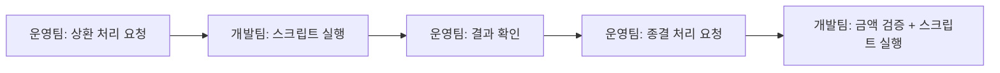
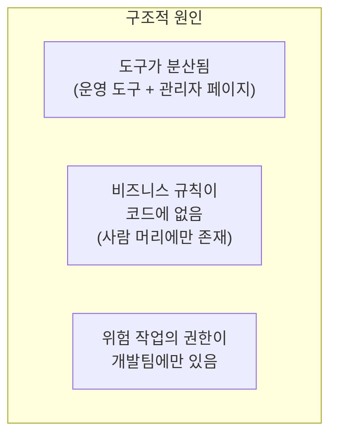
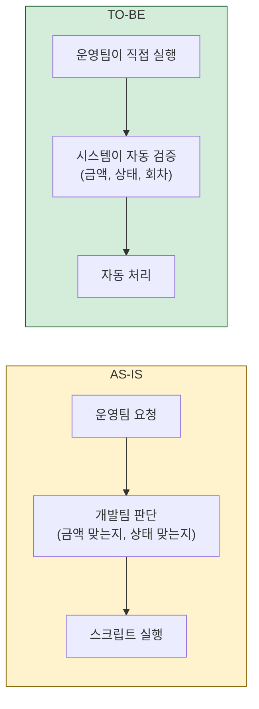
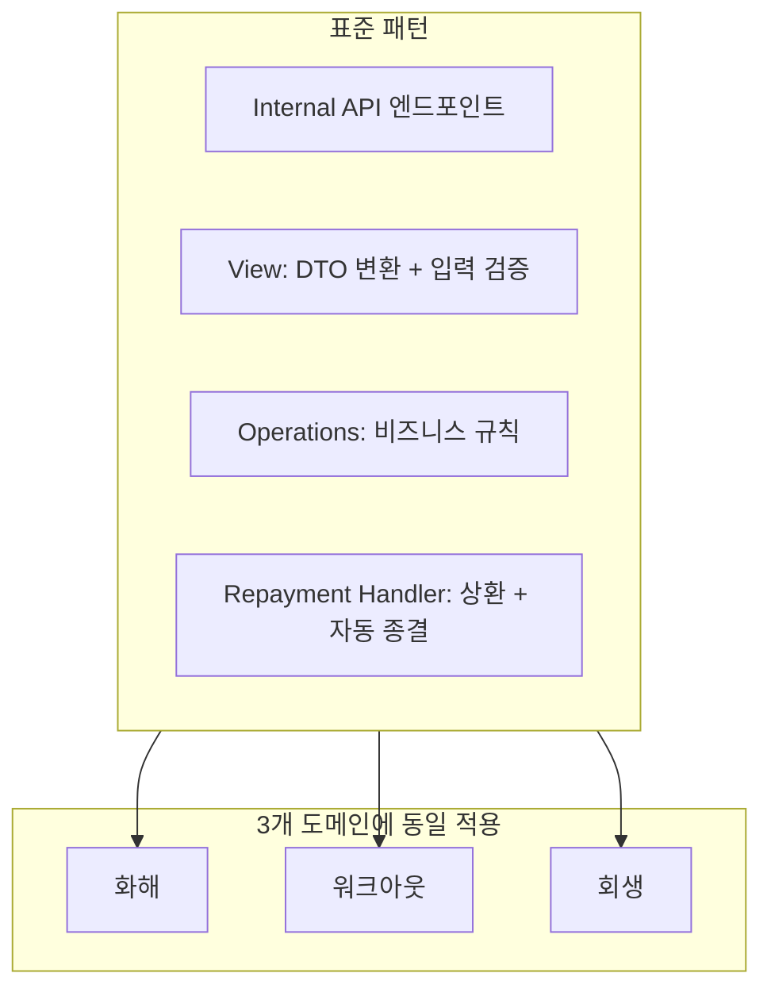
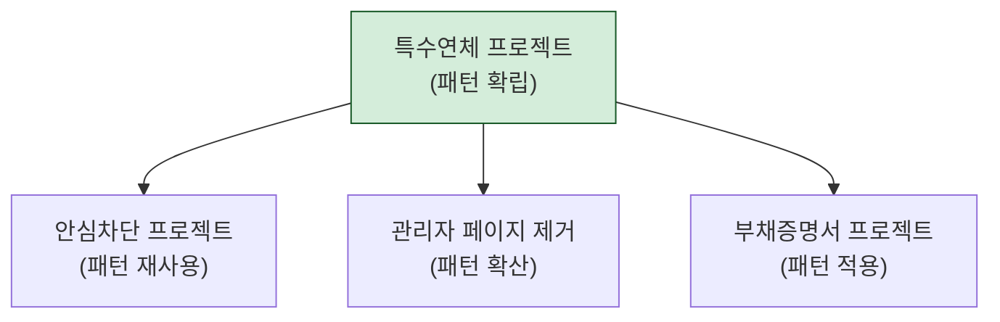

## 배경

백엔드 엔지니어의 일은 "코드를 잘 짜는 것"으로 끝나지 않는다. 실제로 가장 큰 임팩트를 만든 프로젝트들은 **운영 현장의 불편함을 시스템으로 해결**한 경우였다.

이 글은 운영팀의 반복적 요청을 관찰하고, 그것을 시스템화하여 결국 팀 전체의 표준 패턴으로 확산시킨 과정을 정리한다.

---

## 1단계: 문제 관찰 — "이 요청이 왜 반복되는가?"

운영팀에서 개발팀에 반복적으로 들어오는 요청 패턴이 있었다:

이 흐름이 반복되는 동안 양쪽 모두 소모적이었다:
- **운영팀**: 매번 요청하고 기다려야 함. 긴급한 케이스에서 개발팀이 바쁘면 지연됨
- **개발팀**: 본업(기능 개발) 대신 스크립트 실행에 시간을 쓰고 있음. 실수 위험도 있음

---

## 2단계: 문제 정의 — 구조적 원인 파악

단순히 "자동화하자"가 아니라, 왜 이 상태가 된 것인지 파악했다.

핵심 원인은 3가지였다:
1. 운영 도구와 관리자 페이지를 오가며 작업해야 함
2. "상환 금액이 초과하면 안 된다", "상태를 되돌리면 안 된다" 같은 규칙이 시스템에 없음
3. 상환/종결 같은 금융 작업의 실행 권한이 개발팀 스크립트에만 있음

---

## 3단계: 해결 설계 — 비즈니스 규칙의 코드화

사람이 하던 판단을 시스템으로 옮기는 작업:

| 기존 (사람 판단) | 변환 후 (시스템 검증) |
|----------------|-------------------|
| "이 금액이 총 변제액을 넘지 않는지 계산" | `if total_repaid + amount > projected_amount: reject` |
| "상태를 되돌리면 안 됨" | 상태 역행 API 자체를 제거 |
| "최종 상환이면 종결 처리" | `if total_repaid == projected_amount: auto_close()` |

**"못 하게 하는 것"이 가장 강력한 검증이다.** 수동 종결 API를 아예 만들지 않으면, 금액 불일치 상태의 종결이 원천적으로 불가능하다.

---

## 4단계: 구현 — 패턴의 표준화

비슷한 워크플로우가 3개(화해/워크아웃/회생)였는데, 공통 패턴을 먼저 추출하고 3개 도메인에 동일하게 적용했다.

---

## 5단계: 배포 + 현장 피드백

구현 후 운영팀에 교육을 진행하고, 실제 사용 중 나온 피드백을 반영했다.

### 피드백 1: 당일 지급 필요

설계 시 "익일 지급"만 고려했는데, 운영에서 "오늘 바로 지급해야 하는" 케이스가 있었다. 당일 지급 기능을 추가했다.

### 피드백 2: 에러 메시지 개선

"잘못된 요청"이라는 메시지로는 운영팀이 뭘 고쳐야 할지 모른다. "상환 금액(50만원)이 남은 변제액(30만원)을 초과합니다"로 구체화했다.

### 피드백 3: UI 흐름 개선

운영 도구의 버튼 순서가 실제 업무 순서와 다른 부분이 있었다. 운영팀의 실제 작업 흐름에 맞게 조정했다.

---

## 6단계: 패턴의 확산

이 프로젝트에서 확립한 "운영 도구 + Internal API" 패턴이 이후 프로젝트에서 팀 표준이 되었다.

한 번의 프로젝트에서 만든 패턴이 3개의 후속 프로젝트에서 재사용되었다. 매번 "운영 도구를 어떻게 만들지?"를 고민하지 않고, 검증된 패턴을 바로 적용할 수 있게 된 것이다.

---

## 느낀 점

### 반복되는 요청은 시스템의 부재를 알려주는 신호다
운영팀이 같은 유형의 요청을 반복한다면, 그건 운영팀이 게으른 게 아니라 시스템이 해당 워크플로우를 지원하지 않는 것이다. 이 신호를 무시하면 양쪽 모두 소모적인 상태가 계속된다.

### 엔지니어가 문제를 정의하면 임팩트가 달라진다
운영팀은 "이 스크립트를 자동으로 돌려주세요"라고 요청한다. 엔지니어가 거기서 멈추면 스크립트를 cron에 걸어주는 것으로 끝난다. 하지만 "왜 이 요청이 반복되는가?"를 질문하면, 스크립트가 아니라 시스템을 만들게 된다.

### 비즈니스 규칙을 코드로 옮기는 것이 가장 강력한 자동화다
API를 만들고, 버튼을 만들고, 자동화하는 것은 수단이다. 진짜 목적은 **사람의 머릿속에만 있던 규칙을 시스템이 강제하도록 만드는 것**이다. "이렇게 하면 안 됩니다"라고 교육하는 것보다 시스템이 거부하는 것이 100배 안전하다.

### 현장의 피드백은 설계보다 중요하다
아무리 잘 설계해도 실제 사용에서 나오는 피드백은 예상하지 못한 것들이다. 당일 지급, 에러 메시지, UI 흐름 — 모두 운영팀이 직접 써보기 전에는 알 수 없었던 것들이다. 빠르게 배포하고, 빠르게 피드백을 받고, 빠르게 고치는 것이 완벽한 설계보다 낫다.
