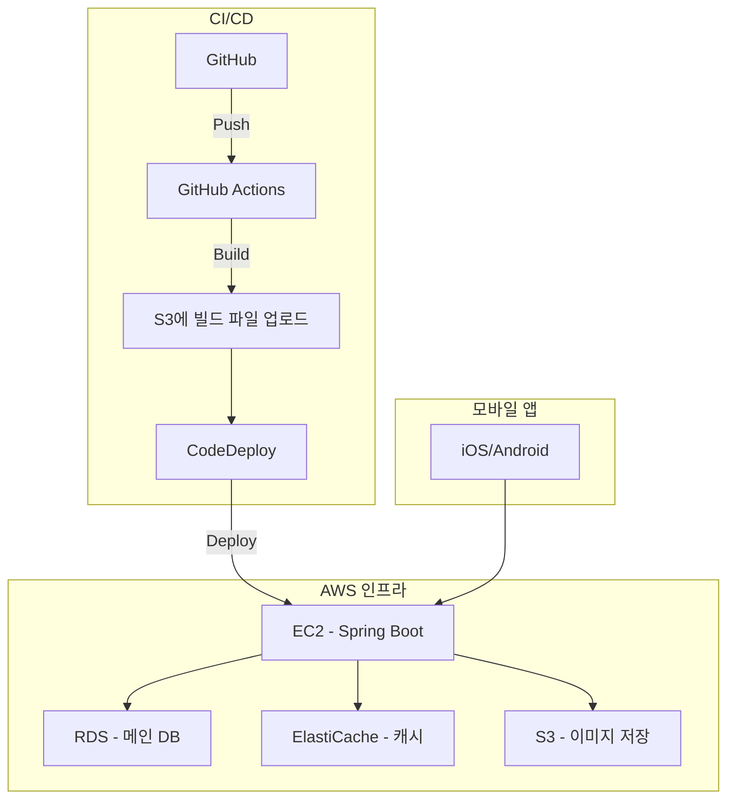
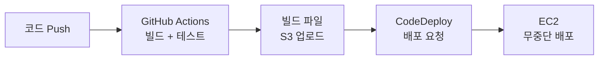
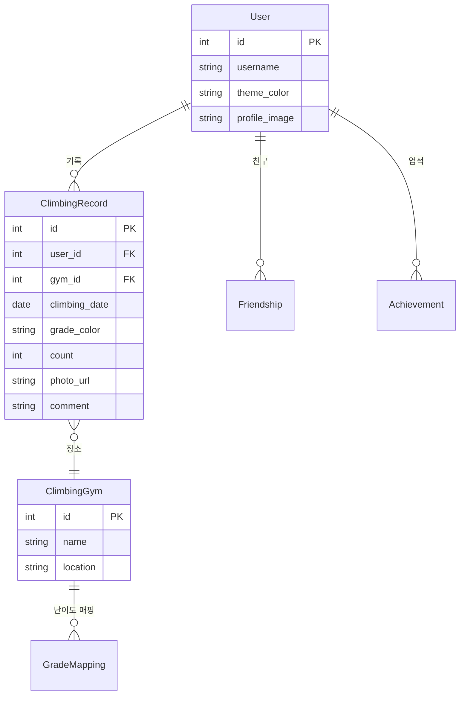
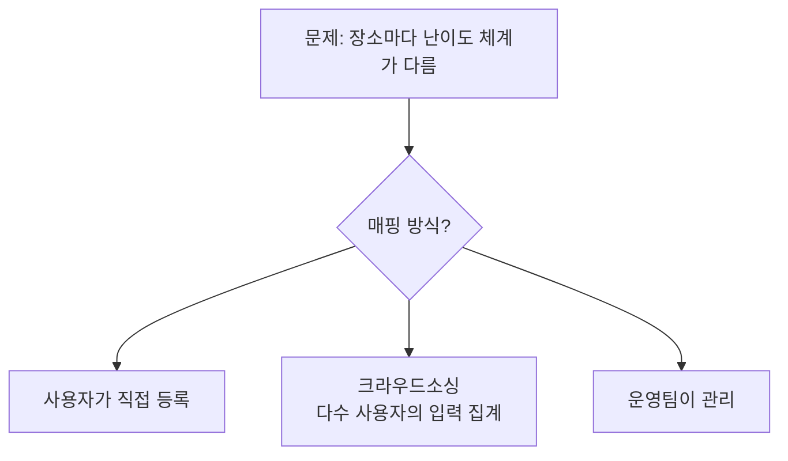

## Project Introduction

CliInfo is an SNS/logging app for climbers. It's a service for recording problems solved at climbing gyms (bouldering routes), tracking progress, and sharing with friends.

I designed everything solo -- planning, UI design, infrastructure architecture, and CI/CD pipeline. Although I never reached the implementation stage, **the experience of "designing an entire system from start to finish"** became a significant asset in my professional work afterward.

---

## Why I Wanted to Build This

Frustrations I experienced while climbing:

- **No records**: Relying on memory to recall what difficulty grades I completed and how many
- **No visible progress**: Hard to tell how much I've improved compared to a month ago
- **No sharing**: No way to compare records or cheer on friends who climb together

Existing apps were generic workout trackers that didn't reflect climbing-specific characteristics (color-coded difficulty grades, bouldering vs. lead climbing, gym-specific route-setting cycles).

---

## UI Design: Designing the User Experience

Instead of Figma, I drew prototypes directly. Three key screens:

### 1. Profile Screen

The first screen that represents a user's identity:

- **Theme color customization**: Users choose their profile background color (yellow, pink, blue, red, purple, brown, etc.)
- **Achievement badges**: Trophy, certification, climbing, torch -- badges based on different accomplishment criteria
- **Problem History**: Recently visited climbing gyms and records
- **Friends**: List of friends who climb together

### 2. Problem Recording Screen

The core flow for logging records after climbing:

```text
클라이밍장 선택 → 날짜 선택 → 난이도별 완등 기록 → 사진 첨부 → 코멘트
```

- Since each gym has a different grading system, location-specific color/grade mapping was needed
- x/y graphs for weekly/monthly/total statistics visualization by color

### 3. Social Feed

- Display friends' records in a timeline
- Compare records from the same climbing gym

---

## Architecture Design



### Rationale for Technology Choices

| Layer | Choice | Rationale |
|-------|--------|-----------|
| **Backend** | Spring Boot (Kotlin) | Leveraged Spring Boot/Kotlin experience from previous company and loan brokerage project handling 150 TPS |
| **DB** | AWS RDS | Well-suited for relational data structures (users-records-gyms) |
| **Cache** | ElastiCache | Caching frequently queried data like gym information and difficulty mappings |
| **Images** | S3 | Problem photo storage with CDN integration capability |
| **CI/CD** | GitHub Actions + CodeDeploy | Automated deployment pipeline |

---

## CI/CD Pipeline Design



When pushing to GitHub, the following happens automatically:
1. Build + test on GitHub Actions
2. Upload build artifacts to S3
3. CodeDeploy deploys to EC2

I applied the same deployment pipeline structure used in production environments to this personal project.

---

## Data Model Design



### Key Design Considerations

**Per-gym difficulty mapping**: Every gym has a different grading system. At Gym A, red is the hardest, while at Gym B, black is the hardest. How should this mapping be managed?



For the MVP, I chose the **user self-registration** approach. As the user base grows, it can transition to crowdsourcing.

---

## Why It Wasn't Implemented and What I Learned

### Why I Couldn't Reach Implementation

- I was preparing to switch jobs at the time and didn't have enough time
- I had no mobile app frontend development experience, so the learning cost was higher than expected
- Trying to handle planning/design/backend/frontend/infrastructure all solo made the scope too large

### What I Still Learned

**1. The experience of drawing the full picture**

In professional settings, you're responsible for only part of a system. In this project, I designed everything from user flows to UI to APIs to DB to infrastructure to CI/CD. This experience was tremendously helpful later in understanding "where the part I'm responsible for fits within the whole."

**2. Design sensibility**

When an engineer designs the UI themselves, they viscerally understand "this button placement would be inconvenient for users." This sensibility was directly applied later when designing operational tools (Retool + Internal API pattern).

**3. The importance of scope management**

The ambition to "do everything solo" can kill a project. After this experience, in LifeRPG I strictly follow the principle of "don't look at M2 before M1 is done."

---

## How This Project Connects to the Present

| Designed in CliInfo | Applied Later in Professional Work |
|--------------------|------------------------------------|
| Spring Boot + AWS infrastructure design | Loan brokerage project at previous company (150 TPS) |
| CI/CD pipeline (GitHub Actions) | Deployment automation at current company |
| User flow to API design | Operational tool workflow redesign |
| Achievement/badge system | Inspired the skill unlock system in LifeRPG |

Even an unfinished project preserves the design experience. In fact, knowing "why it failed" increases the probability of success in the next project.

---

## Reflections

### Unfinished is okay, because the design remains
Even without code, the UI mockups, infrastructure diagrams, and data models remain. These artifacts serve as a portfolio showing "how this person thinks about systems."

### An engineer's design is a "buildable design"
A designer's design pursues beauty, but an engineer's design simultaneously considers "can this actually be implemented?" Because you understand the data model and APIs, when drawing screens, you naturally think "where does this data need to come from?"

### Scope creep kills side projects
If you try to handle planning/design/backend/frontend/infrastructure all solo, you end up completing nothing. For the next project (LifeRPG), I switched strategies to "replace the frontend with a Telegram bot" and "simplify infrastructure with SQLite" to complete the MVP first.
