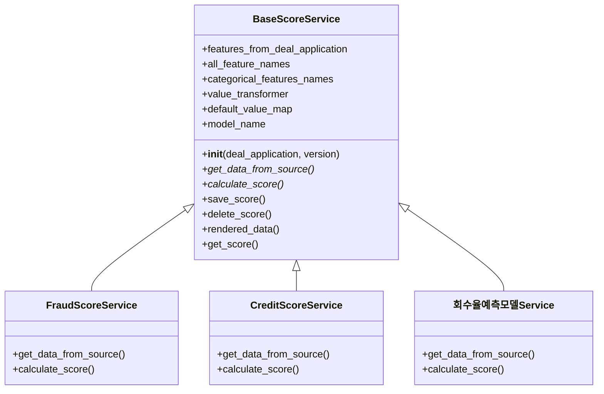
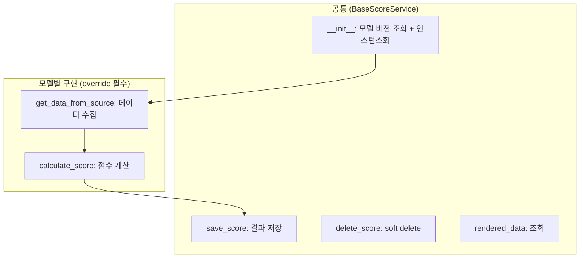
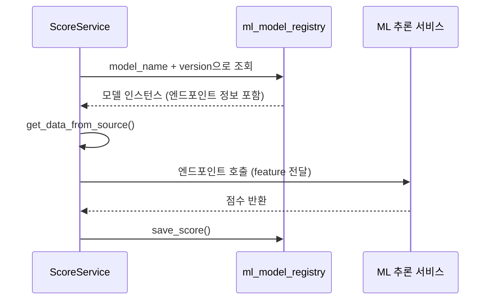
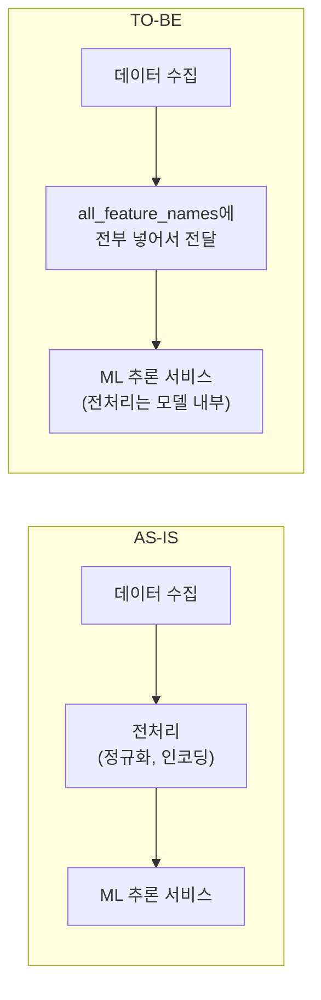
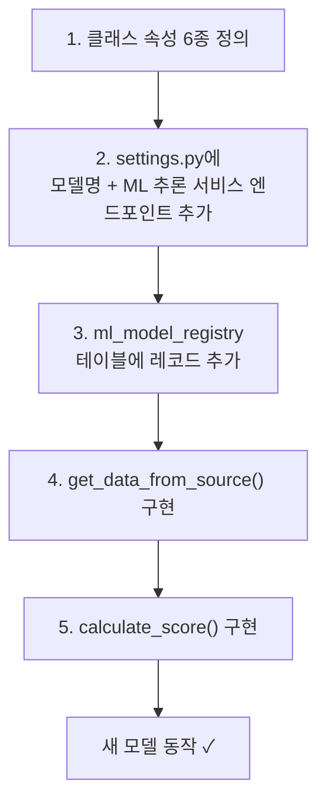

## Background

A loan underwriting system contains multiple types of credit scoring models. Fraud detection models, credit score models, recovery rate prediction models -- each takes different input data and calculates scores differently, but **the overall flow of "gather data, calculate a score, and save the result"** is identical across all of them.

The problem was that similar code was being duplicated every time a new model was added, and each model was implemented in its own way, making maintenance difficult.

---

## Solution: BaseScoreService Abstract Class

By applying the Template Method pattern, the common flow is defined in the parent class while only the model-specific differences are implemented in child classes.

### Class Attributes: "What does this model use?"

Each service class declares six attributes to specify what data it uses.

| Attribute | Role |
|-----------|------|
| `features_from_deal_application` | Values to retrieve from the loan application |
| `all_feature_names` | Complete list of features |
| `categorical_features_names` | Categorical data (enums) |
| `value_transformer` | Data requiring value transformation |
| `default_value_map` | Default value mapping |
| `model_name` | Model name used at the ML inference service endpoint |

### Methods: "Common Flow" vs. "Model-Specific Implementation"

Simply implement `get_data_from_source()` and `calculate_score()`, and the new model is operational. The parent class handles everything else.

---

## Model Version Management

ML models change versions. Even for the same "fraud detection," v1 and v2 may use different features and call different ML inference service endpoints.

During `__init__`, the `ml_model_registry` table is queried to retrieve the model instance for that version. To deploy a new version, you simply add a record to the DB and change the configuration.

---

## Data Delivery Strategy: "Don't Preprocess"

Initially, data preprocessing (normalization, encoding, etc.) was done in the service layer. However, this approach required modifying the preprocessing code every time the model version changed.

Decision: Send all parameters via `all_feature_names`, and let the ML inference service model handle preprocessing internally. The service layer focuses solely on "gathering data and sending it."

---

## New Model Addition Checklist

As the system grows in complexity, the biggest cost becomes "what do I need to do to add a new model?" Thanks to the Template Method pattern, this process has been standardized.

Five steps and a new model is added. Not a single line of common logic (save, delete, query, version management) needs to be touched.

---

## Reflections

### Template Method is the perfect pattern for "same flow, different details"
When the flow of "data collection, score calculation, save" is identical across all models and only the collection/calculation methods differ, Template Method is the right choice. The cost of adding a new model is reduced to "creating one class."

### Delegating preprocessing to the model simplifies the service
If the service layer handles preprocessing, the code branches for every model version. By splitting responsibilities into "gather raw data and send it" while "the model handles its own preprocessing," there's no need to touch the backend code when versions change.

### The value of a checklist emerges after the pattern is established
Creating a checklist without a pattern just yields a "list of things to do." A checklist after a pattern is established becomes a guarantee that "this is all you need to do." This difference is significant.
