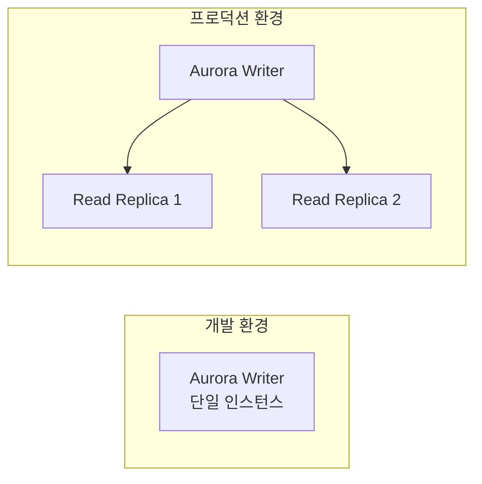
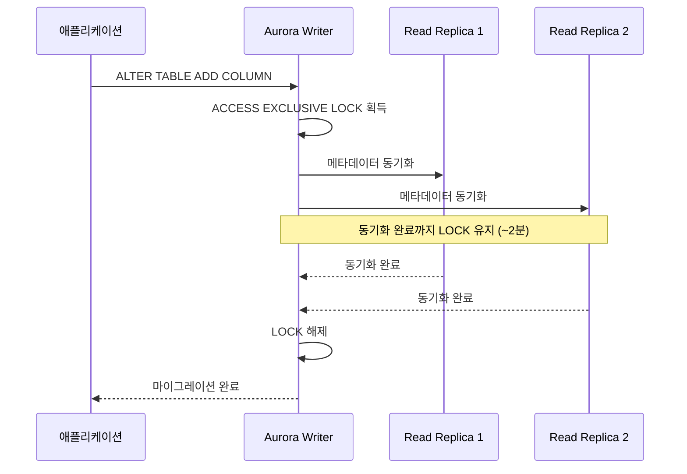
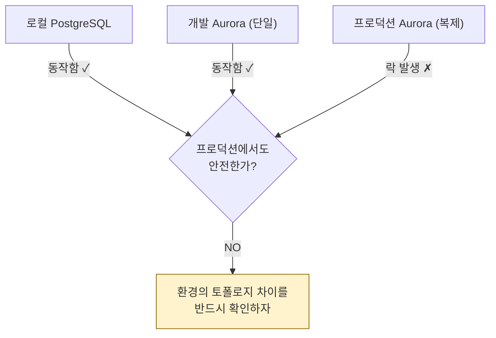

## The Incident

We ran a Django migration that added **90 nullable columns** to a production table. An `ACCESS EXCLUSIVE LOCK` was acquired, causing **all requests dependent on that table to time out for approximately 2 minutes**.

```mermaid
gantt
    title 장애 타임라인
    dateFormat HH:mm
    axisFormat %H:%M
    section DB
    마이그레이션 시작 (LOCK 획득) :crit, a1, 14:40, 20min
    section 서비스
    요청 타임아웃 발생 :crit, b1, 14:40, 20min
    section 복구
    마이그레이션 완료 (LOCK 해제) :done, c1, 15:00, 1min
```



---

## The Conventional Wisdom: "Adding Nullable Columns Is Safe"

In PostgreSQL, adding a nullable column (without a default) via `ALTER TABLE ADD COLUMN` **does not rewrite the table.** Only metadata is modified, so it should complete very quickly.

When running the SQL directly:

```sql
ALTER TABLE my_table ADD COLUMN new_col VARCHAR(100);
-- → Completed in 45ms
```

However, when running the same operation via a Django migration, the table was **locked for approximately 2 minutes**.

```text
Direct SQL execution:     45ms ✓
Django migration:         ~2min ✗  (roughly 2,600x slower)
```

Why?

---

## Hypothesis Testing

### Hypothesis 1: The ALTER statement itself causes the lock

According to PostgreSQL's official documentation, adding a nullable column (without a default) is non-blocking. Direct SQL execution confirmed this at 45ms.

**Verdict: Rejected**

### Hypothesis 2: Data volume is the cause

We replicated production data to a development DB and ran the migration, but the 2-minute lock was not reproduced.

**Verdict: Rejected**

### Hypothesis 3: Aurora replica synchronization is the cause

We analyzed the key difference between development and production:





Aurora automatically synchronizes with replicas during DDL execution. The `ACCESS EXCLUSIVE LOCK` is presumably not released until this synchronization completes.

**Verdict: Likely** (requires further verification by adding replicas to the development DB)

---

## Lessons Learned

### 1. Local/Dev Environment Verification Does Not Guarantee Production Safety



"Adding nullable columns is safe" applies **to single-instance setups**. In environments with replicas, behavior can differ.

### 2. Strategy for Executing Large-Scale DDL

Adding 90 columns at once is inherently risky. Safer approaches:

```sql
-- Method 1: Prevent prolonged locks with lock_timeout
SET lock_timeout = '5s';
ALTER TABLE my_table ADD COLUMN new_col INTEGER;
-- Fails if lock isn't acquired within 5 seconds → retry

-- Method 2: Batch splitting (execute 90 columns in groups of 10)

-- Method 3: Execute during low-traffic periods
```

### 3. Cloud Managed DB Specifics

| Aspect | Vanilla PostgreSQL | Aurora |
|--------|-------------------|--------|
| Adding nullable columns | Metadata-only change, completes instantly | May wait for replica synchronization |
| DDL execution scope | Single instance | Affects entire cluster |
| Test reproduction | Single instance is sufficient | Requires identical replica configuration |

---

## Reflections

Even operations considered "safe" require consideration of production environment specifics. Cloud managed databases (Aurora, Cloud SQL, etc.) can behave differently from vanilla PostgreSQL.

Before executing DDL, testing on an environment with **the same topology as production** (including replicas) is the most reliable approach. If that's not possible, at minimum set `lock_timeout` and execute during low-traffic periods.
