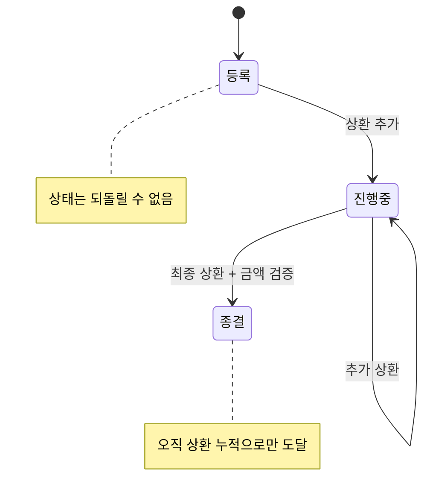
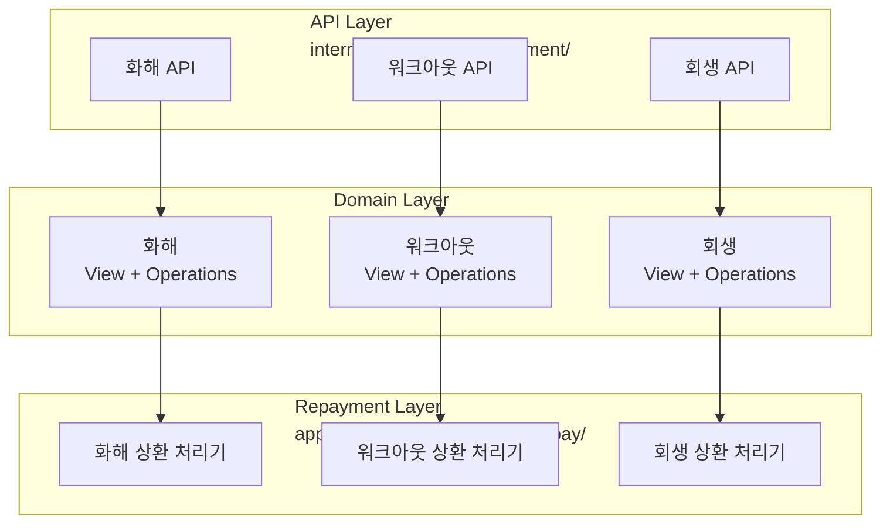
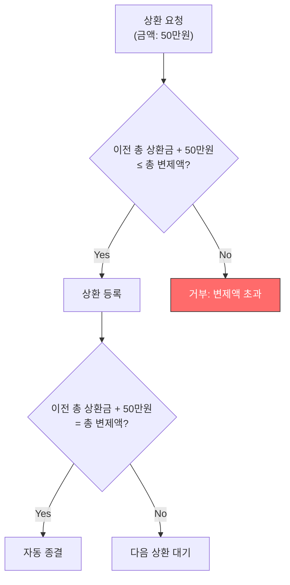

## Background

After a loan defaults, there are three post-default resolution processes: settlement (negotiated agreement), workout (voluntary debt restructuring), and rehabilitation (court-supervised restructuring). The common thread across all three is that they share the same lifecycle: **registration, repayment, and closure**.

The problem was that this workflow was scattered across multiple tools and teams.

### AS-IS: 3 Tools, 2 Teams


- The debt management team had to switch between the operations tool and Django Admin
- Repayment and closure required requesting the development team every time
- The development team manually executed scripts

### TO-BE: 1 Tool, 1 Team


---

## Core Insight: Extracting the Common Pattern Across 3 Processes

Settlement, workout, and rehabilitation differ in their legal procedures and involved agencies, but **from a backend perspective, their lifecycles are identical**.



| Rule | Description |
|------|-------------|
| State irreversibility | Cannot revert to a previous state (skipping ahead is allowed) |
| Sequential repayment | Repayment installments must increase sequentially |
| Amount validation | Repayment amount + previous total repaid must be less than or equal to total settlement amount |
| Automatic closure | Closure only occurs when total repaid equals the projected settlement amount (manual closure is not possible) |
| Automatic disbursement | Next-day automatic disbursement upon repayment registration |

Encoding these rules in code creates a **structure where the operations team cannot make mistakes**.

---

## Backend Architecture: 3 Domains x Common Pattern



The role of each layer:

| Layer | Role | Example |
|-------|------|---------|
| **API** | URL routing, authentication | `POST /post_management/workout/repayment/` |
| **View** | DTO conversion, input validation | Request data to internal objects |
| **Operations** | Core business logic | State transition rules, amount validation |
| **Repayment** | Repayment processing | Amount recording, automatic disbursement, automatic closure |

---

## Codifying Business Rules

### State Irreversibility

```python
# Block attempts to revert status
def validate_status_transition(current, new):
    STATUS_ORDER = ['registered', 'in_progress', 'closed']
    if STATUS_ORDER.index(new) <= STATUS_ORDER.index(current):
        raise ValidationError("상태를 이전 단계로 되돌릴 수 없습니다")
```

### Repayment Amount Validation



### Automatic Closure Conditions

```python
def process_repayment(plan, amount):
    # Amount validation
    if plan.total_repaid + amount > plan.projected_amount:
        raise ValidationError("총 변제액을 초과합니다")
    
    # Record repayment
    plan.add_repayment(amount)
    
    # Automatic closure determination
    if plan.total_repaid == plan.projected_amount:
        plan.close()  # No manual closure API exists — only this path
```

There is no API to manually change the status to "closed." The system automatically closes only when cumulative repayments match the projected settlement amount. This makes it fundamentally impossible to close a case with a mismatched amount.

---

## Feedback from Actual Operations

After the production deployment, we conducted training with the debt management team and gathered feedback.

### Additional Requirement: Same-Day Disbursement

The original design was "next-day disbursement," but operations had cases where "repayments registered today need to be disbursed today." We added a same-day disbursement feature.

### Operational Bug Case

After deployment, the debt management team discovered an error while using the system directly:

> "Gyubo said we could perform repayment registration/disbursement preparation in July, but when we tried, we got an 'invalid request' error message."

An edge case discovered by the operations team actually using the system I built. It was resolved with a same-day hotfix.

---

## Reflections

### "Manual request followed by script execution" is a smell of technical debt
A structure where the operations team requests the development team, who then executes scripts, is a burden on both sides. Encoding business rules in code and providing a UI allows the operations team to work autonomously while the development team focuses on their core work.

### The essence of a state machine is "what it prevents"
Defining "what cannot be done" is more important than "what can be done." Making states irreversible, amounts non-exceedable, and manual closure impossible eliminates operational mistakes at the source.

### Find the common pattern across the 3 domains first
Had settlement/workout/rehabilitation been designed separately, there would have been 3x the code and 3x the bugs. If the business rules are the same, the backend structure should be the same. Only the parts that truly differ need to be separated.
