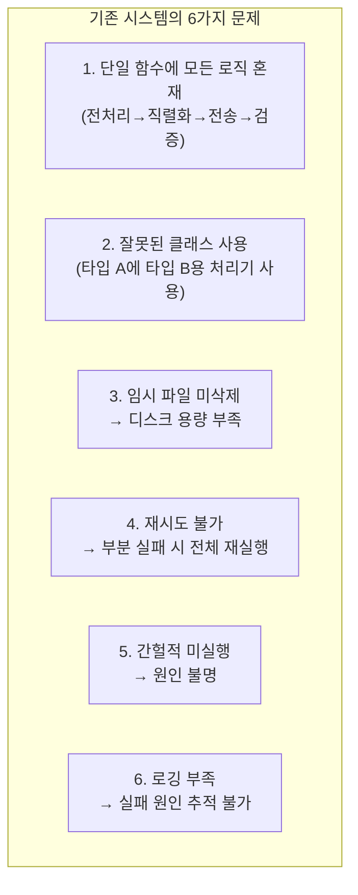
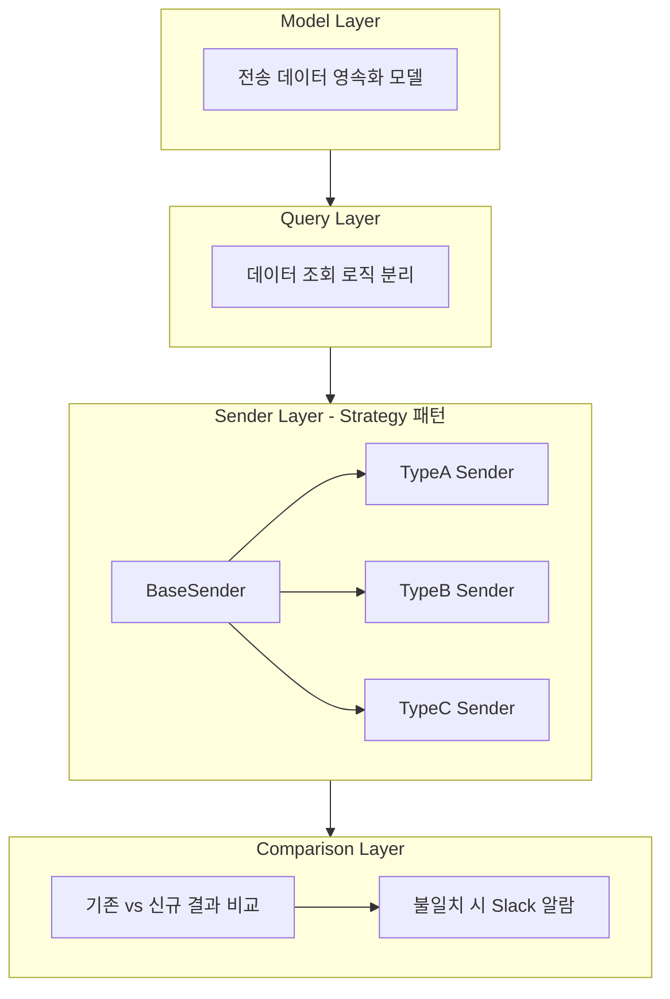
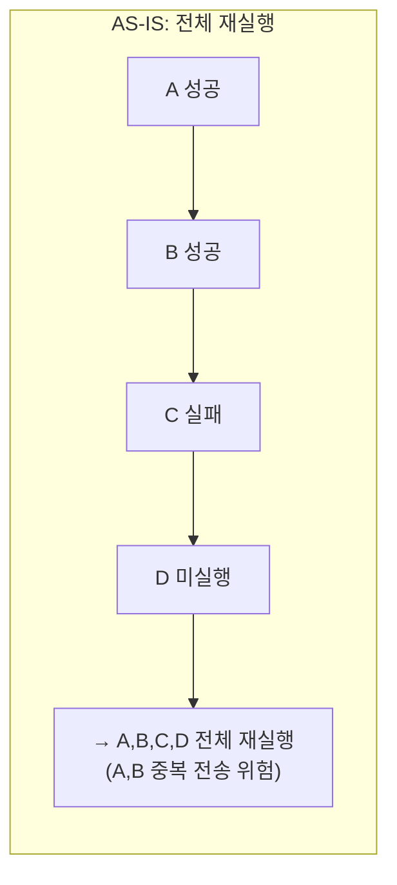
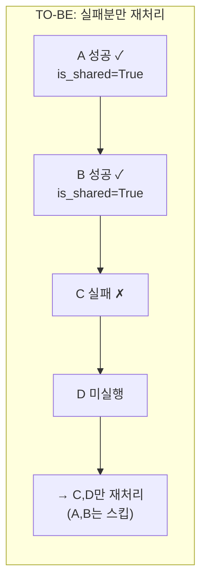
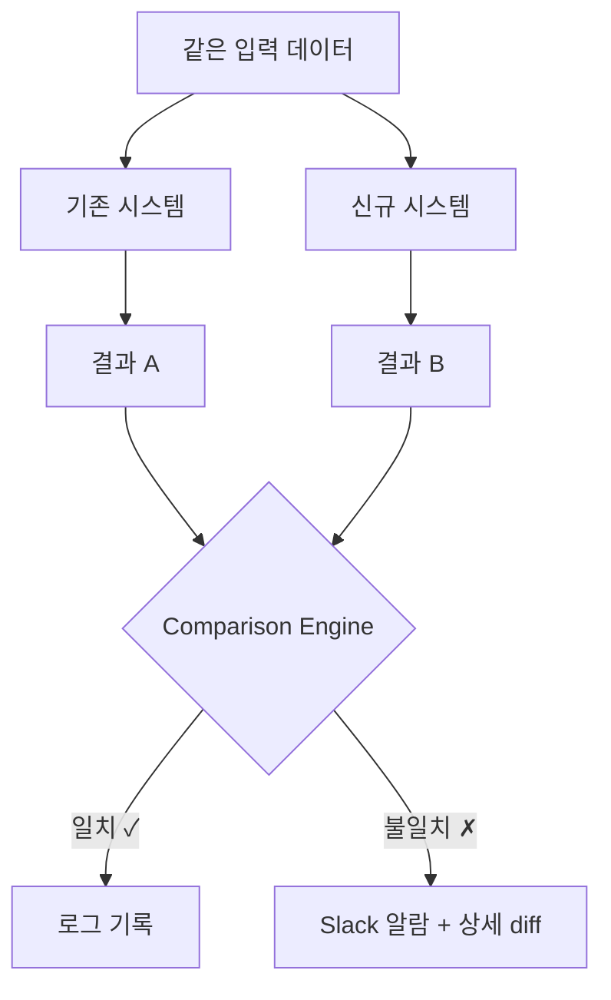
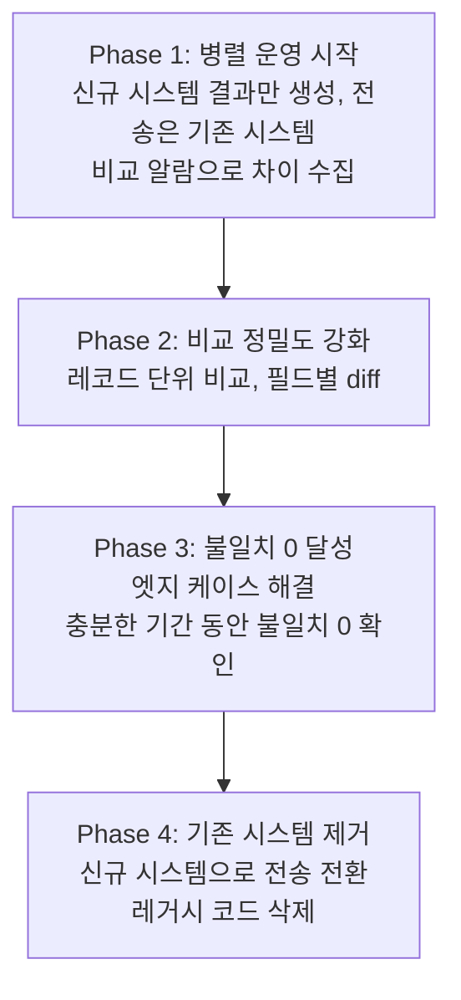

## Background

I refactored a batch task that transmits daily data to a financial institution. Since this involves financial data transmission, accuracy is paramount -- even a single incorrect record can lead to regulatory issues.

### Problems with the Existing System



**Problem #4** (no retry capability) in particular was a major operational burden. When a batch partially failed in the early morning hours, even the successfully transmitted records had to be resent, and there was a risk of duplicate transmissions.

---

## Solution: 4-Layer Architecture

The monolithic function was split into four layers.



### Strategy Pattern Sender

Each transmission type requires different preprocessing, which was previously handled with if-else branching.

```python
# AS-IS: if-else branching (modifying existing code for each new type)
def send_daily():
    if record_type == 'A':
        data = process_type_a(records)  # Was actually using Type B's processor (bug)
    elif record_type == 'B':
        data = process_type_b(records)
    elif record_type == 'C':
        ...

# TO-BE: Strategy pattern (just add a new class for new types)
class TypeASender(BaseSender):
    record_info_class = TypeARecordInfo  # Correct processor

    def preprocess(self, records):
        ...

    def serialize(self, data):
        ...
```

When a new transmission type is added, you simply create a new Sender class without modifying existing code.

### Idempotency and Partial Failure Recovery





By marking successful transmissions with an `is_shared=True` flag, only the failed records are reprocessed on re-execution. This single flag significantly reduced the stress of handling early-morning incidents.

---

## Core Strategy: Comparison Alert System

Replacing legacy code all at once is risky. Especially with financial data, "it's probably correct" doesn't cut it.

We **safely migrated by running the old and new systems in parallel and comparing their results**.



### 4-Phase Migration



### Edge Cases Discovered by Comparison Alerts

The comparison process uncovered unexpected cases:

```text
09:00  Loan registration (registration record created)
15:00  Same-day repayment (repayment record created)
23:00  Daily batch execution

→ Old system: Processes registration/repayment separately
→ New system: Processes as a single transaction
→ Result mismatch → Slack alert → Root cause analysis → Logic fix
```

Without comparison alerts, this edge case would have been discovered in production. Test code alone cannot cover every possible combination of real-world data.

---

## Reflections

### Comparison alerts are the safety belt for large-scale refactoring
By automatically verifying "does the new code produce the same results as the old?" we could refactor with confidence. This method is especially effective in financial systems.

### Strategy pattern fits well with "same task, different approaches"
When preprocessing differs by transmission type, separating implementations is more maintainable than if-else branching. The bug where Type A was using Type B's processor was also discovered through this refactoring.

### Idempotency is the lifeline of batch systems
Being able to say "just re-run it" when a partial failure occurs completely changes the experience of handling early-morning incidents.

### Gradual migration is better than big-bang switchover
The temptation of a big-bang cutover is strong -- "running two systems is more complex anyway." But in systems where accuracy matters, a big-bang approach is a gamble. Taking ample time for parallel operation ultimately turned out to be the faster path.
