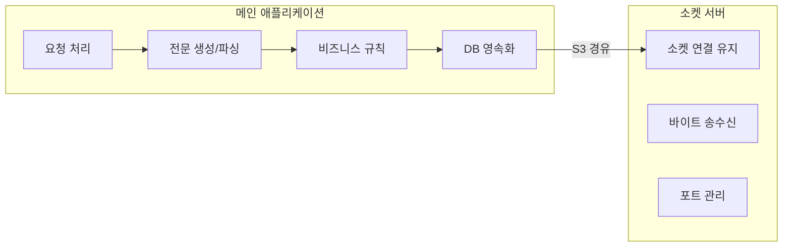
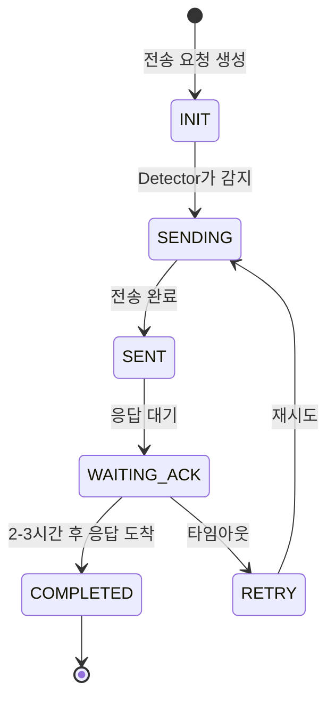
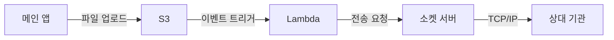
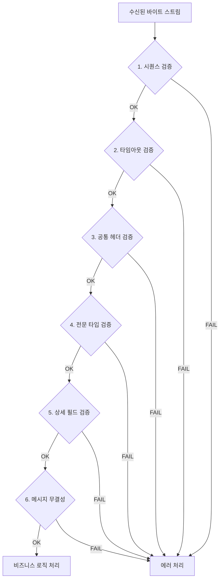
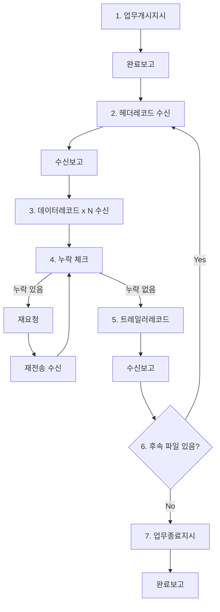
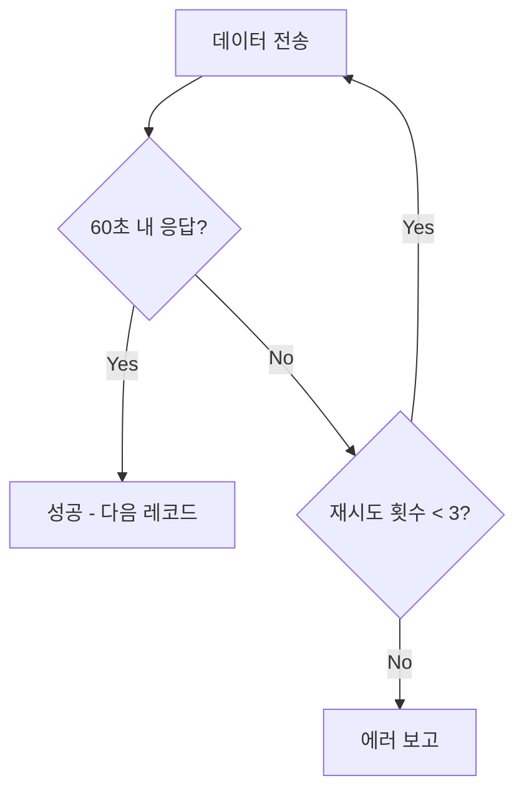
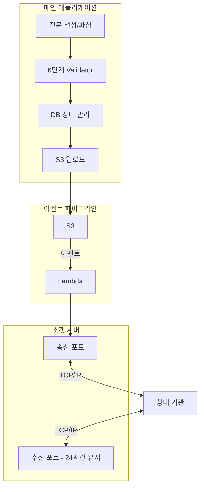

## Background

I designed a new system for exchanging file messages (electronic documents) with a financial institution. Previously, a dedicated operator would manually send and receive files through a Windows-only application. The project was to replace this with a **24/7 automated socket-based system**.

### Requirements and Constraints

- **3 bidirectional processes**: Delta data reception, selective reception requests, intensive data reception
- **Sequential processing mandatory**: Initialization, transmission, and reporting stages must proceed in strict order
- **Single concurrent socket connection limit**: Only one file can be transmitted at a time
- **Asynchronous responses**: The counterpart institution's responses arrive 2-3 hours later on a separate port

These constraints are what made the design interesting.

---

## Design Decision 1: Separating Business Logic from Communication

The main application decides "what to send," while the socket server handles only "how to send it." The rationale for this separation:

- The **socket server** must maintain long-lived connections on specific ports, whereas **business logic** follows a request-response pattern
- Each can be deployed independently and failures can be isolated
- If the socket server has issues, the business logic continues to operate, and retransmission occurs after recovery

---

## Design Decision 2: DB-Based Event Architecture

Instead of a message queue (RabbitMQ, SQS, etc.), we used **DB tables as the event store**.

A process called the Detector periodically polls the DB, and when it discovers records in a specific state, it executes the corresponding function and updates the state.

**Why DB instead of MQ?**

| Comparison | Message Queue | DB-Based Events |
|------------|--------------|-----------------|
| Sequential processing | Requires ordering configuration | Naturally guaranteed via state machine |
| Async responses (2-3h) | Requires message TTL management | Persisted in DB, time-independent |
| Pause/Resume | Requires separate checkpoint implementation | Resume from anywhere by checking state |
| Additional infrastructure | MQ server required | Uses existing DB |

If you set aside the bias that "polling is an anti-pattern," your design options expand. In cases like this with strong sequential processing constraints and the need to wait for asynchronous responses, a DB state machine was simpler and more reliable than MQ.

---

## Design Decision 3: S3 Event Pipeline

Instead of direct API calls from the main app to the socket server, I chose S3 event triggers for data handoff.

**Advantages over direct API calls:**

- **Simplified failure recovery**: When API calls fail, retry logic becomes complex. With the file persisted in S3, only the failed events need reprocessing
- **Reduced coupling**: The main app just uploads a file to S3 and it's done. It doesn't need to know the socket server exists
- **Automatic logging**: S3 events and Lambda execution logs are captured automatically

The simple contract of "if a file exists, process it" provides a loose coupling between the two systems.

---

## 6-Layer Message Validation System

Unlike HTTP, socket communication has no frame boundaries. Since the byte stream must be parsed manually, multi-layer validation is essential.

Each layer independently detects failures, making it immediately clear at which level a problem occurred.

---

## File Reception Process

File reception consists of 7 stages, handling missing data re-requests and sequential file reception.

### Transmission Retry Logic

A retry occurs after 60 seconds of no response, with a maximum of 3 attempts. Managed via an event queue so that successful transmissions are preserved even during partial failures.

---

## Full Architecture Summary

---

## Reflections

- A **DB-based state machine** is a practical way to implement event-driven patterns without MQ. It is especially useful when sequential processing constraints exist and you need to wait for asynchronous responses.

- **S3 event triggers** reduce coupling between systems while simplifying failure recovery. Instead of complex retry logic, the simple contract of "if a file exists, process it" is sufficient.

- **Socket communication is qualitatively different from HTTP.** There are many low-level concerns: no frame boundaries, byte parsing, connection state management. Building sufficient validation layers is the key to long-term operational stability.

- Transitioning from manual processes to an automated system is not just a technical challenge -- **defining failure modes in advance and designing recovery strategies for each** is the real essence.
