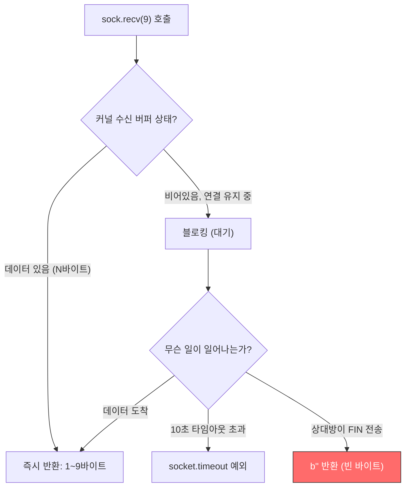
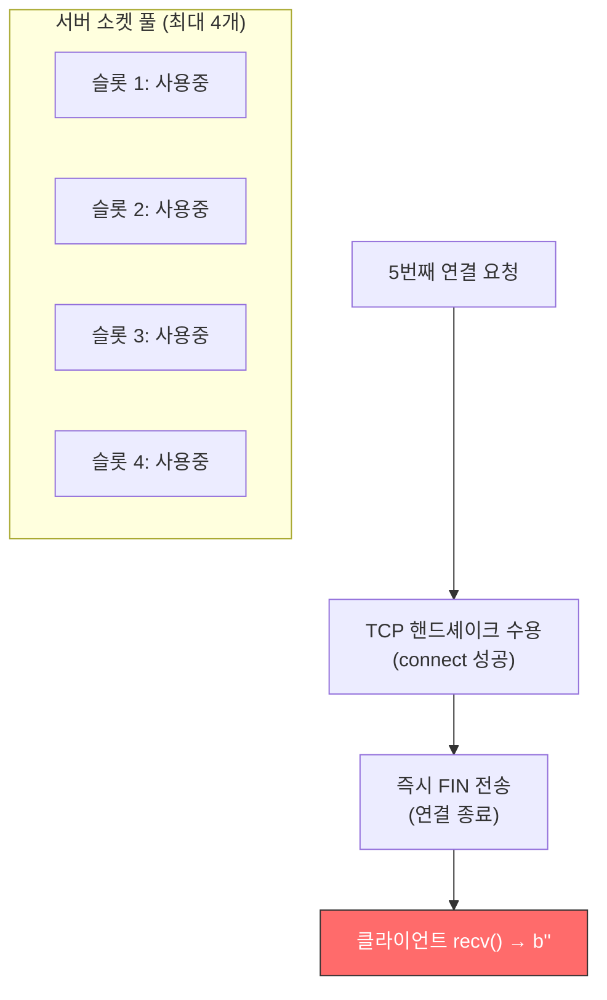
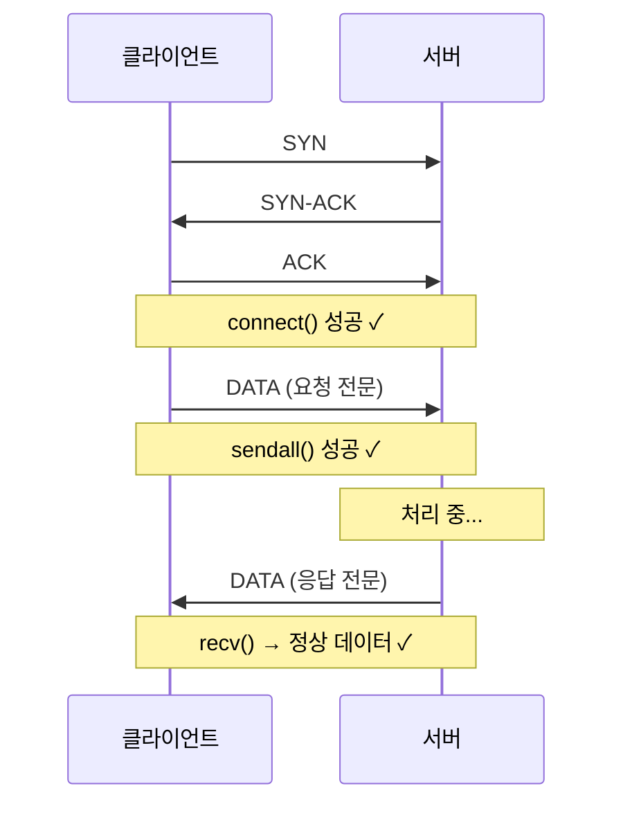
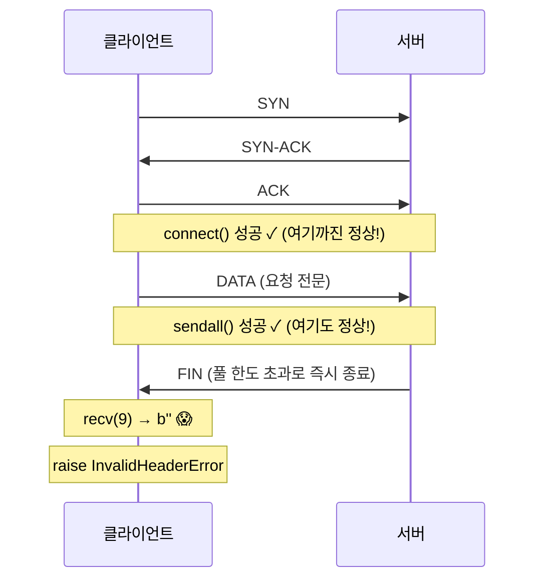
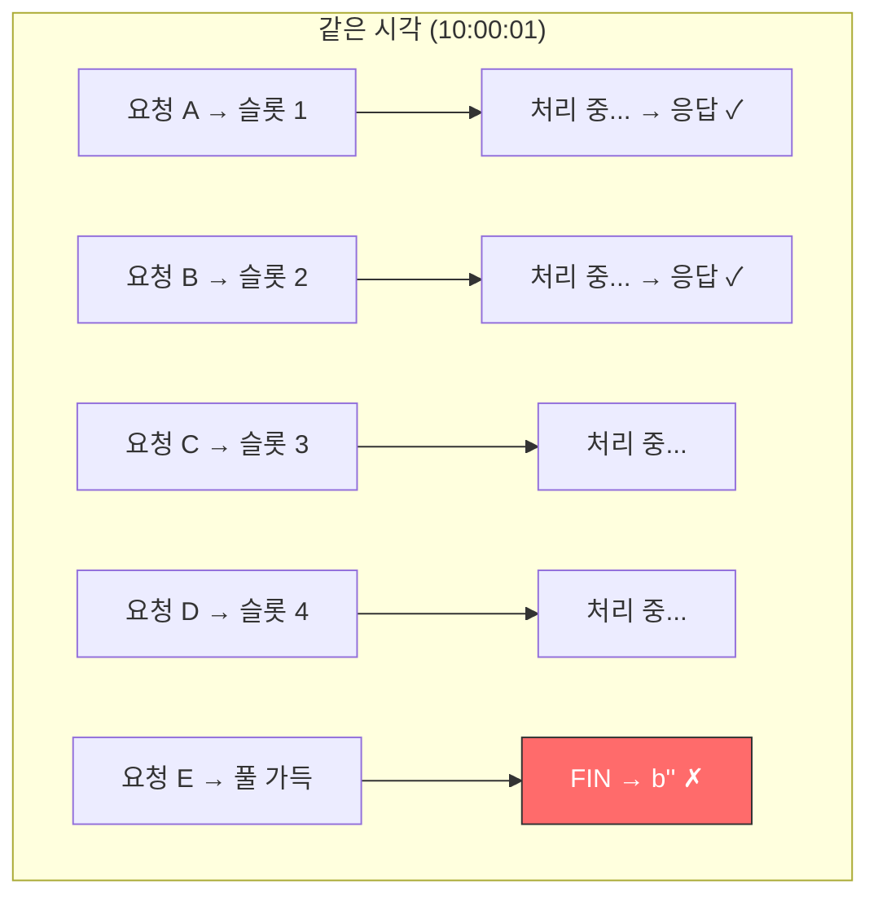
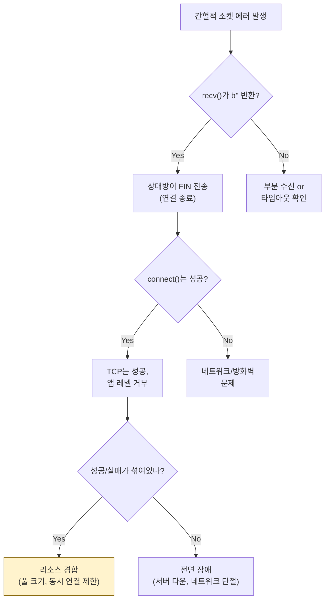

## The Problem

In socket communication with an external institution, an `InvalidHeaderError: b''` was occurring intermittently. It was an error caused by receiving empty bytes, and the occurrence pattern was irregular.

---

## Socket Code Analysis

Basic communication structure:

```python
with socket.socket(socket.AF_INET, socket.SOCK_STREAM) as sock:
    sock.settimeout(10)  # 10-second timeout
    sock.connect((SERVER_IP, PORT))
    sock.sendall(encoded_request)
    header = sock.recv(9)  # Receive up to 9 bytes
    if len(header) != 9:
        raise InvalidHeaderError(header)  # ← b'' occurs here
```

---

## Understanding the Actual Behavior of recv()

`sock.recv(9)` **does not mean "read exactly 9 bytes."** It is a wrapper around the OS system call `recv()`, meaning **"read up to 9 bytes."**



**Key distinction:**

| Situation | Result | Meaning |
|-----------|--------|---------|
| Timeout | `socket.timeout` **exception** raised | The remote side is **not responding** |
| Connection closed | `b''` **returned** (not an exception!) | The remote side has **explicitly closed the connection** |

Without understanding this distinction, the debugging direction goes completely wrong.

---

## Hypothesis Testing

### Hypothesis 1: Server overload from excessive requests

I analyzed the request volume at the time of the errors:

```text
Time        Req/sec    Success    Failure
────────────────────────────────────────
10:00:00    2         2          0
10:00:01    3         2          1  ← b'' occurred
10:00:02    1         1          0
10:00:03    2         1          1  ← b'' occurred
10:00:04    2         2          0
```

At 1-3 req/sec, this is within normal range, and **successes and failures coexist at the same time**. If server overload were the cause, all requests should have failed from a certain point onward.

**Verdict: Rejected**

### Hypothesis 2: Server socket pool management issue

Confirmed with the counterpart institution:



**Verdict: Likely**

---

## What Happens at the TCP Level

### Normal Case (Pool has available slots)



### Problem Case (Pool is full)



**Key point**: Because `connect()` and `sendall()` both succeed, it appears as though there is no network issue. However, **the TCP handshake (OS kernel level) and application-level acceptance are separate things**.

---

## Why Successes and Failures Were Intermixed at the Same Time



When new connections arrive while existing connections still occupy slots, some succeed and some fail. This was the cause of the "intermittent failures."

---

## Resolution

```python
header = sock.recv(9)
if not header:
    # b'' → The remote side has closed the connection
    # Not "the header is malformed" but "the connection was dropped"
    raise ConnectionClosedError(
        "서버가 연결을 종료함 - 소켓 풀 초과 가능성"
    )
if len(header) < 9:
    # Partial receive → need to read the remaining bytes
    remaining = 9 - len(header)
    header += sock.recv(remaining)
```

---

## Socket Debugging Checklist



---

## Reflections

### When recv() returns b'', the remote side has closed the connection
A timeout (`socket.timeout` exception) and a connection close (`b''` return) are entirely different signals. Without understanding this distinction, the debugging direction goes completely wrong.

### A successful connect() does not guarantee successful communication
The TCP 3-way handshake is handled at the OS kernel level. An application can accept a connection and immediately close it. "We connected, so the network is fine" is a dangerous assumption.

### For intermittent errors, suspect resource limits
A pattern of "fails occasionally" is often a resource contention issue: concurrency limits, pool sizes, rate limits. If you see partial failures rather than total failures, check the remote side's resource limits first.

### Python socket is a thin wrapper around OS syscalls
Python's `socket` module provides almost no abstraction. You need to understand how the OS-level `recv()` system call works in order to properly debug Python socket code.
