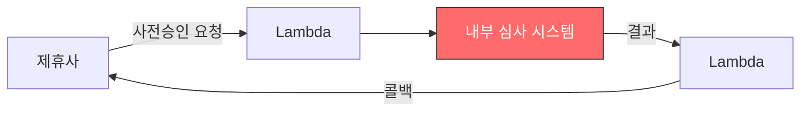
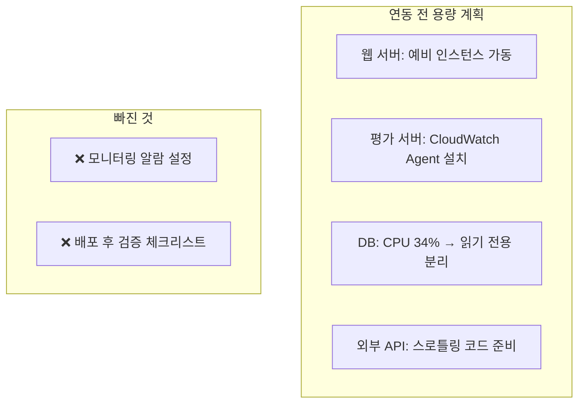
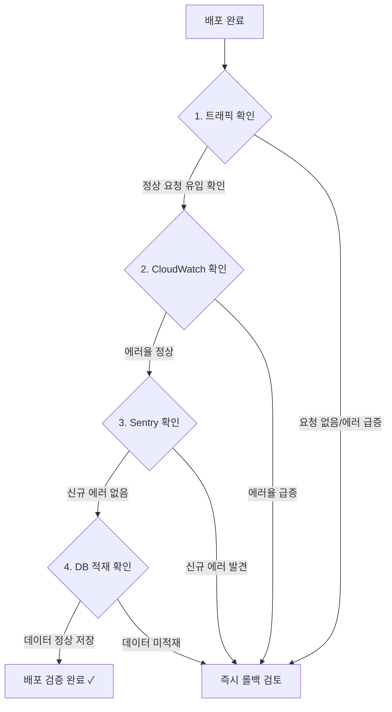
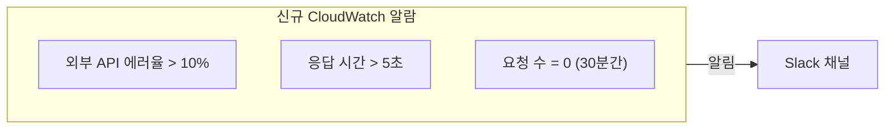

## Incident Summary

| Item | Details |
|------|---------|
| Outage window | Friday 18:30 ~ Monday 12:53 |
| Duration | **Approximately 66 hours** |
| Impact scope | All pre-approval requests from external partner failed |
| Root cause | Serializer mismatch due to external data format change (v2) |

---

## System Architecture

The loan pre-approval integration with the partner used a Lambda as a proxy, with an internal underwriting system handling the processing.



The problem occurred in the internal underwriting system (highlighted in red).

---

## What Happened

### Root Cause: Serializer Type Mismatch

An external API providing health insurance data was updated to v2, **changing the response format from a list to a dictionary**.

```python
# === v1: List format ===
health_data = [
    {"year": 2025, "month": 1, "amount": 150000},
    {"year": 2025, "month": 2, "amount": 160000},
]
Serializer(data=health_data, many=True)  # OK ✓


# === v2: Changed to dictionary format ===
health_data = {
    "insurance_type": "health",
    "payments": [
        {"year": 2025, "month": 1, "amount": 150000},
    ]
}
Serializer(data=health_data, many=True)  # FAIL ✗
# → TypeError: "item list expected, got dict"
```

Django REST Framework's `many=True` internally uses `ListSerializer`, which requires the input to be a list. Passing a dict causes immediate failure.

### Additional Bug: Empty String Handling

```python
{"expired_date": None}       # → None allowed → OK
{"expired_date": "2025-12-31"} # → Date parsing succeeds → OK
{"expired_date": ""}          # → Empty string parsing fails → ValidationError
```

The external API sometimes sent empty strings (`""`) instead of `None` for "no value."

---

## Why Did It Take 66 Hours?

The real lesson of this incident is not the bug itself, but **the time it took to discover it**.

```mermaid
gantt
    title 장애 타임라인 (66시간)
    dateFormat YYYY-MM-DD
    axisFormat %m/%d (%a)
    section 장애
    장애 시작 (금 18:30)         :crit, f1, 2025-11-07, 3d
    section 모니터링
    Sentry 알람 지연 + 주말      :crit, s1, 2025-11-07, 3d
    section 복구
    출근 후 발견 + 핫픽스 배포    :done, m1, 2025-11-10, 1d
```

### Monitoring Blind Spot

| Monitoring Tool | Status | Problem |
|----------------|--------|---------|
| **Sentry** | Error collection: YES, Alert: **2-day delay** | Alert threshold not configured |
| **CloudWatch** | Error logs: YES, **Alerts not set up** | No dedicated monitoring for external APIs |
| **Developer** | Left work on Friday | Unable to check over the weekend |

Errors were being recorded in real time, but **nobody was notified**.

---

## We Had Done Capacity Planning Beforehand

Before the partner integration, we had prepared an infrastructure capacity plan:



We verified whether the infrastructure could **handle the load**, but there was no system to **alert us** when problems occurred. "Capacity planning" and "monitoring" are separate concerns.

---

## Prevention: Post-Deployment 4-Step Checklist

The mandatory checklist introduced after this incident:



### Additional Monitoring Measures



---

## Reflections

### 1. Don't trust the feeling that "things seem fine"
External integrations especially can only reveal problems when real traffic flows through them. A service hidden behind a Lambda is invisible unless you actively call it and check for errors.

### 2. Don't rely solely on Sentry
Sentry **collects** errors, but there can be delays in alert **delivery**. Infrastructure-level monitoring (CloudWatch, etc.) should be the first line of defense. Sentry is the second.

### 3. Avoid deploying on Friday evening
Without monitoring, crossing into a weekend turns into a 66-hour outage. Simply shifting the deployment window to Tuesday through Thursday mornings allows most incidents to be caught within half a day.

### 4. `many=True` is sensitive to input types
Django REST Framework's `many=True` internally uses `ListSerializer`. Since external API responses can change at any time, defensive type checking is the safe approach:

```python
# Defensive handling example
if isinstance(health_data, dict):
    health_data = [health_data]
serializer = MySerializer(data=health_data, many=True)
```
