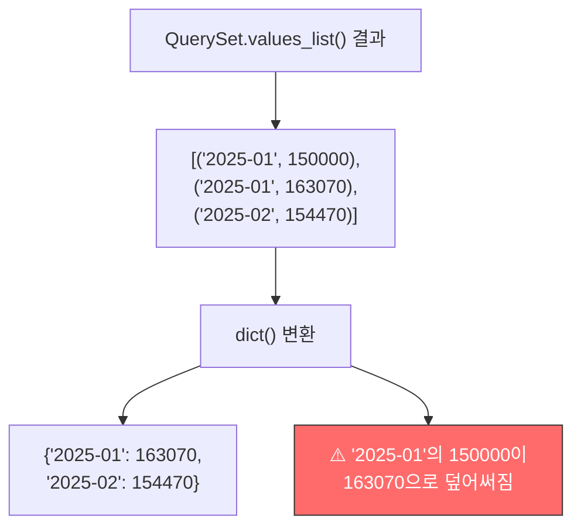
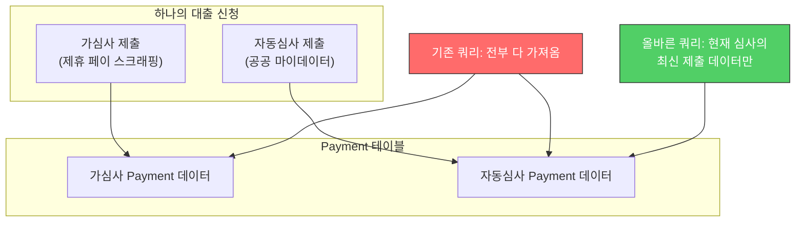
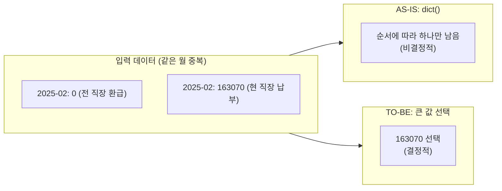

## Discovery

A bug was found in the loan underwriting system's logic for passing health insurance payment data to an external scoring engine. **Different values were being passed for the same application depending on the underwriting path (pre-screening vs. automated underwriting).**

```text
-- Automated underwriting (public MyData)
"HEALTH_INSURANCE": "0,0,0,0,0,0,0,0,-56460,163070,163070,0,0,0,..."

-- Pre-screening (partner pay scraping)
"HEALTH_INSURANCE": "0,154470,154470,154470,154470,...,163070,163070,..."
```

The original data stored in the DB was identical. **The data was diverging in the delivery logic.**

---

## Root Cause Analysis

### Bug 1: Value overwriting during dict() conversion

```python
payments = dict(
    self.health_insurance_payments.values_list(
        "payment_month", "employee_health_notice_amount",
    )
)
```

The problem lies in `dict()`.



When `dict()` receives tuples with duplicate keys, **the later value overwrites the earlier one.** In health insurance data, multiple records can exist for the same month (payment_month):

- Concurrent employment (paying at two workplaces simultaneously)
- Job change (refund from previous employer + payment at new employer)
- Separate data per underwriting path (pre-screening/automated)

```python
# How dict() works
dict([("a", 1), ("a", 2)])  # → {"a": 2}  (1 is lost)

# Intended behavior
# When multiple values exist for the same month, select the larger value
```

### Bug 2: Ignoring the underwriting process

```python
@property
def health_insurance_payments(self):
    return Payment.objects.filter(
        cert__submission__deal_application=self._deal_application,
        payment_month__gte=self.start_year_month,
    )
```

This query **retrieves all submission data regardless of the currently active underwriting process.**



Data from pre-screening and automated underwriting was mixed together in the QuerySet, and during the `dict()` conversion, which value survived depended on ordering.

---

## Fix

### Fix 1: Query only the latest submission data

```python
@property
def health_insurance_submission(self):
    return self.health_insurance_submissions.latest("created")
```

Filtering was added to retrieve only the Payment records linked to the **most recent submission** for the current underwriting path.

### Fix 2: Select the larger value for same-month data

Instead of `dict()`, explicit aggregation logic was implemented.

```python
# AS-IS: dict() - later value overwrites (non-deterministic)
payments = dict(queryset.values_list("payment_month", "amount"))

# TO-BE: When multiple values exist for the same month, select the largest (deterministic)
result = {}
for month, amount in queryset.values_list("payment_month", "amount"):
    if month not in result or amount > result[month]:
        result[month] = amount
```



**Why the larger value?** In the case of concurrent employment (paying at two workplaces simultaneously), using the higher-income workplace as the basis is more conservative. Additionally, actual payment amounts are more meaningful data than refunds (negative amounts).

---

## Lessons

### 1. Check for key duplication when converting QuerySets with dict()

```python
# Unsafe - unless key uniqueness is guaranteed
dict(queryset.values_list("key", "value"))

# Alternative 1: Verify key uniqueness
assert queryset.values("key").distinct().count() == queryset.count()

# Alternative 2: Explicit aggregation
from collections import defaultdict
grouped = defaultdict(list)
for key, value in queryset.values_list("key", "value"):
    grouped[key].append(value)
```

### 2. Question the filtering scope of ORM queries

Always ask: "Is this query fetching exactly the data range I need?" Especially in structures where a single entity (loan application) can have data from multiple contexts (pre-screening/automated underwriting), filtering to the current context is essential.

### 3. In financial data, "non-deterministic" is a bug

The fact that `dict()` conversion results depend on QuerySet ordering means that **the same input can produce different outputs.** In a typical application this might not be a major issue, but in a loan underwriting system where results directly determine approval or rejection, non-deterministic behavior is a serious bug.
