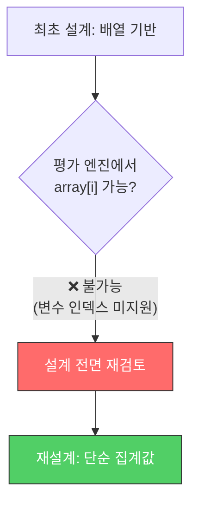
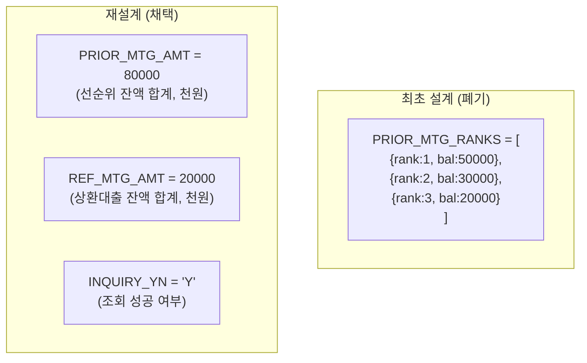
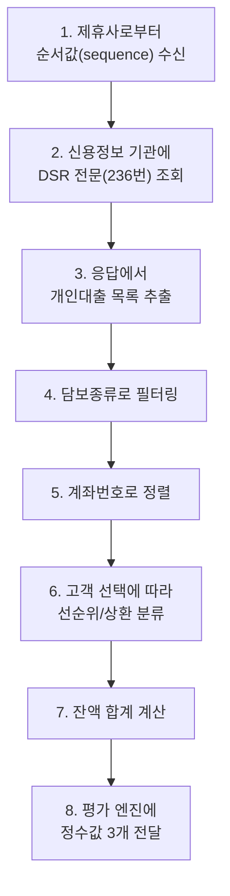
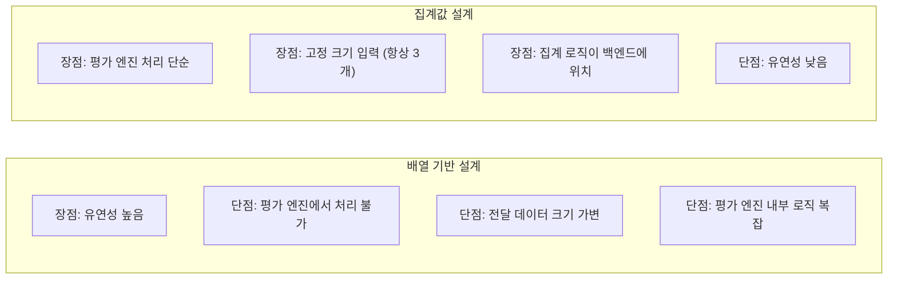

## Background

For a mortgage loan comparison service, I worked on querying data from an external credit bureau and passing it to an internal scoring engine (hereafter "scoring engine"). The key task was **delivering the prior mortgage loan balances needed for DSR (Debt Service Ratio) calculation**.

**Project scope**: Approximately 2 months (the most significant scoring engine integration effort)

---

## Initial Design: Array-Based Rank List

Initially, I planned to pass the loan list in **array format**. I assumed that passing each loan's rank and balance individually would give the scoring engine flexibility in how it used the data.

```python
# Initial design: array-based
PRIOR_MTG_RANKS = [
    {"rank": 1, "balance": 50000, "type": "주택담보"},
    {"rank": 2, "balance": 30000, "type": "보금자리론"},
    {"rank": 3, "balance": 20000, "type": "전세자금"},
]
```


Logically, it was clean. But...

---

## Constraint Discovered: Scoring Engine's Array Processing Limitation

During development, I discovered a **critical constraint** in the scoring engine (a Java-based script engine).

> **Array access using variable indices is not supported.**

```java
// Possible: hardcoded indices
array[0]  // OK
array[1]  // OK

// Impossible: using variables as indices
for (int i = 0; i < array.length; i++) {
    array[i]  // ❌ Not supported
}
```

Arrays could be passed, but they couldn't be iterated with a loop. Since the number of loans varies per customer, hardcoded indices couldn't handle this.



---

## Redesign: Switching to Simple Aggregate Values

Instead of arrays, I decided to pass **pre-aggregated simple integer values**.



| Input Value | Description |
|-------------|-------------|
| `PRIOR_MTG_AMT` | Sum of prior mortgage loan balances selected by the customer (in thousands of KRW) |
| `REF_MTG_AMT` | Sum of refinance loan balances selected by the customer (in thousands of KRW) |
| `INQUIRY_YN` | Credit information inquiry success status (Y/N) |

---

## Data Processing Pipeline

The complete flow after redesign:



### Filtering/Sorting Rules

```text
Step 4: Filter by collateral type
  → Extract only 220 (residential mortgage) or 245 (jeonse deposit loan)

Step 5: Sort by account number
  → Descending string sort
  → (Ensures consistent ordering when a customer has multiple loans)
```

---

## Did the Redesign Result in a Better Design?



In retrospect, the redesign was actually the better approach:

1. **Improved separation of concerns**: The business logic of "which loans should be considered prior liens" moved from the scoring engine script to the backend code. The logic now resides where it's easier to test and modify.

2. **Interface simplification**: Passing 3 fixed values instead of a variable-length array made the integration spec simpler.

3. **Easier debugging**: A single value like "prior lien balance total is 80 million KRW" is much easier to verify in logs than "a list of 3 loans."

---

## Reflections

### Constraints are not always a bad thing
The external system's constraint forced the design to be simplified. The decision to "use aggregate values since arrays aren't supported" ultimately brought the benefits of separation of concerns and interface simplification.

### Put complex logic where you have control
Backend code is far easier to test, debug, and modify than scoring engine scripts. When complex logic is placed in an external system, root cause analysis becomes much harder when problems arise.

### The courage to change the design mid-way through a 2-month effort
Deciding to redesign when work on the array-based approach was already underway is not easy. But "the cost of changing now" is always less than "the cost of changing later." Because I pivoted direction as soon as the constraint was discovered, the project was completed within 2 months.
