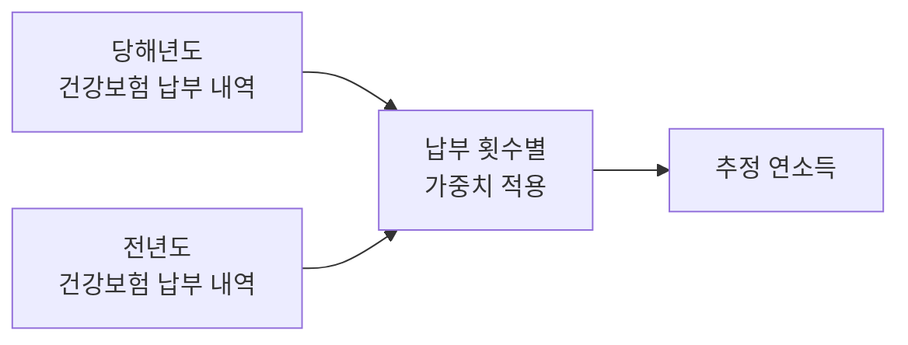
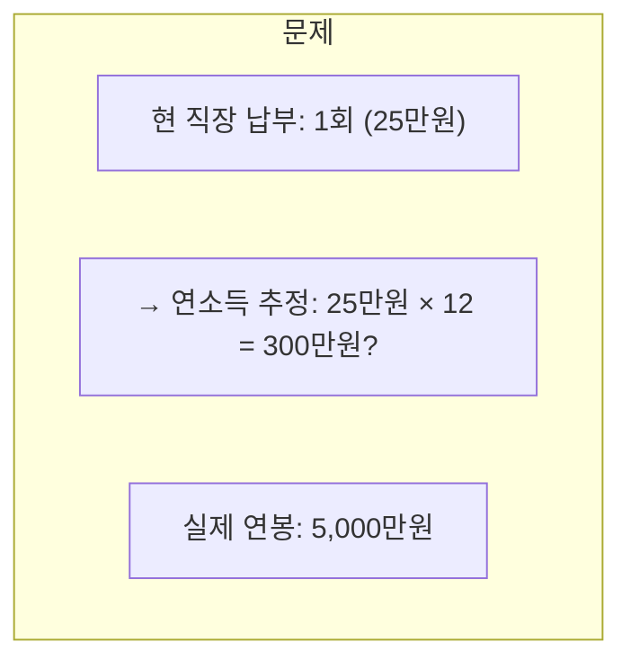
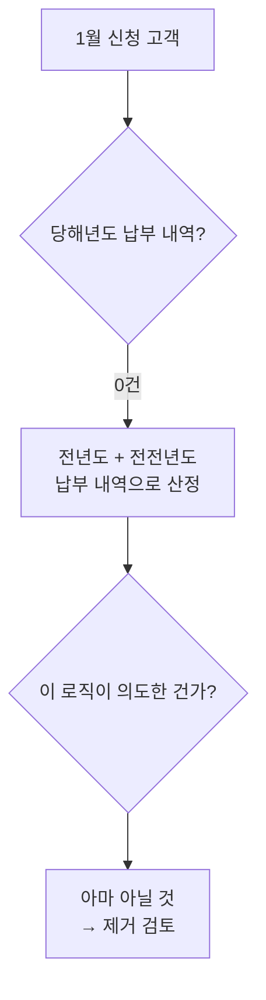
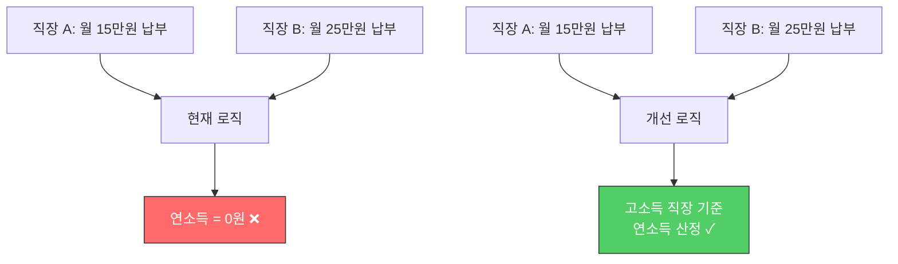
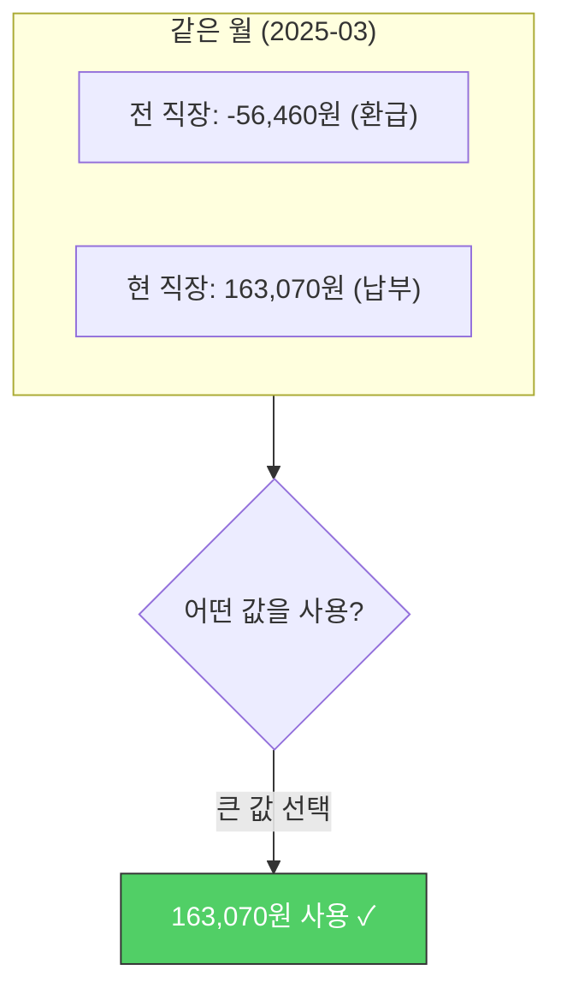
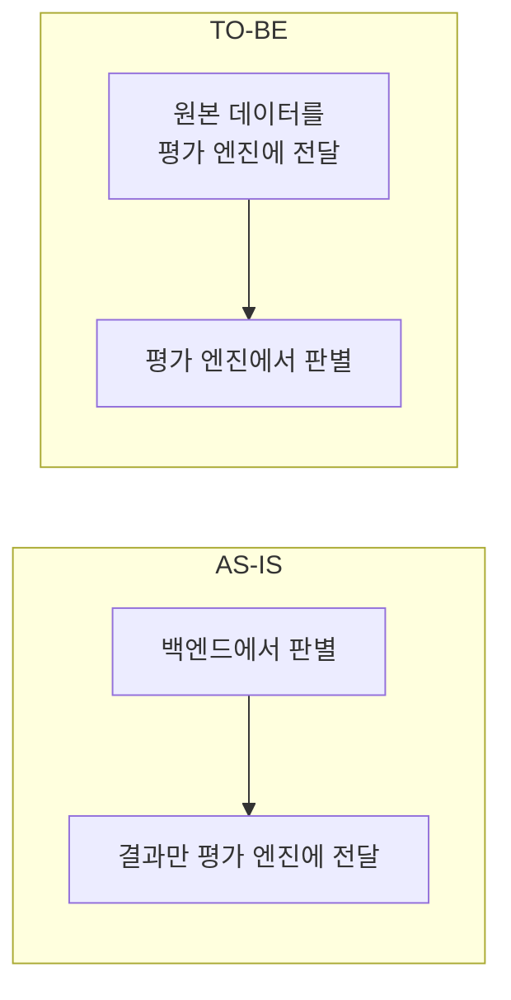
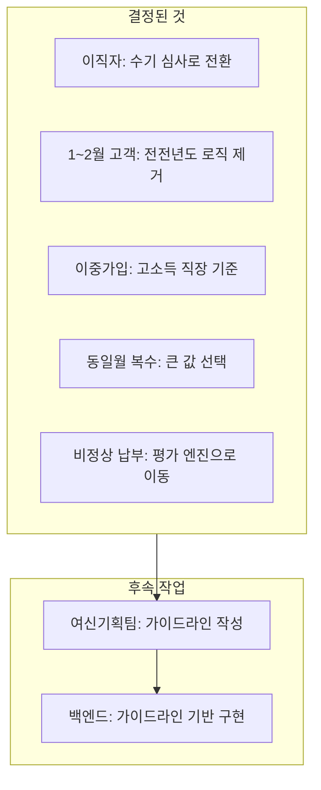

## Background

Annual income is a key metric in loan underwriting. There is logic that estimates annual income from health insurance payment data, but complex real-world situations kept breaking this logic.

This post documents the process of the credit planning team, credit analysis team, and backend engineer meeting together to work through edge cases one by one.

---

## Basic Logic

Since health insurance premiums are proportional to income, income can be estimated in reverse from payment amounts. Current year and previous year payment records are combined, with weights applied based on the number of payments.

It seems simple, but in reality, things like the following happen.

---

## Edge Case 1: Recent Job Changers

**Situation**: A person who changed jobs 2 months ago. They have only 1 health insurance payment record at their current employer.

The reliance on a single payment is excessive. Moreover, income from the previous employer is not reflected at all.

**Decision**: We decided not to handle this extensively. These cases are routed to manual review. Trying to handle every exception in code actually degrades accuracy for the normal cases.

> "Don't try to automate everything. Routing to manual review is also a design decision."

---

## Edge Case 2: Customers Arriving in January or February

**Situation**: A customer applying for a loan in January or February has 0 payment records for the current year.

There was logic that went back to the year before last, but nobody was confident whether this was intentional design. After checking with the credit planning team: "It's probably fine to remove."

**Decision**: We decided to remove it. Unnecessary logic only increases maintenance costs.

---

## Edge Case 3: Dual Health Insurance Enrollment (Concurrent Employment)

**Situation**: A person working at two places simultaneously. They are enrolled in health insurance at both.

The existing logic was calculating the annual income of dual enrollees as **0 KRW**. It was a structural bug where two payment records were canceling each other out.

**Decision**: We decided to estimate based on the higher-income workplace. This required a feature to modify health insurance information on the review screen and re-run the assessment.

---

## Edge Case 4: Multiple Payment Records in the Same Month

A priority issue when multiple payment records exist for the same month:

When changing jobs, insurance premiums from the previous employer are refunded (resulting in a negative amount), while simultaneously the new employer's premiums are charged. When positive and negative values coexist for the same month, we decided to **select the larger value**.

This issue is directly connected to the previously discovered [`dict() conversion bug`](/posts/python-dict-변환의-함정-금융-데이터-집계-버그/).

---

## Additional Discussion: Relocating Code

Logic for determining abnormal payments (2 months of non-payment, refunds, payments exceeding 1.2x the norm, etc.) was in the backend code, and we decided to **move it to the scoring engine**.

The criteria for abnormal payments change frequently with credit policy updates. If this logic is in the backend, every policy change requires a deployment. If it's in the scoring engine, only the engine configuration needs updating.

---

## Final Summary

---

## Reflections

### Business rules are harder than code
Properly writing `if-else` is less challenging than defining "what should we do in this case?" Should a job changer's single payment be multiplied by 12 to estimate annual income? This isn't a coding problem -- it's a business judgment call.

### "Choosing not to automate" is also a design decision
There's a temptation to handle every edge case in code. But for cases that occur infrequently and involve complex judgment, routing to manual review may be the better choice. Defining the scope of automation is itself a form of design.

### The value of cross-functional meetings
An engineer alone could never have discovered the bug where "dual enrollees' annual income is 0 KRW." The credit planning team brings real underwriting cases, the credit analysis team provides the modeling perspective, and the engineer determines implementation feasibility -- this combination is what produces correct rules.
