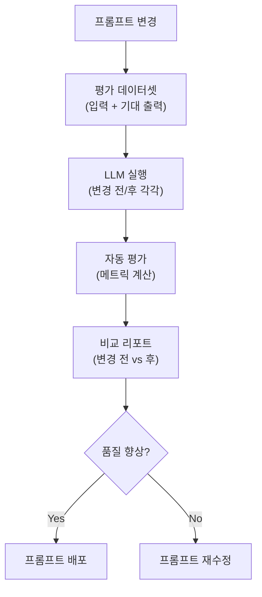
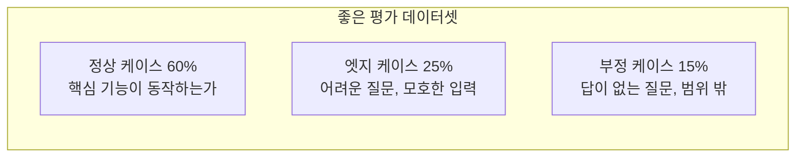
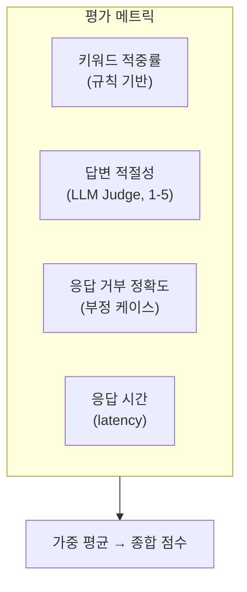
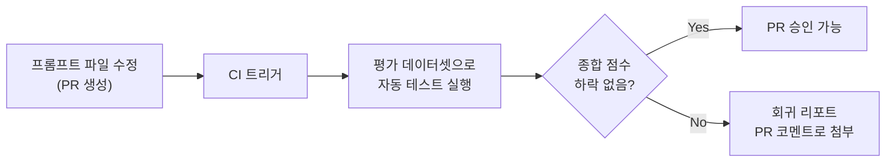

## The Problem

Every time you modify a prompt, it's hard to judge whether "this change is an overall improvement." Improving one case often degrades another.

Traditional software can catch regressions with unit tests, but LLM outputs are non-deterministic. The same prompt with the same input can produce different outputs.

We need **a pipeline that systematically measures the quality of prompt changes**.

---

## Evaluation Pipeline Architecture



---

## Step 1: Building the Evaluation Dataset

The quality of the evaluation depends on the quality of the dataset. You must first define "what constitutes a good answer."

```python
# 평가 데이터셋 구조
eval_dataset = [
    {
        "input": "DB 마이그레이션 시 락 발생하면 어떻게 대응하나요?",
        "expected_keywords": ["lock_timeout", "저트래픽 시간대", "레플리카"],
        "expected_behavior": "구체적인 SQL 명령어를 포함한 대응 방법 제시",
        "category": "troubleshooting",
        "difficulty": "medium",
    },
    {
        "input": "안녕하세요",
        "expected_behavior": "업무 관련 질문을 안내",
        "category": "off-topic",
        "difficulty": "easy",
    },
    # ... 50-100개
]
```

### Dataset Composition Principles



Negative cases are critical. If you don't test for "the model should not answer this question," you won't notice if hallucinations increase after a prompt change.

---

## Step 2: Automated Evaluation Metrics

There are several ways to automatically evaluate LLM outputs.

### Rule-Based Metrics

```python
def evaluate_response(response: str, expected: dict) -> dict:
    scores = {}
    
    # 1. 키워드 포함 여부
    if "expected_keywords" in expected:
        found = sum(1 for kw in expected["expected_keywords"] 
                    if kw.lower() in response.lower())
        scores["keyword_recall"] = found / len(expected["expected_keywords"])
    
    # 2. 응답 길이 적절성
    word_count = len(response.split())
    scores["length_appropriate"] = 1.0 if 50 < word_count < 500 else 0.5
    
    # 3. 출처 포함 여부 (RAG의 경우)
    scores["has_source"] = 1.0 if "[출처:" in response else 0.0
    
    return scores
```

### LLM-as-Judge (Using an LLM to Evaluate Another LLM)

For "answer quality" that's hard to capture with rules, we delegate evaluation to another LLM.

```python
def llm_judge(question: str, response: str, criteria: str) -> float:
    judge_prompt = f"""
다음 응답을 1-5점으로 평가하세요.

질문: {question}
응답: {response}

평가 기준: {criteria}

점수만 숫자로 답하세요.
"""
    result = claude.messages.create(
        model="claude-sonnet-4-20250514",
        messages=[{"role": "user", "content": judge_prompt}]
    )
    return float(result.content[0].text.strip())
```

### Combining Metrics



| Metric | Measurement Method | Weight |
|--------|-------------------|--------|
| Keyword hit rate | Ratio of expected keywords present | 0.2 |
| Answer relevance | LLM Judge score (1-5) | 0.4 |
| Rejection accuracy | Correct refusal on negative cases | 0.2 |
| Response time | p95 latency | 0.2 |

---

## Step 3: A/B Comparison Report

Run the same dataset against both the pre- and post-change prompts, then compare.

```python
def compare_prompts(prompt_a: str, prompt_b: str, dataset: list) -> dict:
    results_a, results_b = [], []
    
    for case in dataset:
        # 동일 입력에 대해 각 프롬프트로 실행
        resp_a = run_with_prompt(prompt_a, case["input"])
        resp_b = run_with_prompt(prompt_b, case["input"])
        
        # 평가
        score_a = evaluate_response(resp_a, case)
        score_b = evaluate_response(resp_b, case)
        
        results_a.append(score_a)
        results_b.append(score_b)
    
    return {
        "prompt_a_avg": mean([r["total"] for r in results_a]),
        "prompt_b_avg": mean([r["total"] for r in results_b]),
        "improved_cases": count_improved(results_a, results_b),
        "regressed_cases": count_regressed(results_a, results_b),
        "details": zip(dataset, results_a, results_b),
    }
```

### Example Report

```text
=== 프롬프트 A/B 비교 리포트 ===

종합 점수: A=3.42 → B=3.78 (+10.5%)

카테고리별:
  troubleshooting: 3.5 → 4.1 (+17.1%) ✓
  how-to:          3.8 → 3.9 (+2.6%)  ✓
  off-topic:       2.9 → 2.7 (-6.9%)  ✗ ← 회귀 발생

회귀 케이스 (2건):
  [off-topic] "오늘 날씨 어때?" → 거부해야 하는데 답변함
  [off-topic] "점심 뭐 먹지?" → 거부해야 하는데 답변함

결론: off-topic 거부 로직 보강 후 배포 권장
```

---

## Step 4: CI Integration

Set up the evaluation pipeline to run automatically whenever a prompt file changes.



Prompts are code. Just as code has tests, prompts should have tests too.

---

## Reflections

### Prompt Engineering Is an Experimental Science
The intuition that "this prompt should be better" is usually wrong. When you measure with an evaluation dataset, results often differ from expectations. Modifying prompts without measurement is gambling.

### LLM-as-Judge Works Surprisingly Well
Having an LLM judge "is this answer good?" might seem unreasonable, but in practice it shows high correlation with human judgment. This is especially true when evaluation criteria are clearly specified.

### Negative Cases Determine the True Quality of a Prompt
"Does it answer well?" matters less than "does it refuse to answer when it should?" in production. Hallucinations can be more harmful than incorrect answers.

### The Evaluation Pipeline Is Worth the Upfront Investment
With one or two prompts, manual review is fine. But once you have more than ten prompts, each handling multiple cases, automation becomes essential. The earlier you invest, the lower your iteration costs become.
