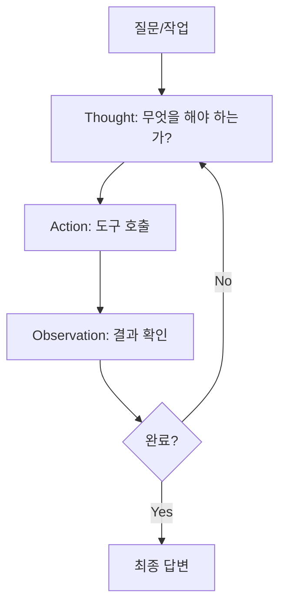
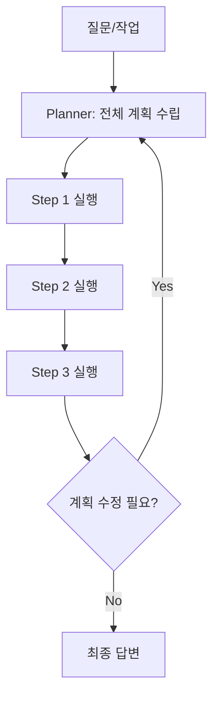
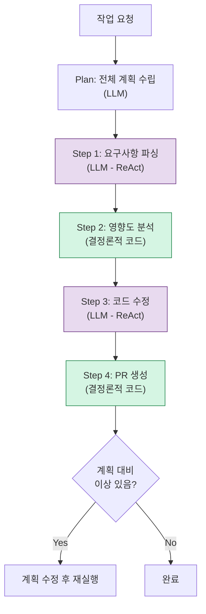

## Background

The first decision when building an LLM Agent is the **orchestration pattern**. It determines "in what order, with what reasoning, and when to stop" as the Agent uses tools to perform tasks.

This post documents the process of comparing several patterns while designing a parameter change automation Agent at work.

---

## Pattern 1: ReAct (Reasoning + Acting)



ReAct is a pattern where **you think and act one step at a time**. The LLM decides "what should I do next?" at each step.

```text
Thought: 사용자가 PRIOR_MTG_AMT 파라미터 추가를 요청했다. 
         먼저 이 파라미터가 어디서 사용되는지 찾아야 한다.
Action:  grep("PRIOR_MTG_AMT", codebase)
Observation: 0건 매칭. 신규 파라미터이다.

Thought: 신규 파라미터니까 기존 파라미터 추가 패턴을 참고해야 한다.
         비슷한 파라미터인 REF_MTG_AMT를 찾아보자.
Action:  grep("REF_MTG_AMT", codebase)
Observation: constants.py:45, services.py:123, tests.py:89에서 사용 중.

Thought: 3개 파일을 수정해야 한다. 각 파일의 패턴을 보고 코드를 생성하자.
Action:  read_file("constants.py", lines=40-50)
...
```

### Strengths
- Simple and intuitive
- Flexibly adapts to unexpected situations
- Each step's reasoning is clear (Thought serves as a log)

### Weaknesses
- Costs increase as steps grow (LLM call at every step)
- A wrong judgment early on affects all subsequent steps
- Lack of an overall plan can lead to inefficient paths

---

## Pattern 2: Plan-and-Execute



Plan-and-Execute is a pattern that **creates a full plan first, then executes accordingly**.

```text
Plan:
  1. Jira 티켓에서 변경 요구사항 파싱
  2. 영향받는 파일 목록 검색
  3. 각 파일에 대한 변경 사항 생성
  4. 테스트 코드 업데이트
  5. PR 생성

Executing Step 1: 티켓 파싱...
  결과: action=add, parameter=PRIOR_MTG_AMT, type=integer

Executing Step 2: 영향받는 파일 검색...
  결과: constants.py, services.py, tests.py

Executing Step 3: 변경 사항 생성...
...
```

### Strengths
- Sees the big picture and chooses efficient paths
- Each step is independent, making partial failure retries easier
- The plan can be reviewed by humans

### Weaknesses
- If the initial plan is wrong, everything goes off track
- Less flexibility for unexpected results during execution
- Requires two LLM calls: Planner + Executor

---

## Pattern 3: Hybrid (The Approach I Chose)

While implementing the actual Agent, I chose a hybrid approach that **combines the strengths of both patterns**.



| Step | Pattern | Reason |
|------|---------|--------|
| Overall plan | Plan-and-Execute | Understand the scope upfront; allows human review |
| Requirements parsing | ReAct | Natural language interpretation needs flexibility |
| Impact analysis | Deterministic | Code search must be accurate |
| Code modification | ReAct | Read file, modify, verify -- iterative loop |
| PR creation | Deterministic | API calls must be accurate |

---

## Tool Design

The interface of the tools an Agent uses determines the quality of orchestration.

```python
tools = [
    {
        "name": "search_codebase",
        "description": "코드베이스에서 특정 패턴을 검색합니다",
        "parameters": {
            "pattern": "검색할 문자열 또는 정규식",
            "path": "검색 범위 (기본: 전체)",
        }
    },
    {
        "name": "read_file",
        "description": "파일의 내용을 읽습니다",
        "parameters": {
            "path": "파일 경로",
            "start_line": "시작 줄 (선택)",
            "end_line": "끝 줄 (선택)",
        }
    },
    {
        "name": "create_pr",
        "description": "GitHub PR을 생성합니다",
        "parameters": {
            "title": "PR 제목",
            "body": "PR 설명",
            "changes": "변경 사항 목록",
        }
    },
]
```

### Tool Design Principles

1. **Keep tools small and composable**: Separate `search` + `read` + `modify` instead of `search_and_modify_file`
2. **The description is the prompt**: The `description` must be precise for the LLM to select the right tool
3. **Fail safely**: When tool execution fails, returning the error message as an Observation lets the Agent try an alternative approach

---

## Cost and Performance Comparison

I compared the cost of each pattern for the same task (adding a parameter).

| Metric | ReAct | Plan-and-Execute | Hybrid |
|--------|-------|-----------------|--------|
| LLM call count | 8-12 | 4-6 | 5-7 |
| Total tokens | ~15K | ~12K | ~10K |
| Success rate | 75% | 70% | 85% |
| Average time | 45s | 35s | 30s |

The hybrid is the most efficient because it saves LLM calls on steps that can be handled deterministically (search, PR creation) while using the LLM only for steps that require judgment.

---

## Reflections

### Pattern Selection Depends on "How Predictable the Task Is"
If the task is predictable, use Plan-and-Execute. If unpredictable, use ReAct. If it's a mix, go hybrid. Most real-world scenarios call for the hybrid approach.

### Draw a Clear Boundary Between LLM and Code
Ask at every step: "Should the LLM handle this, or should code?" Having the LLM guess at something that grep can find precisely is a loss in both cost and accuracy.

### Tool Descriptions Are Prompts
An Agent's behavior is determined by tool descriptions. "Searches code" leads to less precise tool selection than "Searches the codebase for a specific pattern. Supports regular expressions."
