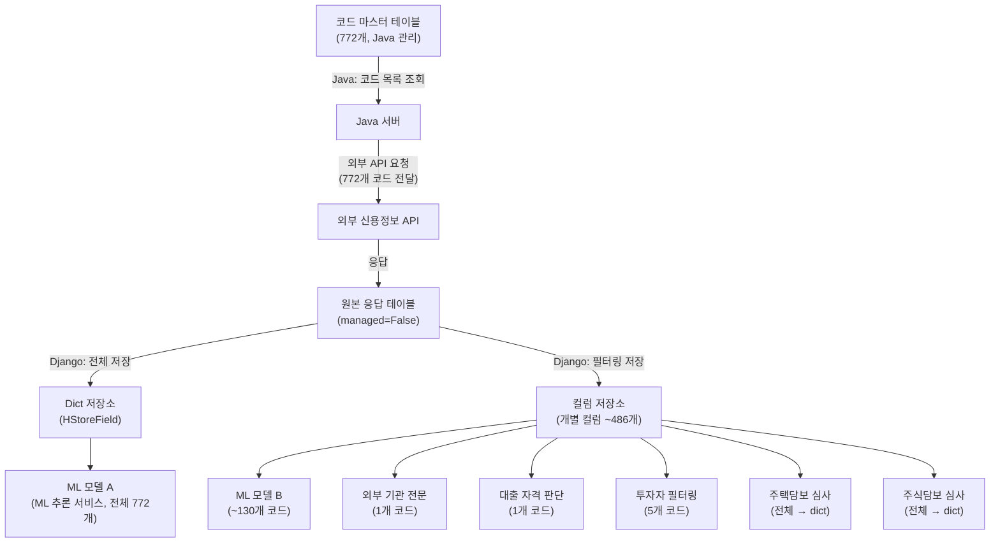
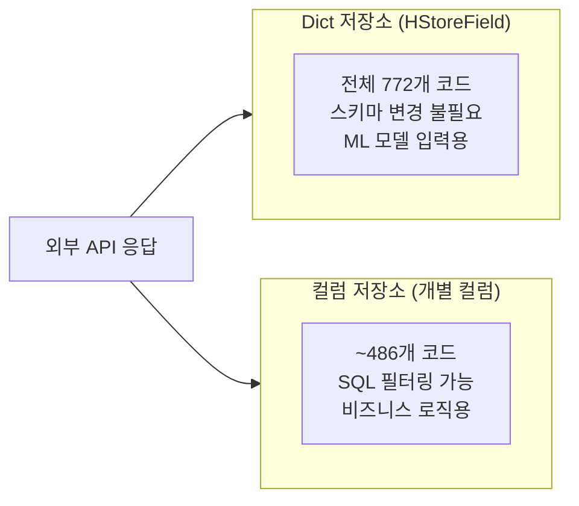
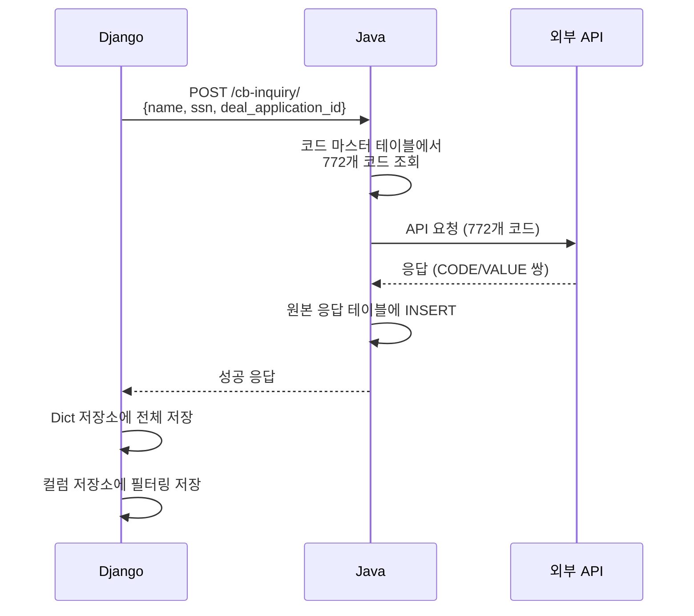
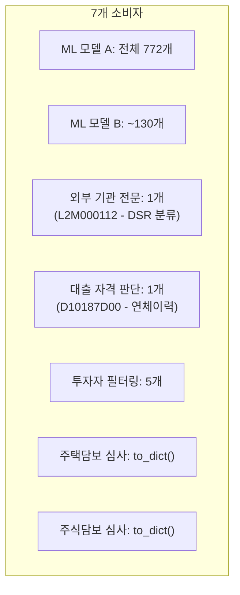
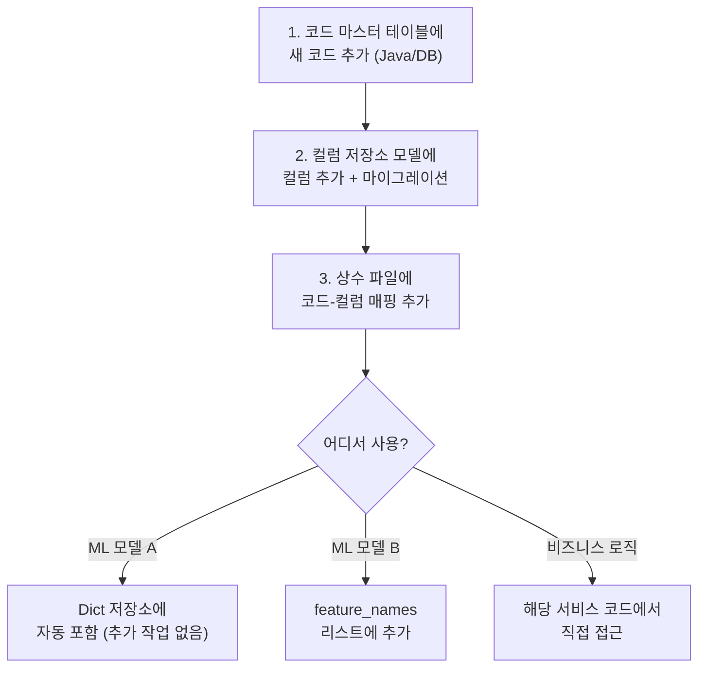

## Background

Credit profile data used for credit scoring is retrieved through an external credit bureau's API. We send 772 codes and receive response values for each. This data is then delivered to **7 different consumers** within the system.

The challenge is that this pipeline **spans two languages -- Python (Django) and Java** -- and each consumer needs the data in a different format.

---

## Overall Data Flow



---

## Key Design Decision: Why Two Storage Formats

The same data is stored in **two different formats**:

### Storage 1: HStoreField (Dict Format)

```python
class CpsDataDict(models.Model):
    data = HStoreField()  # {"CODE_001": "1234", "CODE_002": "5678", ...}
```

| Pros | Cons |
|------|------|
| Store/retrieve all 772 codes at once | Difficult to filter by individual codes |
| Add codes without schema changes | No type safety (all values are strings) |
| Easy to pass directly to ML models | Inconvenient SQL WHERE conditions |

### Storage 2: Individual Columns

```python
class CpsDataColumns(models.Model):
    d10187d00 = models.CharField(...)  # 연체이력
    l2m000112 = models.CharField(...)  # DSR 분류
    # ... ~486개 컬럼
```

| Pros | Cons |
|------|------|
| WHERE clause on individual codes | Migration needed when adding codes |
| Type checking possible | Very large number of columns |
| Natural fit with Django ORM | Additional logic needed to convert to dict |



**Why do we need both?** Because each consumer has a different data access pattern:

- **ML models**: "Give me all 772 codes at once" --> Dict storage
- **Business logic**: "Find only records where the delinquency code has a specific value" --> Column storage

---

## Managing the Cross-Language Boundary



### The Intermediate Table: managed=False

The table where Java stores the raw response is declared as `managed=False` in Django.

```python
class ExternalCreditRaw(models.Model):
    class Meta:
        managed = False  # Django가 이 테이블의 스키마를 관리하지 않음
        db_table = 'external_credit_raw'
```

This means:
- **Java**: Manages the table structure and INSERTs data
- **Django**: Doesn't touch the table structure; only performs SELECTs

Both languages share the same table, but ownership is clearly divided.

---

## Data Usage Patterns Across 7 Consumers



| Consumer | Codes Used | Access Method | Storage |
|----------|-----------|---------------|---------|
| ML Model A (ML inference service) | All 772 | Pass as whole | Dict |
| ML Model B | ~130 | Filter by feature_names list | Column |
| External bureau report | 1 | Direct access to specific code | Column |
| Loan eligibility check | 1 | Direct access to specific code | Column |
| Investor filtering | 5 | Access to specific codes | Column |
| Mortgage underwriting | All | to_dict() conversion | Column |
| Stock-backed loan underwriting | All | to_dict() conversion | Column |

---

## Checklist for Adding a New Code

When a system grows complex, the biggest pain point becomes "where do I need to make changes to add this?" That's why I documented the code addition procedure as a checklist.



---

## Reflections

### When You Need "Two Views" of the Same Data
Transforming and storing the same source data to fit each consumer's pattern goes against normalization principles, but it was a pragmatic choice. By providing dicts to ML models and columns to business logic, each consumer can access data in its natural way.

### managed=False Is a Great Tool for Cross-Language Boundaries
When Django and Java share the same database, using `managed=False` to clearly define ownership allows collaboration without migration conflicts. It's a contract: "This table belongs to Java, and Django only reads from it."

### Checklists Are Survival Tools for Complex Systems
In a system where adding a single code requires modifying 4 files, you will inevitably miss one without a checklist. Documentation has the highest ROI in procedures where "multiple things need to change simultaneously."
