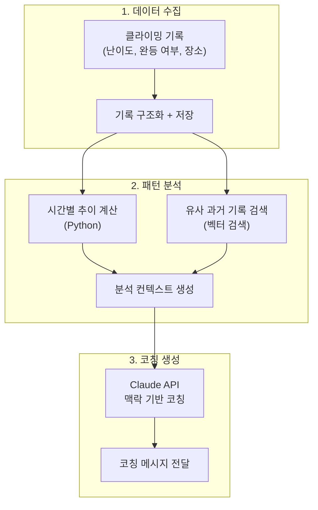
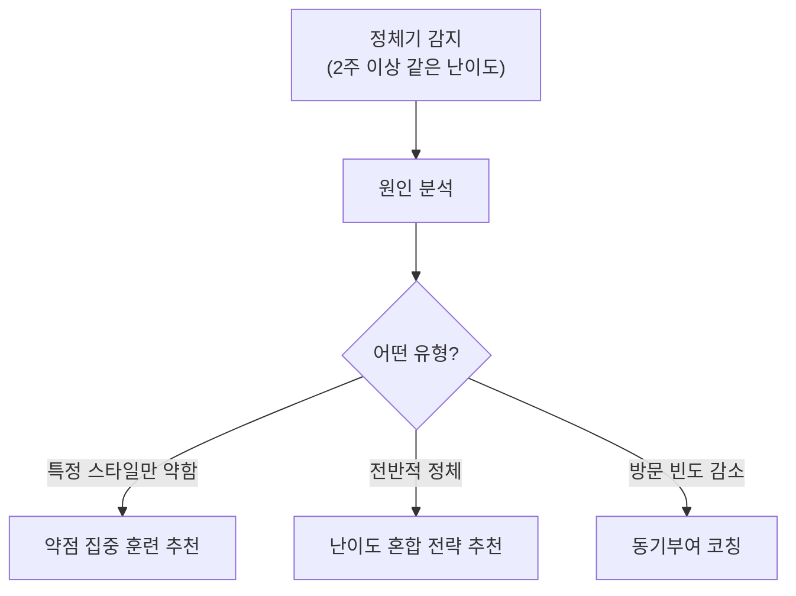
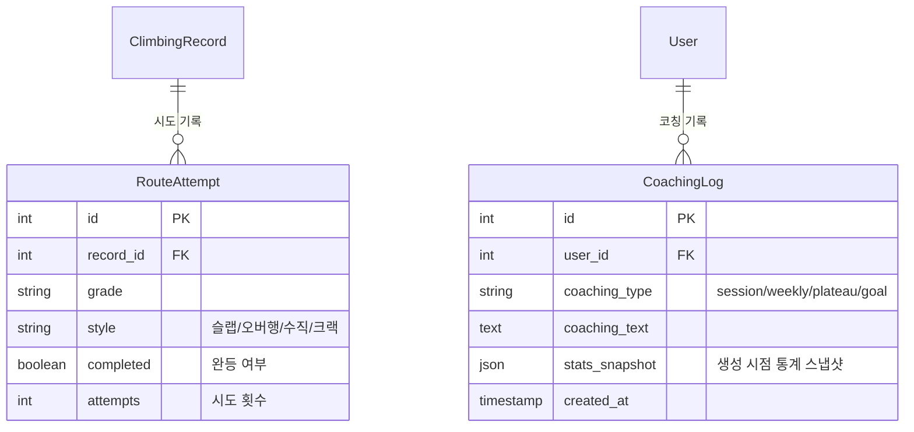

## Background

I occasionally think back to CliInfo, a climbing SNS app I once designed but never implemented. Back then, I only thought of it as "records + social." In today's AI era, what more could this project offer?

As climbing records accumulate, could AI analyze them and coach you on "what to do next to improve"? Implementation hasn't started yet, but I sketched out what the architecture might look like.

---

## The Problem: Growth in Climbing Is Invisible

Growth in climbing is non-linear:

- Beginners advance through grades quickly, but from intermediate onward, **plateaus** are long
- Even at the same grade, **skill varies significantly by style** -- slab, overhang, crack, etc.
- The false impression of "I'm working hard but not improving" kills motivation

Simply tracking "cleared 10 red this month" doesn't convey growth. You need coaching that tells you **what styles you're strong at, where you're weak, and what to work on next**.

---

## Architecture: 3-Stage Coaching Pipeline



### LLM Call Boundaries

The principle established in LifeRPG applies here as well: **What's certain goes to code; what requires judgment goes to the LLM.**

| Task | Approach | Reason |
|------|----------|--------|
| Weekly send count aggregation | **Code** | Simple SQL aggregation |
| Completion rate by grade | **Code** | Formula is fixed |
| Plateau detection | **Code** | Plateau if stuck at the same grade for 2+ weeks |
| Weakness analysis coaching | **LLM** | Interpreting "good at slab but weak at overhang" requires judgment |
| Next goal recommendation | **LLM** | Requires synthesizing current level + weaknesses |
| Motivational message | **LLM** | Needs different natural expressions each time |

---

## 4 Types of Coaching

### 1. Session Coaching -- "How Did I Do Today?"

Immediate feedback after logging a climbing session:

```text
📊 오늘의 클라이밍 요약
성수 클라이밍파크 | 2시간 30분

완등: 빨강 3 / 파랑 5 / 초록 2
실패: 빨강 2 (시도 5 중)

💬 "빨강 완등률이 60%로 지난주(40%) 대비 올라갔어.
    특히 오버행 빨강을 처음 클리어했는데, 
    2주 전에 실패했던 루트랑 비슷한 홀드 배치야. 확실히 늘었다."
```

### 2. Weekly Coaching -- "Looking at the Whole Week?"

```text
📈 이번 주 성장 리포트

방문: 3회 (성수 2, 강남 1)
총 완등: 28개 (지난주 대비 +5)

난이도 분포:
  초록 ████████░░  80% 완등률
  파랑 ██████░░░░  60% 완등률  ← 안정권
  빨강 ███░░░░░░░  30% 완등률  ← 도전 중

💬 "파랑이 60%로 안정권에 들어왔어. 
    이제 빨강에 더 시간을 투자할 타이밍이야.
    특히 빨강 중에서도 슬랩 루트를 집중적으로 해보는 건 어때?
    네 초록/파랑 기록을 보면 슬랩 성향이 강한데, 
    빨강 슬랩부터 공략하면 자연스럽게 올라갈 거야."
```

### 3. Plateau Coaching -- "Why Am I Not Improving?"



```text
💬 "3주째 파랑에서 머물고 있는데, 기록을 보면 원인이 보여.
    파랑 실패 기록 8개 중 6개가 오버행이야.
    슬랩/수직벽은 거의 다 클리어하는데, 오버행에서 막히고 있어.
    
    제안: 이번 주는 초록 오버행을 10개 이상 풀어봐.
    쉬운 난이도에서 오버행 자세를 잡으면, 
    파랑 오버행도 자연스럽게 클리어될 거야."
```

### 4. Goal Coaching -- "How Far Am I From Clearing Red?"

```text
🎯 목표: 빨강 첫 완등

현재 상태:
  빨강 시도 12회, 완등 0회
  파랑 완등률 65% (안정권 진입)

예상 달성 시기: 3~4주 후
근거: 파랑 완등률이 70%를 넘으면 빨강 첫 완등이 나오는 패턴이 있음

💬 "파랑을 좀 더 다져야 해. 65%면 거의 다 왔어.
    이번 주 파랑 10개 이상 시도하면 70% 넘길 수 있을 거야.
    그러면 빨강도 슬슬 풀리기 시작할 거야."
```

---

## Prompt Design

Coaching quality depends on the prompt. The key is to **compute quantitative data first and only ask the LLM to interpret it**.

```python
def generate_coaching(user_id: int, coaching_type: str) -> str:
    # 1. 정량 데이터 계산 (코드)
    stats = calculate_stats(user_id)  # 난이도별 완등률, 추이, 스타일 분포
    recent = get_recent_records(user_id, days=14)
    plateau = detect_plateau(user_id)  # 정체기 여부
    
    # 2. 프롬프트 구성
    prompt = f"""너는 경험 많은 클라이밍 코치야.

사용자 현재 상태:
- 주력 난이도: {stats['main_grade']}
- 난이도별 완등률: {stats['grade_completion']}
- 최근 2주 방문 횟수: {stats['visit_count']}
- 스타일별 성적: 슬랩 {stats['slab_rate']}%, 오버행 {stats['overhang_rate']}%, 수직 {stats['vertical_rate']}%
- 정체기 여부: {plateau['is_plateau']} ({plateau['duration']}일째)

최근 기록:
{format_records(recent)}

코칭 규칙:
1. 숫자를 근거로 말해 (체감이 아니라 데이터 기반)
2. 칭찬과 개선점을 균형있게
3. 구체적인 다음 행동을 제안 (추상적 조언 금지)
4. 3-4문장으로 짧게
5. 반말, 친근한 톤"""
    
    response = claude.messages.create(
        model="claude-sonnet-4-20250514",
        messages=[{"role": "user", "content": prompt}]
    )
    return response.content[0].text
```

### What Matters in the Prompt

- **Pre-compute quantitative data**: Don't ask the LLM to "analyze the records" -- ask it to "interpret these numbers"
- **Enforce specific action suggestions**: Coaching like "try harder" is meaningless
- **Specify the tone**: The climbing community naturally uses casual, friendly language

---

## Data Model Extension

Adding coaching-specific fields to the existing CliInfo schema:



The `stats_snapshot` stores statistics as JSON at the time coaching was generated. This is useful later when comparing "coaching from 2 months ago vs now."

---

## Reusing LifeRPG Patterns

Parts of this design where LifeRPG patterns were directly reused:

| LifeRPG Pattern | Application in Climbing Coaching |
|-----------------|--------------------------------|
| Limit LLM calls to 3 places | Aggregation in code, only interpretation via LLM |
| Cache parsing results | Store stats snapshots |
| Contextual feedback | Analyze growth/plateau against historical records |
| Readiness system | Estimate time to goal achievement |

The same AI patterns can transfer from "personal growth agent" to "climbing coaching" with just a domain change. **A pattern being reusable is a signal that the design is sound.**

---

## Reflections

### Revisiting Past Projects Through an AI Lens Reveals New Possibilities
An app I once only thought of as "records + social" becomes an "AI coach" when you layer an LLM on top. When the technology landscape changes, ideas you once abandoned can come back to life.

### Domain Knowledge Will Determine AI Coaching Quality
To identify "weak at overhang," you need to understand climbing. LLMs have general knowledge, but climbing-specific context (slab vs overhang, grade systems, plateau patterns) must be explicitly provided in the prompt.

### Applying the Same Pattern to a Different Domain Is the Fastest Way to Learn
Applying the "parsing -> analysis -> coaching" pattern from LifeRPG to climbing produced a design quickly. I believe it's a direction worth pursuing through to implementation.
