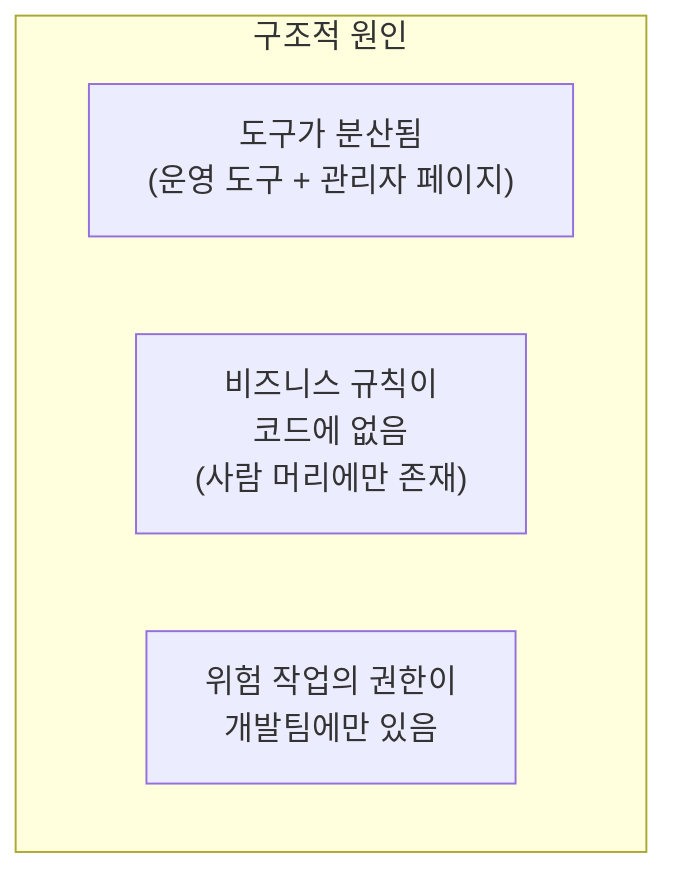
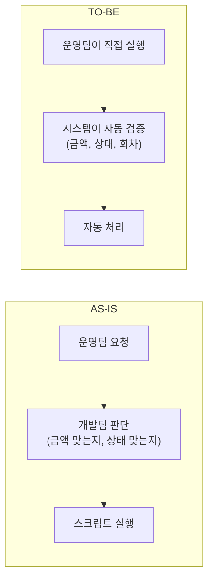
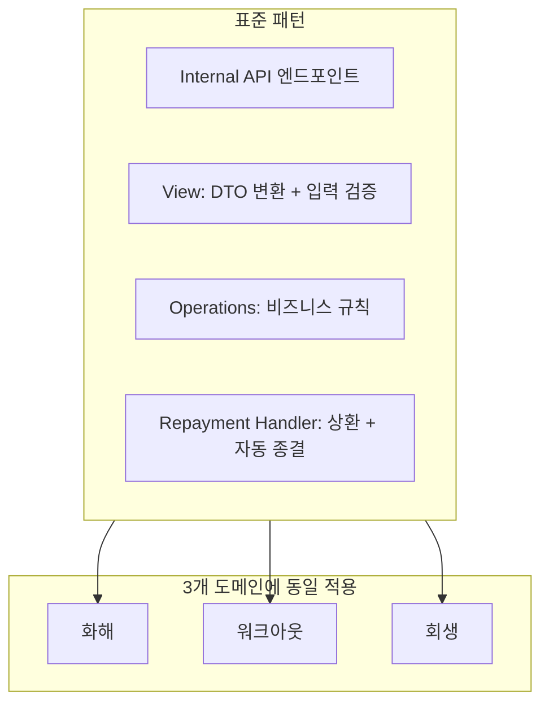
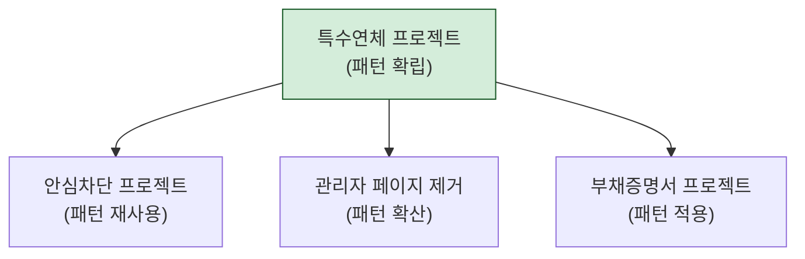

## Background

A backend engineer's job doesn't end with "writing good code." The projects that created the biggest impact were cases where **operational pain points were solved through systems**.

This post documents the process of observing repetitive requests from the operations team, systematizing them, and eventually spreading the pattern as a team-wide standard.

---

## Step 1: Observing the Problem -- "Why Does This Request Keep Repeating?"

There was a recurring pattern of requests from the operations team to the engineering team:

While this cycle repeated, both sides were being drained:
- **Operations team**: Had to request and wait each time. Delays when the engineering team was busy on urgent cases
- **Engineering team**: Spending time running scripts instead of their core work (feature development). Risk of manual errors

---

## Step 2: Defining the Problem -- Identifying Structural Causes

Rather than simply saying "let's automate this," I investigated why things ended up this way.

There were 3 root causes:
1. Operations had to switch between operational tools and the admin page to complete tasks
2. Rules like "the repayment amount must not exceed the total" or "status must not be reversed" existed only in people's heads, not in the system
3. Execution authority for financial operations like repayment and closure only existed in engineering team scripts

---

## Step 3: Designing the Solution -- Codifying Business Rules

The work of transferring human judgment into the system:

| Before (Human Judgment) | After (System Validation) |
|------------------------|--------------------------|
| "Calculate whether this amount exceeds the total repayment" | `if total_repaid + amount > projected_amount: reject` |
| "Status must not be reversed" | Remove the status reversal API entirely |
| "If it's the final repayment, process closure" | `if total_repaid == projected_amount: auto_close()` |

**"Making it impossible" is the most powerful validation.** If you simply don't create a manual closure API, closure with mismatched amounts becomes fundamentally impossible.

---

## Step 4: Implementation -- Standardizing the Pattern

There were 3 similar workflows (settlement/workout/rehabilitation), so I extracted the common pattern first and applied it identically to all 3 domains.

---

## Step 5: Deployment + Field Feedback

After implementation, I conducted training sessions with the operations team and incorporated feedback from actual usage.

### Feedback 1: Same-Day Disbursement Needed

The original design only considered "next-day disbursement," but operations had cases requiring "immediate same-day disbursement." I added the same-day disbursement feature.

### Feedback 2: Error Message Improvement

A message saying "Invalid request" gave the operations team no clue about what to fix. I made it specific: "The repayment amount (500,000 KRW) exceeds the remaining balance (300,000 KRW)."

### Feedback 3: UI Flow Improvement

The button order in the operational tool didn't match the actual workflow sequence. I adjusted it to align with the operations team's real work flow.

---

## Step 6: Pattern Proliferation

The "operational tool + Internal API" pattern established in this project became a team standard for subsequent projects.

A pattern created in one project was reused across 3 subsequent projects. Instead of pondering "how should we build the operational tool?" each time, the team could immediately apply a proven pattern.

---

## Reflections

### Recurring Requests Are a Signal That a System Is Missing
If the operations team keeps making the same type of request, it's not because they're lazy -- it's because the system doesn't support that workflow. Ignoring this signal perpetuates a draining situation for both sides.

### When Engineers Define the Problem, the Impact Changes
The operations team requests "please run this script automatically." If the engineer stops there, the solution is just putting the script on a cron job. But if you ask "why does this request keep repeating?", you end up building a system instead of a script.

### Codifying Business Rules Into Code Is the Most Powerful Automation
Building APIs, creating buttons, and automating are all means. The real purpose is to **make the system enforce rules that previously existed only in people's heads**. A system rejection is 100 times safer than training someone "you shouldn't do this."

### Field Feedback Is More Important Than Design
No matter how well you design, feedback from actual usage reveals things you never anticipated. Same-day disbursement, error messages, UI flow -- all were unknowable until the operations team actually used the tool. Deploying fast, getting feedback fast, and iterating fast beats perfect design.
