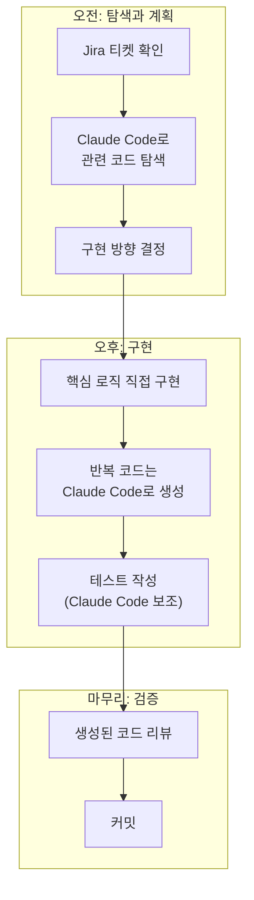

## Background

I've been using Claude Code as a core tool in my development workflow since early 2025. After over a year of daily use, I've developed my own principles on "how to actually increase productivity with AI coding tools."

This post isn't about promoting Claude Code. It's a record of **where it's effective and where it's actually counterproductive**, based on a year of hands-on experience.

---

## Top 5 Effective Use Patterns

### 1. Codebase Exploration: "How Does This System Work?"

Most effective when understanding a new project or legacy code.

```text
"이 모듈에서 건강보험 데이터가 어떻게 처리되는지 흐름을 설명해줘"
"이 함수가 호출되는 모든 경로를 찾아줘"
"이 테이블을 사용하는 쿼리를 전부 찾아서 정리해줘"
```

An exploration that would take a person 2 hours of grep and code reading can be received as a structured explanation in under 5 minutes.

### 2. Repetitive Code Generation: "Make 10 of These Following This Pattern"

Strong at generating repetitive code where the pattern is already established.

```text
"기존 ReconciliationView와 동일한 패턴으로 RehabilitationView를 만들어줘"
"이 API 엔드포인트에 대한 시리얼라이저와 테스트를 생성해줘"
```

When you need to create multiple copies of the same pattern -- like 3 post-processing domains (settlement/workout/rehabilitation) -- having a person create the first one and delegating the rest to Claude Code saves significant time.

### 3. Bug Debugging: "Analyze Why This Error Occurs"

Providing the stack trace along with related code helps narrow down root causes quickly.

```text
"이 InvalidHeaderError: b''가 발생하는 조건을 코드에서 찾아줘"
"이 쿼리가 왜 N+1 문제를 일으키는지 분석하고 해결책을 제안해줘"
```

### 4. Documentation: "Turn This Code's Design Decisions Into Documentation"

The task of reading code and organizing design intent into documentation. It quickly handles work that people find tedious and tend to postpone.

### 5. Refactoring Planning: "Analyze This Code's Issues and Suggest Improvements"

Used for analyzing structural problems in legacy code and getting refactoring direction suggestions.

---

## Ineffective Use Patterns

### 1. "Build the Whole Thing for Me"

```text
❌ "대출 심사 시스템을 처음부터 설계하고 구현해줘"
```

Having it build an entire system at once produces code that works on the surface but **doesn't align with actual requirements**. Code generated without domain knowledge always ends up being rewritten.

### 2. "Copy-Pasting Code Without Understanding"

**Using Claude Code's generated code without understanding it** means you can't debug it when problems arise later. AI-generated code is still code that I must understand and take responsibility for.

### 3. "Subtle Business Logic Decisions"

```text
❌ "이중가입자의 건강보험료를 어떻게 처리해야 할까?"
```

This isn't a code problem -- it's a business judgment call. It's something to ask the credit planning team, not AI.

---

## Workflow Integration



Core principle: **Humans decide, AI executes.**

---

## Prompting Tips (Based on 1 Year of Experience)

### Provide Sufficient Context

```text
❌ "이 버그 고쳐줘"

✅ "Payment 모델에서 같은 payment_month에 여러 레코드가 있을 때 
   dict() 변환 시 나중 값이 덮어쓰는 문제가 있어. 
   큰 값을 선택하는 방식으로 수정해줘.
   기존 코드는 apps/health_insurance/utils.py의 45번째 줄이야."
```

### State Constraints Explicitly

```text
❌ "API를 만들어줘"

✅ "Django REST Framework로 GET /api/debts/ 엔드포인트를 만들어줘.
   인증은 Bearer 토큰, 응답은 기존 MyDataView와 동일한 패턴,
   단 remaining_principal > 0 필터는 제거해야 해."
```

### Request in Stages

```text
❌ "전체 시스템을 리팩토링해줘"

✅ 1단계: "현재 send_daily 함수의 문제점을 분석해줘"
   2단계: "Model/Query/Sender 3계층으로 분리하는 방안을 제안해줘"  
   3단계: "Model 레이어부터 구현해줘"
```

---

## Perceived Productivity Changes

Precise measurement is difficult, but in terms of perceived impact:

| Task | Before | After | Perceived Change |
|------|--------|-------|-----------------|
| Understanding legacy code | Half a day | 1-2 hours | Major improvement |
| Repetitive code generation | Several hours | 30 minutes | Major improvement |
| Bug root cause analysis | Varies | 30% faster | Moderate |
| Core design decisions | - | No change | No change |
| Business logic implementation | - | No change | No change |

**Design decisions and business logic are not replaceable by AI.** These are areas that require domain knowledge and stakeholder communication. AI speeds up "execution" but doesn't determine "the right direction."

---

## Reflections

### The Value of AI Tools Depends on "What You Ask It to Do"
Even with the same tool, some people double their productivity while others actually decrease it. The difference isn't in the tool itself but in the judgment of which tasks to delegate to AI and which to handle yourself.

### Responsibility for "AI-Generated Code" Lies With Humans
If code generated by Claude Code causes a bug in production, it's not the AI's fault -- it's the fault of the person who didn't review it. AI is an assistive tool, nothing more.

### The Biggest Takeaway From a Year of Use Is "Prompt Intuition"
I've developed a sense for what questions yield good answers and what context needs to be provided. This intuition directly helps not just with Claude Code but also with designing systems that leverage LLM APIs.
