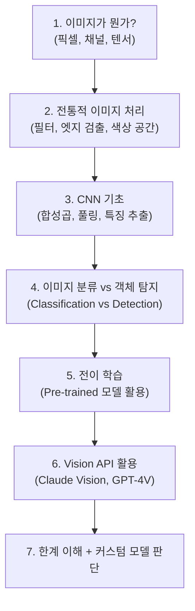
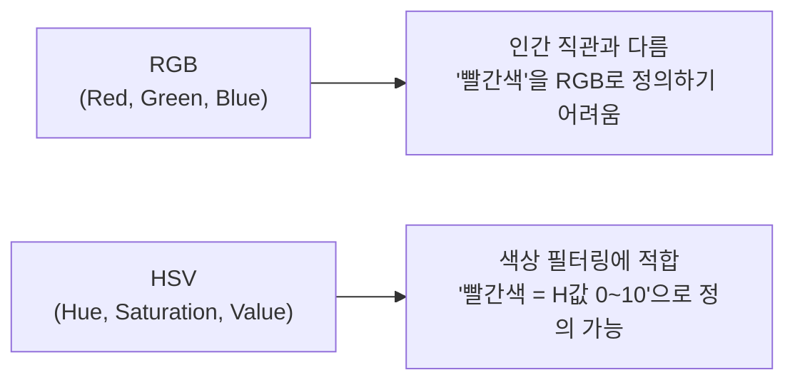
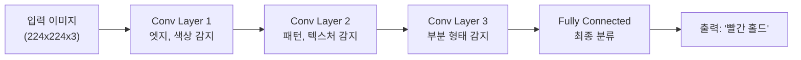
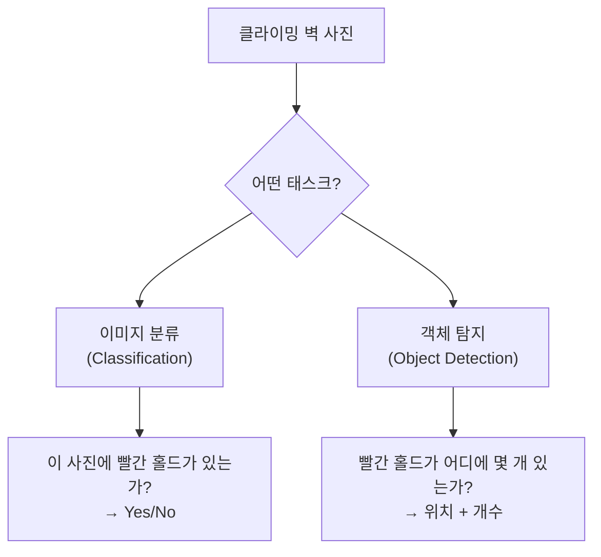
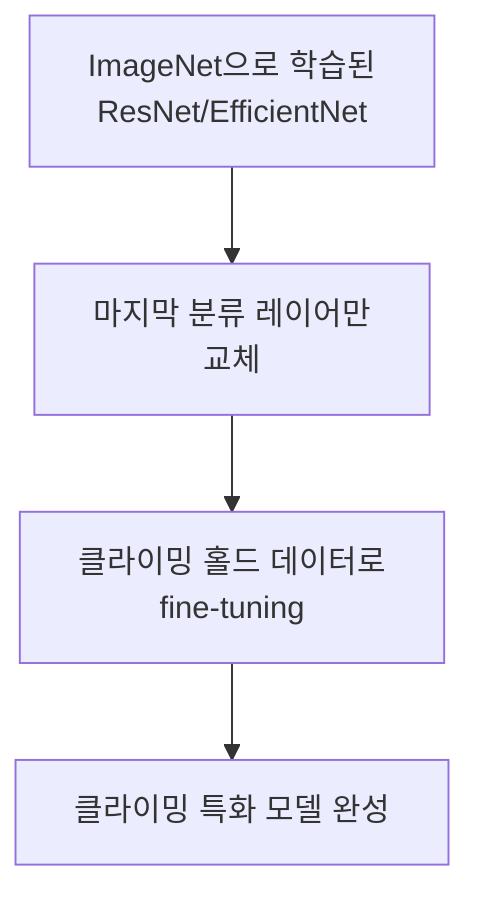
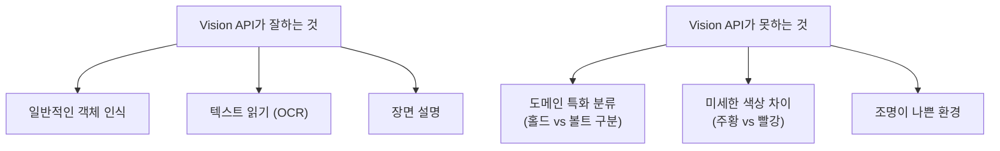

## Why Study CV

While pondering what AI could add to a half-finished climbing app I once started, the idea of "automatically recognizing hold colors from photos" came up. But I'm a backend engineer, not an ML engineer. Can't I just call the Vision API? Sure, but without understanding the basics, I wouldn't know why things fail or how to write proper prompts.

I have no intention of learning CV "at an expert level." I've organized **the minimum fundamentals needed to use Vision APIs effectively**. Following this roadmap, it should take about 16 hours.

---

## Learning Roadmap



Rather than going deep into everything, the approach was to **understand "why this is necessary" at each stage and move on to the next**.

---

## Step 1: The Essence of Images -- Pixels and Tensors

To a computer, an image is a **numerical array (tensor)**.

```text
흑백 이미지 (3x3):     컬러 이미지 (3x3):
┌─────────────┐        ┌─────────────────────┐
│ 0   128  255 │        │ R채널 │ G채널 │ B채널 │
│ 64  192   32 │        │ (3x3) │ (3x3) │ (3x3) │
│ 128  96  160 │        └─────────────────────┘
└─────────────┘         → shape: (3, 3, 3)
→ shape: (3, 3)
```

- Each pixel is an integer between 0-255
- A color image has 3 RGB channels --> a 3D tensor of (height, width, 3)
- **A 4000x3000 photo = 36 million numbers** --> feeding this directly to an LLM causes costs to explode

Key insight: **Resizing images is fundamental to cost optimization.** Sending originals as-is to Vision APIs leads to unnecessarily high token counts.

---

## Step 2: Traditional Image Processing -- Color Spaces

To recognize climbing hold colors, you need to understand **color spaces**.



| Color Space | Strengths | Climbing Application |
|------------|-----------|---------------------|
| **RGB** | Standard, default for input/output | Displaying on screen |
| **HSV** | Easy to filter by hue (H) | Classifying hold colors |
| **LAB** | Robust against lighting changes | In dimly lit climbing gyms |

```python
import cv2
import numpy as np

# 이미지 읽기 + HSV 변환
img = cv2.imread('climbing_wall.jpg')
hsv = cv2.cvtColor(img, cv2.COLOR_BGR2HSV)

# 빨간색 홀드 필터링 (HSV 범위)
lower_red = np.array([0, 100, 100])
upper_red = np.array([10, 255, 255])
mask = cv2.inRange(hsv, lower_red, upper_red)

# 빨간색 영역의 픽셀 수
red_pixels = cv2.countNonZero(mask)
```

Knowing just this much lets you debug "why the Vision API got the color wrong." You can understand that in dim lighting, the V (brightness) in HSV drops, making color identification difficult.

---

## Step 3: CNN Basics -- Why Neural Networks Excel at Image Recognition



The key concepts of CNN (Convolutional Neural Network):

- **Convolution**: Sliding small filters across the image to extract features
- **Hierarchical feature learning**: Low-level (edges) --> mid-level (patterns) --> high-level (objects)
- **Pooling**: Reducing spatial dimensions for computational efficiency

**Why do you need to know this?** Vision APIs use this architecture internally. To understand "why it confuses similar colors" or "why it misses small holds," you need a sense of how CNNs work.

---

## Step 4: Image Classification vs Object Detection

There are two possible approaches for analyzing climbing wall photos:



| Task | Output | Climbing Application |
|------|--------|---------------------|
| **Classification** | "This photo is a red route" | Simple, high accuracy, identifies single route |
| **Detection** | "8 red holds, positions (x,y)" | Complex, identifies multiple routes simultaneously |
| **Segmentation** | "These pixels are red holds" | Most accurate, most complex |

For an MVP, **classification level** is sufficient. All you need is to determine "what color routes are in this photo?" Vision APIs can handle this much.

---

## Step 5: Transfer Learning -- When a Custom Model Is Needed

When the limitations of Vision APIs become clear, a custom model is necessary. Instead of **training from scratch, you use transfer learning**.



```python
import torch
from torchvision import models

# Pre-trained ResNet 로드
model = models.resnet50(pretrained=True)

# 마지막 레이어만 교체 (1000개 클래스 → 8개 홀드 색상)
model.fc = torch.nn.Linear(model.fc.in_features, 8)

# 기존 레이어는 동결, 마지막만 학습
for param in model.parameters():
    param.requires_grad = False
model.fc.requires_grad_(True)
```

With transfer learning, **you can build a usable model with just a few hundred images**. The efficiency is incomparable to training from scratch, which requires tens of thousands.

### Data Acquisition Strategy

Building a custom model requires data:

| Strategy | Data Volume | Feasibility |
|----------|-----------|-------------|
| Self-photograph + label | Hundreds possible | Labor-intensive |
| User correction data from the app | Requires the app to exist | **Most ideal** |
| Crowdsourcing | Requires a community | Long-term |

**The app's "suggestion + user correction" flow naturally generates training data.** When the Vision API suggests "3 red" and the user corrects it to "2 red, 1 orange," that correction becomes labeling data.

---

## Step 6: Vision API Usage -- Practical Choices

With the above fundamentals understood, you can now judge what Vision APIs are good and bad at.



**Knowing the basics changes your prompts:**

```text
❌ (기초 없이): "이 사진에서 색상을 분석해줘"

✅ (기초 있으면): "이 볼더링 벽 사진에서 홀드를 분석해줘.
   주의: 홀드와 볼트(회색 육각 나사)를 구분할 것.
   조명이 어두우므로 채도가 낮은 색상도 고려할 것.
   테이프 마킹은 홀드 색상이 아닌 루트 구분용임."
```

When you know how CNNs recognize colors, you can specify in the prompt that "dim lighting reduces saturation."

---

## Study Plan Summary

Here's the organized study sequence and resources:

| Order | Topic | Resource | Estimated Time |
|-------|-------|----------|---------------|
| 1 | Image basics | OpenCV official tutorial (Python) | 3 hours |
| 2 | Color spaces | OpenCV HSV filtering hands-on | 2 hours |
| 3 | CNN concepts | 3Blue1Brown "Neural Networks" series | 2 hours |
| 4 | CNN hands-on | PyTorch official tutorial (image classification) | 4 hours |
| 5 | Transfer learning | PyTorch Transfer Learning tutorial | 3 hours |
| 6 | Vision API | Claude/GPT-4V docs + experiments | 2 hours |
| **Total** | | | **~16 hours** |

**16 hours should be enough to reach "a level where you can properly use Vision APIs."** The goal isn't to become a CV expert, but to reach a level where you can make informed decisions as an API user.

---

## What I Realized While Organizing This Roadmap

### Without the Basics, You Won't Be Able to Use APIs Properly
Vision APIs are black boxes. But if you roughly understand what's happening inside, you can diagnose failures and compensate with better prompts. An attitude of "just call the API" will plateau at 80% accuracy.

### ML Fundamentals Are Worth the Investment for Backend Engineers
You don't need to become an ML expert. But knowing what a CNN is and what transfer learning does enables you to judge "does this problem need a custom model, or is an API enough?" Without this judgment ability, you'd have to ask an ML engineer every time.

### A Practical Goal Determines Learning Efficiency
"Let's study CV" is open-ended. But "I want to recognize climbing hold colors with a Vision API" makes it clear what to study. Goalless learning is a waste of time; goal-oriented learning can open doors in 16 hours.
