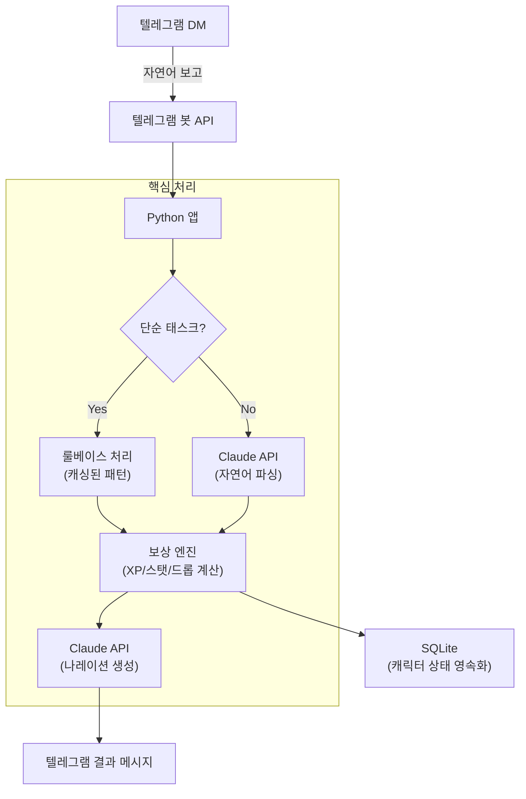
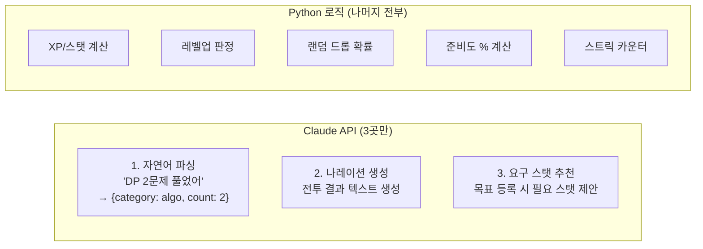
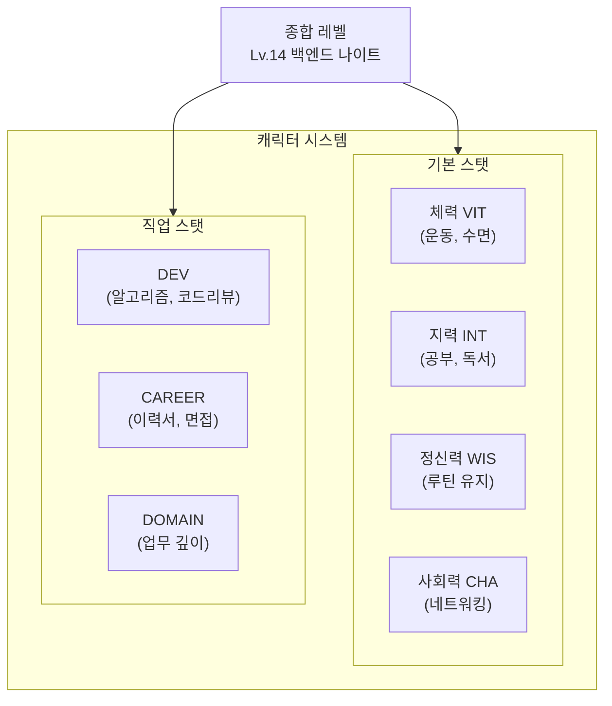
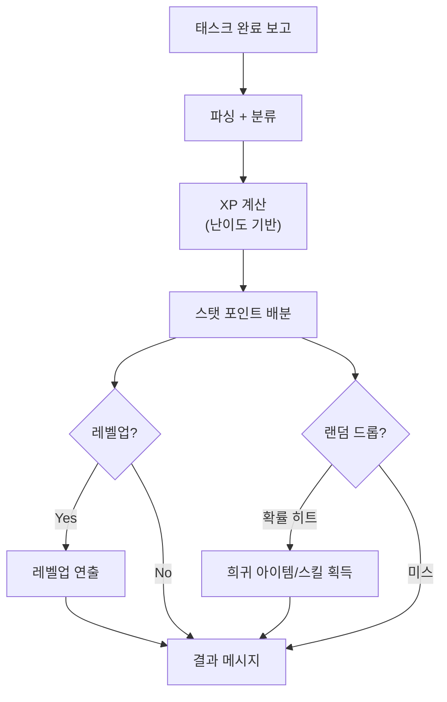
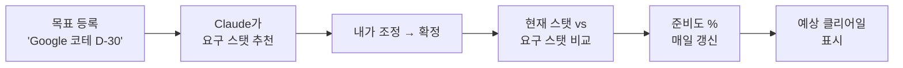
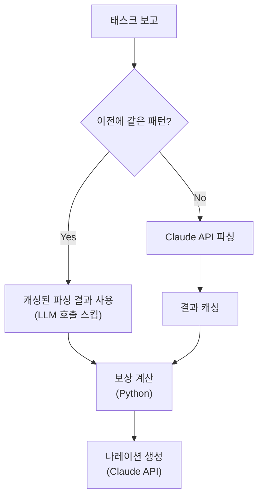
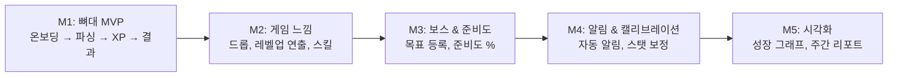

## Project Introduction

LifeRPG is a personal growth agent that makes real-life self-improvement feel like an idle RPG. When you report via Telegram -- "Solved 2 algorithm problems today" -- Claude understands the context and returns an RPG-style battle result + stat changes + random drops.

```text
나: 오늘 NeetCode DP 2문제 풀었어

⚔️  [전투 결과]
메모리 릭 슬라임 x2 처치!

DEV  +4  |  INT  +2  |  경험치 +120
🎲 드롭: [희귀] '재귀 검' — DP 패턴을 꿰뚫는 자에게만

━━━━━━━━━━━━━━━━━━━━━
Lv.14 백엔드 나이트
████████░░  80%  (다음 레벨까지 24 xp)
```

How it differs from existing habit apps (Habitica, etc.):
- **Natural language reporting instead of manual checkboxes** --> Claude handles parsing
- **A world built around my profession, not a generic one** --> "Backend developer" fights Legacy Code Golems
- **Contextual feedback, not just +XP** --> "3 days of DP in a row -- time to look at advanced patterns"

---

## Architecture



### Key Design Decision: Limiting LLM Calls to 3 Places

Claude API calls cost money. Calling it every time would cause API costs to ramp up quickly and slow down response times. So **LLM is called only at 3 places where it's truly necessary**, and everything else is handled with Python logic.



| Processing Area | Approach | Reason |
|----------------|----------|--------|
| Natural language parsing | **LLM** | Structuring "2 DP problems" requires natural language understanding |
| XP/stat calculation | **Code** | Formulas are fixed; deterministic processing |
| Narration generation | **LLM** | Needs to create different entertaining text each time |
| Level-up/drops | **Code** | Probability calculations must be precise |
| Required stat recommendation | **LLM** | LLM infers what stats are needed for "Google coding test D-30" |
| Readiness calculation | **Code** | Current stats vs required stats gap is simple arithmetic |

This principle was applied identically to the parameter change automation Agent built at work. **What's certain goes to code; what requires judgment goes to the LLM.**

---

## Character System: Dual-Level Structure



Both an overall level and individual stat levels coexist. Like an RPG where you can be "Warrior Lv.50 but Magic stat Lv.3," you can be "Overall Lv.14 but DEV Lv.20 and CHA Lv.5."

---

## Reward Engine: Instant Dopamine



Rather than simply giving "+10 XP":

- **Difficulty-based XP**: "DP problems" earn higher XP than "drink water"
- **Streak bonus**: Bonus multiplier based on consecutive days
- **Random drops**: The slot machine principle -- unpredictable rewards are most effective for habit formation
- **Skill unlocks**: Permanently unlock "DP Decoder" skill at 50 DP problems

---

## Readiness System: The Gap Between Goals and Current State



This shows "how close am I to my goal right now?" as a number. Each day you complete tasks, stats increase and the readiness percentage rises. You can objectively gauge the distance to your goal.

---

## Tech Stack and Selection Rationale

| Layer | Choice | Rationale |
|-------|--------|-----------|
| **Language** | Python | 4 years of Django experience, fast development |
| **Storage** | SQLite | Single-user MVP, no need for a complex DB |
| **LLM** | Claude Sonnet (Anthropic API) | 1+ year of in-house usage, leveraging prompt caching |
| **Interface** | Telegram Bot API | Works on both mobile/desktop, no separate app development needed |
| **Scheduler** | APScheduler | Morning/lunch reminders, weekly reports |

### Why Telegram

Building a separate app would mean:
- iOS/Android development needed --> MVP timeline triples or more
- App installation --> high usage barrier
- Push notification infrastructure required

With Telegram:
- Bot API provides a complete interface in 30 minutes
- Immediate use within an already-installed app
- Push notifications included by default
- Markdown and emoji support enable RPG presentation

---

## Cost Optimization Strategy



Repetitive patterns like "solved 2 algorithm problems" are cached after the first parse. This significantly reduces costs compared to calling the LLM every time.

Estimated monthly cost:
- Based on 5-10 reports per day
- Parsing: assuming 60% cache hit rate --> ~120 calls/month
- Narration: called every time --> ~300 calls/month
- Under $5/month on Claude Sonnet

---

## Development Milestones



**Principle: Don't look at M2 until M1 is done.** Scope creep is the number one killer of side projects.

---

## Connecting to Work: How Side Project Learnings Apply to the Day Job

The principles developed while designing this project were directly applied to internal projects:

| LifeRPG Design Principle | Internal Application |
|-------------------------|---------------------|
| Limit LLM calls to 3 places | Separating deterministic/LLM boundaries in AI Agent |
| Simple tasks use rule-based logic | 70% of structured patterns handled by code, only 30% by LLM |
| Cache parsing results | Optimizing API costs with prompt caching |
| Start with SQLite, scale as needed | Start with pgvector, move to dedicated vector DB if needed |

Side projects are "things I build for myself," but the design thinking is reusable anywhere.

---

## Reflections

### The Greatest Advantage of Personal Projects Is "Owning the Whole Experience"
At work, you're responsible for a part of the system. In personal projects, you experience everything from planning to design to implementation to operations. This full-picture perspective helps make better design decisions at work.

### LLM API Cost Optimization Is Decided at the Design Stage
Trying to reduce costs after implementation is difficult. If you decide upfront "where to use the LLM and where not to," you can optimize both cost and performance.

### Telegram Bots Are an Underrated Prototyping Tool
You can implement a complete conversational interface without building a separate app. At the MVP stage, focusing on core logic rather than spending time on UI development is the better investment.
