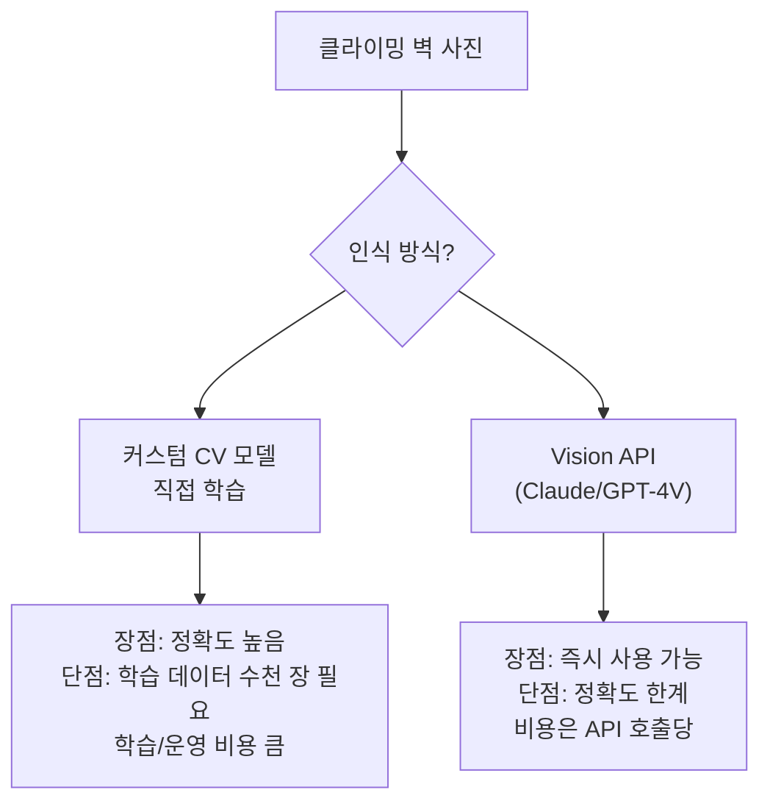
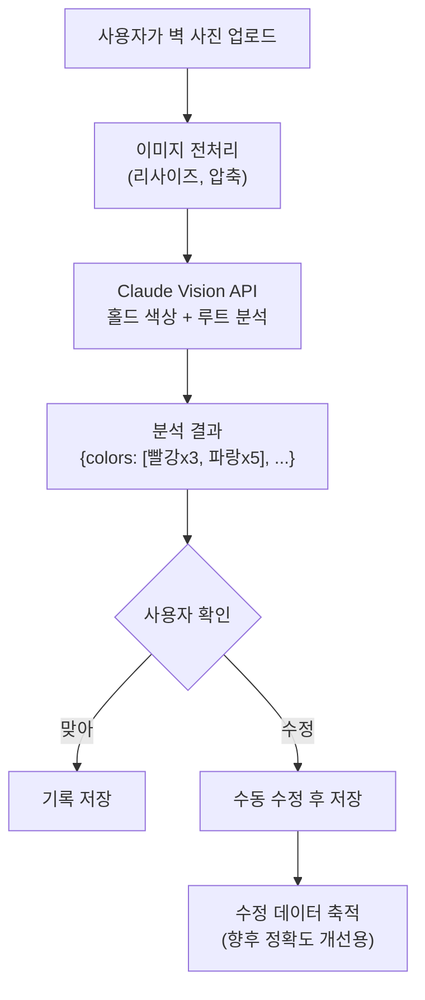
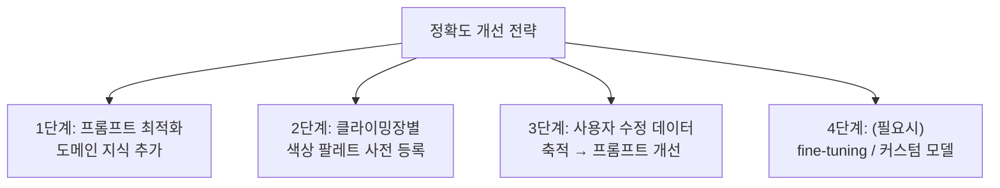
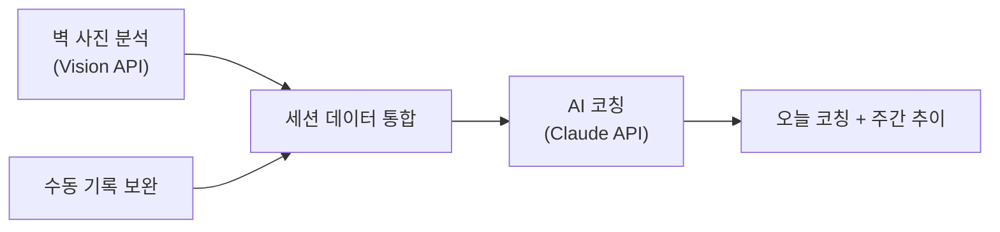

## The Starting Point

This is the second installment in the series(?) of rethinking a half-finished climbing app in the AI era. While considering coaching features, a more fundamental problem came to mind -- recording itself is a hassle.

Manually entering "3 red, 5 blue, 2 green" after every climbing session is tedious. Most users would give up within 3 days. But climbers almost always take photos of the wall. What if a Vision API could **automatically recognize hold colors and routes from a photo**? I explored whether this is feasible and what the limitations would be.

---

## Approach: Vision API vs Custom Model



**I chose Vision API for the MVP.** The custom model route is an uphill battle starting from data collection. Wall configurations, hold colors, and lighting differ across every climbing gym in the country. Start with the Vision API, and consider a custom model once accuracy limitations become clear.

---

## System Design



### Key Design Decision: The "Suggest + Confirm" Pattern

Vision API recognition can never be 100% accurate. So instead of **automatic input, I designed it as automatic "suggestions"**.

```text
📸 사진 분석 결과

감지된 루트:
  🔴 빨강 x3 (확신도 높음)
  🔵 파랑 x5 (확신도 높음)  
  🟢 초록 x2 (확신도 중간)
  ⚪ 흰색 x1 (확신도 낮음 — 조명 반사일 수 있음)

맞나요? [확인] [수정]
```

When users make corrections, that data accumulates and becomes the basis for prompt improvement.

---

## Vision API Prompt Design

Analyzing climbing wall photos differs from general image description. A domain-specific prompt is necessary.

```python
def analyze_climbing_wall(image_base64: str, gym_name: str = None) -> dict:
    prompt = """이 사진은 실내 클라이밍(볼더링) 벽이다.

분석해야 할 것:
1. 벽에 있는 홀드(손잡이)의 색상별 개수
2. 같은 색상의 홀드가 하나의 루트(경로)를 구성함
3. 루트의 대략적 난이도 추정 (홀드 간격, 각도, 위치 기반)

주의사항:
- 홀드와 볼트(회색 고정용 나사)를 구분할 것
- 테이프 표시와 홀드 색상을 구분할 것
- 벽 자체의 색상과 홀드 색상을 구분할 것
- 조명에 의한 색상 왜곡 가능성 고려

응답 형식 (JSON):
{
  "routes": [
    {"color": "빨강", "hold_count": 8, "estimated_difficulty": "중급"},
    {"color": "파랑", "hold_count": 10, "estimated_difficulty": "초급"}
  ],
  "wall_angle": "오버행 약 15도",
  "confidence": "medium",
  "notes": "조명이 어두워 일부 색상 판별이 불확실"
}"""

    response = claude.messages.create(
        model="claude-sonnet-4-20250514",
        messages=[{
            "role": "user",
            "content": [
                {"type": "image", "source": {"type": "base64", "data": image_base64}},
                {"type": "text", "text": prompt}
            ]
        }]
    )
    return json.loads(response.content[0].text)
```

### Why Domain Knowledge Matters in the Prompt

A generic Vision prompt ("analyze the colors in this photo") would:
- **Misidentify bolts (mounting screws) as holds**
- **Confuse wall colors with hold colors**
- **Recognize tape markings as separate holds**

Distinctions that only someone who knows climbing would be aware of must be explicitly stated in the prompt to improve accuracy.

---

## Accuracy Limitations and Mitigation Strategies

Realistic limitations when analyzing climbing walls with Vision APIs:

| Case | Difficulty | Mitigation |
|------|-----------|------------|
| Single-color holds, front-facing photo | Easy (high accuracy) | Use as-is |
| Similar colors (orange vs red) | Medium | Pre-register per-gym color palettes |
| Dim lighting, side-angle photo | Hard | Prompt user corrections + display confidence levels |
| Volumes (large holds) mixed with small holds | Hard | Specify "volumes are part of the route" in the prompt |



---

## Cost Optimization

Photo analysis is where Vision API costs are largest.

| Strategy | Effect |
|----------|--------|
| **Image resizing** | Shrink from original 4000x3000 to 1024x768. Dramatically reduces token count |
| **Caching** | Photos from the same gym/wall section have similar routes --> reference previous analysis results |
| **Batch processing** | Collect multiple photos at session end and analyze all at once |
| **On-demand analysis** | Only analyze photos when the user requests it (no automatic execution) |

Estimated cost: $2-3/month based on 3-5 photo analyses per day

---

## Integration With Automated Session Summaries

Connecting photo recognition results to the AI coaching system enables richer coaching:



```text
📸 + 📊 오늘의 클라이밍 리포트

[사진 분석] 성수파크 A벽
  빨강 x3 완등, 파랑 x5 완등, 빨강 x2 실패

[코칭]
"오늘 찍은 A벽 사진을 보니 빨강 실패 2개가 둘 다 오버행 구간이네.
지난주에도 A벽 오버행에서 같은 패턴으로 떨어졌어.
다음에 A벽 갈 때 오버행 초록부터 워밍업으로 3개 풀고 시작해봐."
```

---

## Feasibility Assessment

Starting with the Vision API makes implementation fast. But accuracy will have limitations, and that's when a custom model becomes necessary. That requires thousands of training images (climbing wall photos + correct labels), which is only possible after the app builds a certain user base.

In conclusion, the realistic order is **Vision API --> accumulate user correction data --> custom model**. For now, even with the Vision API alone, reducing "10 manual inputs to 2 corrections" provides sufficient value.

---

## Reflections

### "Can I Build It?" Matters Less Than "Is It Worth Building?"
The Vision API makes it technically possible. The question is whether climbers actually want this feature. As a climber myself, "take a photo and get automatic input" is something I'd definitely use. Having this conviction makes it worth building.

### The Person Who Knows the Domain Should Write the Prompt
"Analyze colors in this photo" and "Analyze hold colors on a bouldering wall, excluding bolts and tape" would produce completely different results. AI feature quality is proportional to the depth of domain knowledge embedded in the prompt.

### "Smart Suggestions" Are More Realistic Than Perfect Automation
100% accurate recognition is impossible. The "suggestion + user confirmation" pattern is more realistic, and the accumulated user correction data itself becomes an asset for future model improvement.
