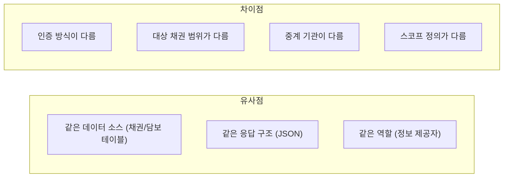
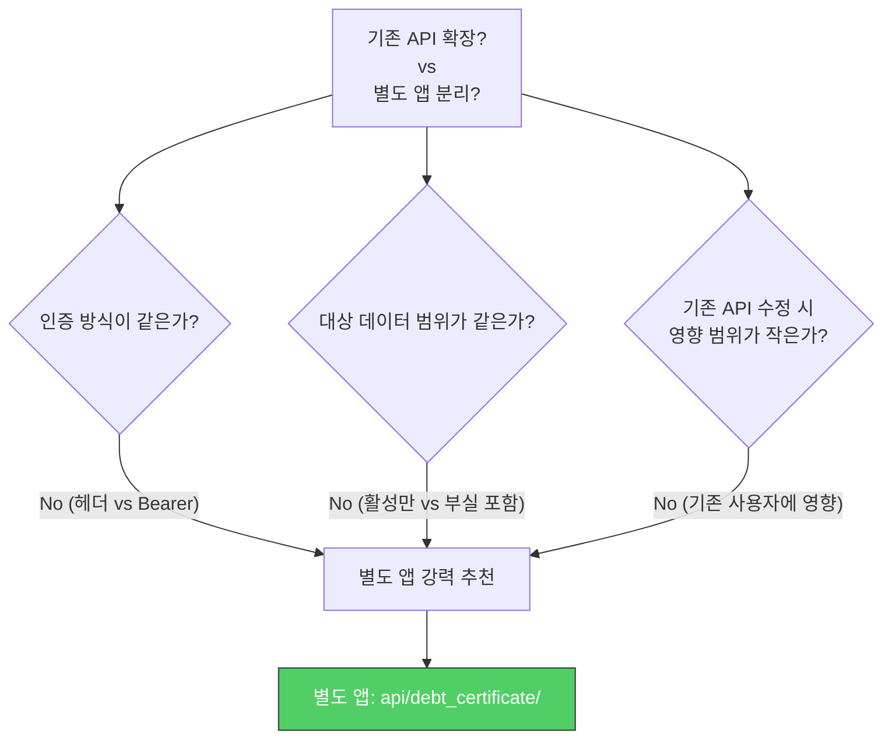
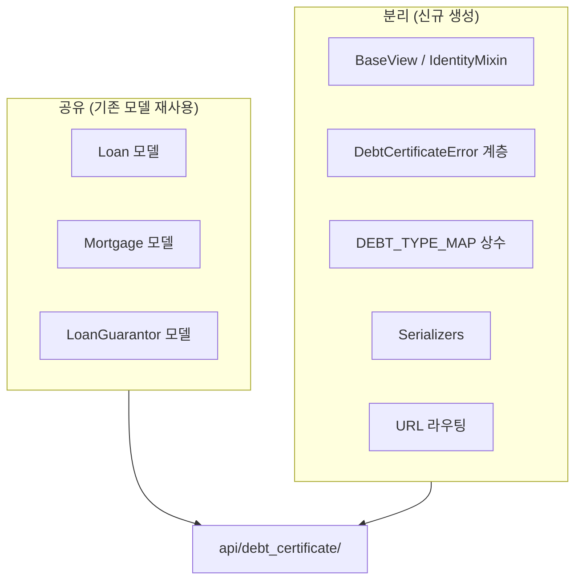
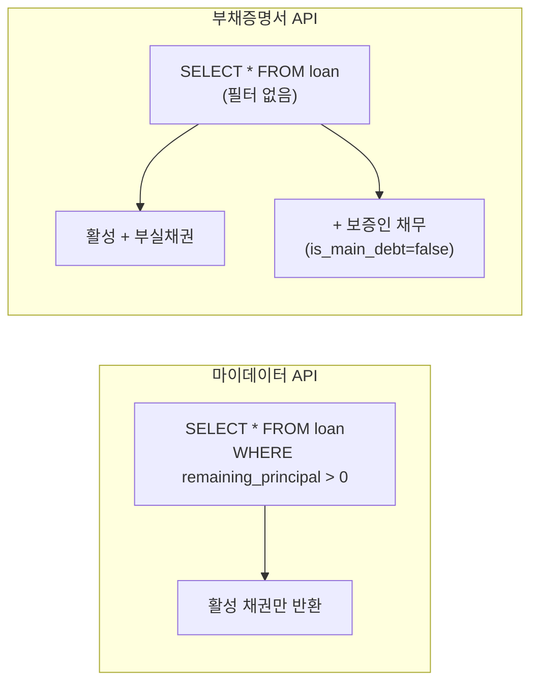
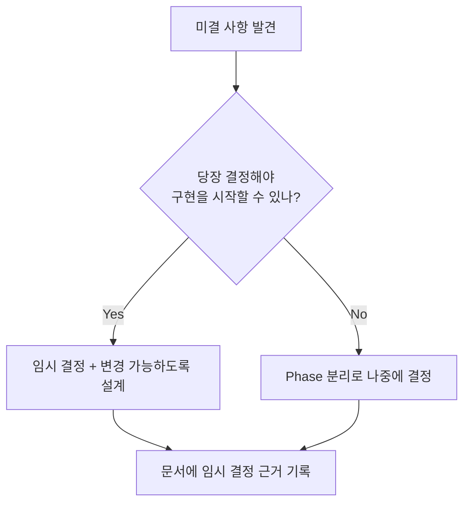

## The Problem

I needed to implement a new debt certificate API. The system already had a similar MyData API (`api/mydata/v2/`). Both are **APIs that respond to external requests with internal loan/collateral/guarantee information**.

The key question: **Should I extend the existing MyData API or create a separate app?**

---

## Comparing Similarities and Differences



| Item | MyData API | Debt Certificate API |
|------|-----------|---------------------|
| **Authentication** | `x-user-ci` header | `Authorization: Bearer` token |
| **Target loans** | Active loans only (`balance > 0`) | Includes non-performing loans and guarantor debts |
| **Requester** | MyData service providers | Credit information portal (individual use only) |
| **Relay institution** | Financial relay institution | Hub relay institution |
| **Scope** | `all_asset` | New separate scope |

---

## Decision: Separate App



**Why I chose a separate app:**

1. **Authentication difference**: Completely different handling needed at the middleware/decorator level
2. **Data scope difference**: The MyData API's core premise is the `remaining_principal > 0` filter. Removing it would change the existing API's behavior
3. **Independent deployment**: Bugs in the debt certificate API must not affect the MyData API
4. **No model changes needed**: The new API only performs read-only queries on existing models, so share the models but separate the views/serializers

---

## Design: What to Share and What to Separate



### Directory Structure

```text
api/debt_certificate/
├── constants.py        # 상품코드 매핑 (DEBT_TYPE_MAP)
├── exceptions.py       # 전용 에러 계층
├── pagination.py       # 페이지네이션 믹스인
├── validators.py       # 헤더/파라미터 검증
├── views/
│   ├── base.py         # BaseView, IdentityMixin (Bearer 토큰 인증)
│   ├── debts.py        # GET /debts (채권 조회)
│   ├── collateral.py   # POST /debts/security (담보 조회)
│   ├── guarantee.py    # POST /debts/guarantee (보증 조회)
│   └── notification.py # POST /debts/notification (발급 알림)
├── serializers/
├── urls.py
└── tests/
```

### Key Difference: Target Loan Scope



The MyData API returns only **active loans with a balance greater than zero**, while the debt certificate API must include **non-performing loans (delinquent/written-off) and guarantor debts**. Same model, but fundamentally different queries.

---

## Open Issues Discovered During Design

During the actual design process, **questions that couldn't be answered immediately** emerged. How you manage these open issues determines the value of a design document.

| Open Issue | Why It's Difficult | Interim Decision |
|-----------|-------------------|-----------------|
| Authentication method (JWT vs OAuth2 vs relay institution format) | Counterparty institution's final spec is undetermined | Implement JWT-based first, abstract to allow future changes |
| Can internal PKs be exposed externally? | Security review needed | Reviewing a separate identifier system |
| Exact scope of non-performing loans | Legal definitions for write-offs/subrogation/sold loans need verification | Confirmation requested from business team |
| Real-time interest calculation vs last settlement basis | Real-time is a performance burden, settlement basis loses accuracy | Start with last settlement basis; switch to cache-based real-time if required |



---

## Product Code Mapping: Converting Between External Spec and Internal Model

When an external institution's product classification system differs from the internal data model, an explicit mapping table is needed.

```python
DEBT_TYPE_MAP = {
    "개인신용대출":    "5101",  # P2P 개인 신용
    "법인신용대출":    "5102",  # P2P 법인 신용
    "부동산PF":       "5201",  # P2P 부동산 PF
    "부동산담보":      "5202",  # P2P 부동산 담보
    "어음매출채권":    "5203",  # P2P 어음/매출채권
    "기타담보":        "5299",  # P2P 기타 담보
}
```

Keeping this mapping as constants in code provides:
- Conversion logic centralized in one place for easy management
- Adding new product types only requires adding a mapping entry
- Incorrect mappings can be verified with tests

---

## Reflections

### Distinguish "Similar" From "Same"
The most dangerous judgment when building a similar API is "they're similar, so let's just extend the existing one." If even one of authentication, data scope, or deployment independence differs, you should strongly consider a separate app. Adding conditionals to the existing API is faster short-term but makes both sides harder to maintain long-term.

### Share Models, but Separate Views
By sharing DB models (tables) while separating views/serializers, you can implement different access patterns without data duplication. This is especially true for "read-only" APIs that don't need to touch models at all.

### Document Open Issues Instead of Hiding Them
Writing "I don't know this yet" in a document isn't a weakness -- it's a strength. Recording open issues and the rationale behind interim decisions preserves context for future decisions. And when team members ask "what's the plan for this?" during design reviews, you can demonstrate that you've already thought it through.
