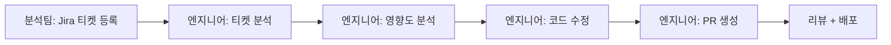
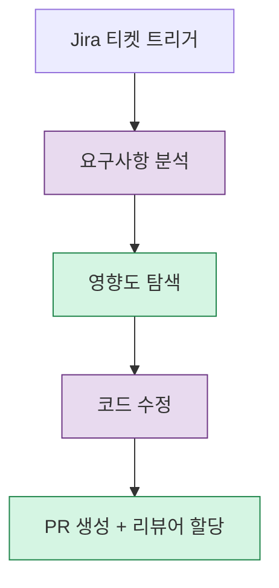
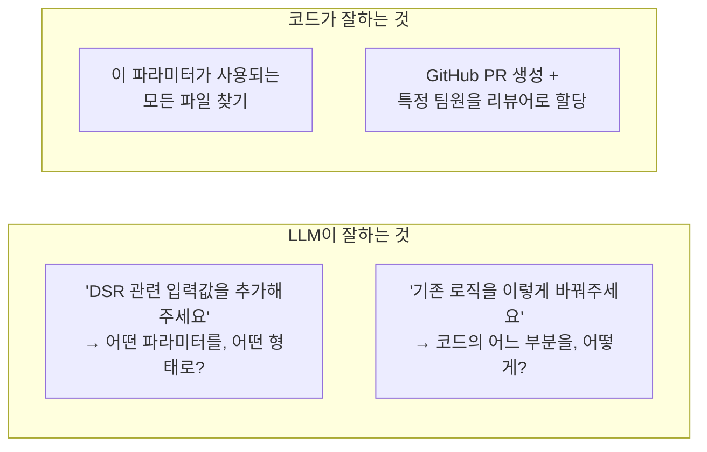
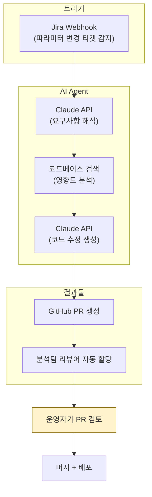

## Background

Our in-house credit scoring model has dozens of input parameters. The credit analysis team regularly submits change requests like "please add this parameter" or "please change this filtering rule."

The existing flow:



The problem is that **70-80% of change requests follow structured patterns**:
- Adding/removing input parameters
- Adding/changing filtering rules
- Modifying calculation logic for existing values

These patterns are fundamentally **work that an agent could handle instead of a person**, yet they were consuming engineer time every time.

---

## Approach: Framing the Problem and Building Consensus

Before the technical solution, the first step was **team alignment**. Adopting an AI Agent isn't a decision an engineer makes alone.

1. Within the team's existing AI adoption initiative, I demonstrated with data that "this area is suitable for automation"
2. Classified the last 6 months of parameter change tickets --> confirmed 70-80% follow structured patterns
3. Obtained team lead approval --> MVP implementation greenlit

The approach was "this problem keeps recurring, and here's how we can solve it" rather than "this is technically possible, so let me try it."

---

## Design: The Boundary Between Deterministic and LLM Processing

The most important decision in AI Agent design is **clearly separating what to delegate to the LLM and what to handle with code**.



| Step | Processing Method | Reason |
|------|------------------|--------|
| **Requirements analysis** | LLM | Interpreting natural language tickets into structured changes |
| **Impact discovery** | Deterministic (code) | Codebase search and dependency tracking must be accurate |
| **Code modification** | LLM | Understanding intent and generating code at the right location |
| **PR creation** | Deterministic (code) | GitHub API calls and reviewer assignment must be precise |

### Why This Split

LLMs are strong at **"understanding intent"** and weak at **"executing precisely."**



If you delegate impact discovery to the LLM, it says "it's probably used in this file." But a code search gives you a 100% accurate result with a single grep. **What's certain goes to code; what requires judgment goes to the LLM.**

---

## Architecture: Attaching to Existing Infrastructure

Rather than building new infrastructure, the design attaches the Agent to existing systems (Jira, GitHub, codebase).



Core design principles:
- **Humans do the final review**: The Agent creates PRs, but merging is always done by a human
- **Leverage existing infrastructure**: No new services to deploy -- just a combination of Jira API + GitHub API + Claude API
- **Safe to fail**: Even if the Agent creates a wrong PR, it gets caught in review. Worst case, "we go back to doing it manually"

---

## Implementation: Using the Claude API

### Requirements Interpretation

```python
# Jira 티켓의 자연어 설명을 구조화된 변경 사항으로 변환
prompt = """
다음 Jira 티켓의 내용을 분석하여 파라미터 변경 사항을 추출하세요.

티켓 내용: {ticket_description}

응답 형식:
- action: add | remove | modify
- parameter_name: ...
- parameter_type: ...
- description: ...
"""
```

### Impact Discovery (Deterministic)

```python
# LLM이 아니라 코드로 정확하게 검색
def find_impact(parameter_name: str) -> list[str]:
    # 1. 파라미터가 정의된 파일 찾기
    definition_files = grep(parameter_name, "apps/")
    
    # 2. 해당 파라미터를 사용하는 서비스 찾기
    usage_files = grep(parameter_name, "services/")
    
    # 3. 테스트 파일 찾기
    test_files = grep(parameter_name, "tests/")
    
    return definition_files + usage_files + test_files
```

### Code Modification Generation

The impact analysis results are passed to Claude to generate code at the precise locations.

```python
prompt = """
다음 파일들에 파라미터 '{param_name}'을 추가해야 합니다.

영향 받는 파일들:
{impact_files_with_context}

기존 파라미터 추가 패턴을 참고하여 코드 변경 사항을 생성하세요.
"""
```

---

## Current Progress

### MVP: Implemented via Claude Code Skills

Currently, we've automated part of the parameter change workflow using Claude Code's Skills feature. When an engineer runs Skills in Claude Code, it analyzes the codebase and generates the changes.

```text
현재 흐름 (Skills 적용):
  Jira 티켓 확인 → Claude Code Skills 실행 → 코드 수정 생성 → 엔지니어 검토 → PR
```

It's not full automation, but the time engineers spend directly analyzing and modifying code has been significantly reduced. These Skills are now shared with the entire team, and **all team members use them when working on parameter changes**, not just myself.

### Future Direction: Fully Automated Agent

The Jira trigger --> automatic analysis --> PR creation pipeline designed above is planned for implementation after validating the Skills MVP. The prompts and tool structures validated through Skills will carry over directly to the Agent.

| Phase | Status | Description |
|-------|--------|-------------|
| Problem discovery + team alignment | **Complete** | Data-driven consensus with team lead |
| Claude Code Skills MVP | **Complete** | Manual trigger by engineer, automated code generation |
| Jira --> Agent --> PR automation | **Design complete, implementation pending** | Full automation from trigger to PR creation |

---

## Reflections

### The Most Important Thing in LLM Agents Is "Boundary Design"
If you delegate everything to the LLM, you get a system that's "mostly right but occasionally wrong." By handling deterministic parts (code search, API calls) with code and delegating only judgment-requiring parts (requirements interpretation, code generation) to the LLM, reliability increases dramatically.

### Starting With a Skills MVP Was the Right Call
If we had tried to build a fully automated Agent from the start, the scope would have been too large to make progress. Validating "do the prompts and tool structures actually work?" through Claude Code Skills first, then layering automation on top, was the realistic approach.

### Consensus Before Technology
"I can automate this" is less effective at persuading a team than "this problem keeps recurring, and this much time is being consumed." Showing the problem with data, proposing a solution, and building consensus was more important than the coding itself.

### "Humans Do the Final Review" Is the Safety Net That Makes Adoption Possible
An AI automatically modifying code and deploying it in a financial system? Nobody would agree to that. But "AI generates the code and humans review it" keeps the risk identical to the status quo while only increasing speed. The Skills MVP follows this principle, and the future Agent will too.
